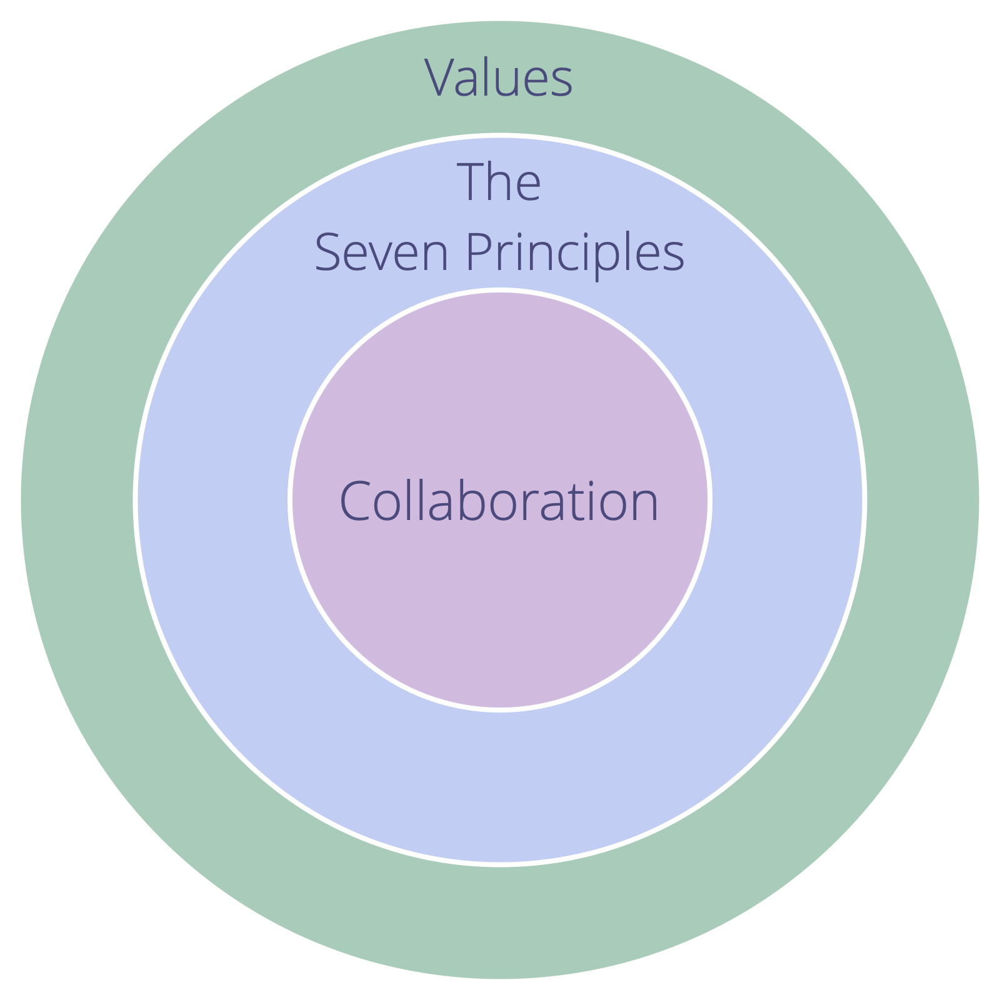

Узгодьте співпрацю з Сімома принципами.

Прийняття Семи Принципів зменшує кількість необхідних явних угод і спрямовує адаптацію шаблонів S3 до контексту організації.

Цінності організації повинні охоплювати Сім Принципів.

