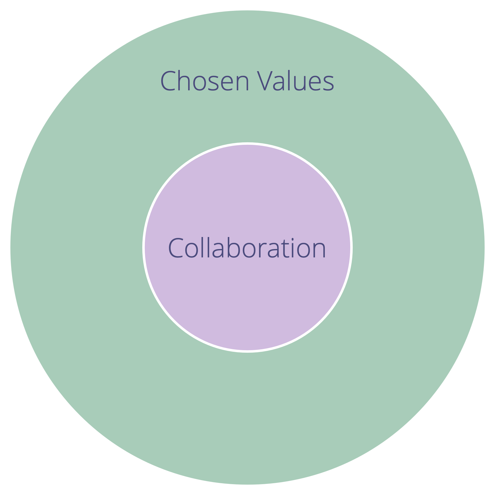

Цілеспрямовано розвивайте культуру у вашій організації.

_**Цінності **- це принципи, які керують поведінкою. Цінності визначають сферу дії та етичні обмеження._

-   кожен член привносить в організацію власні цінності, засновані на особистому досвіді та переконаннях
-   команда або організація може ** вибрати колективне прийняття цінностей**, щоб керувати своєю співпрацею

Цінності дають орієнтири для визначення відповідних дій, навіть за відсутності явних <a href="glossary.html#entry-agreement" class="glossary-tooltip" data-toggle="tooltip" title="Угода: Узгоджений з інструкцією, процесом, протоколом або політикою, призначеним для керування потоком цінностей."> угод</a>.

Колективне прийняття набору цінностей підтримує ефективність організації, та:

-   зменшує ймовірність **нерозуміння**
-   допомагає **узгодити** процес прийняття рішень та дії
-   **залучає нових членів, партнерів та клієнтів**, які поділяють погляди організації

Вибрані значення - це угода, яка виграє від **регулярного перегляду**.

