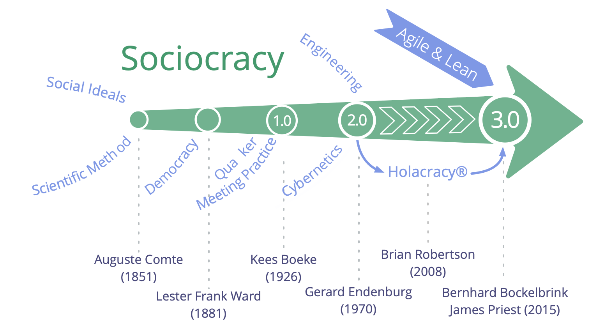
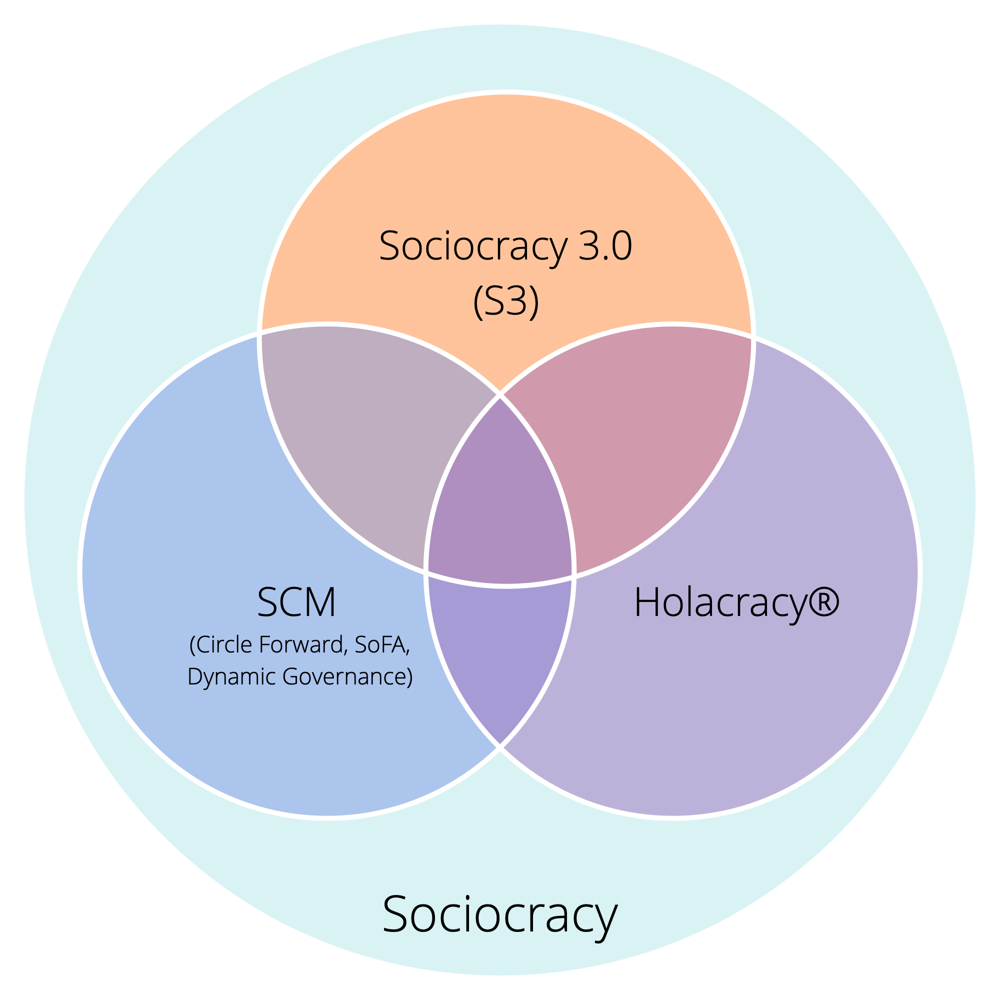
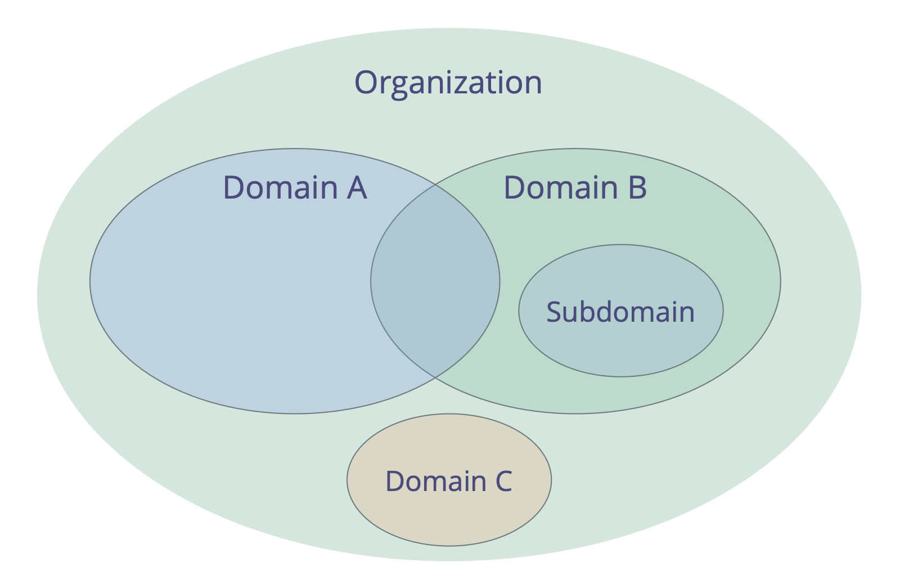
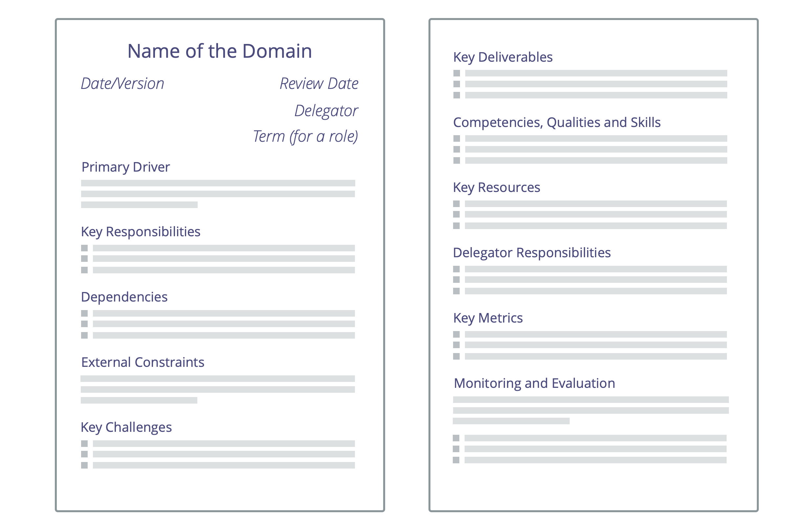
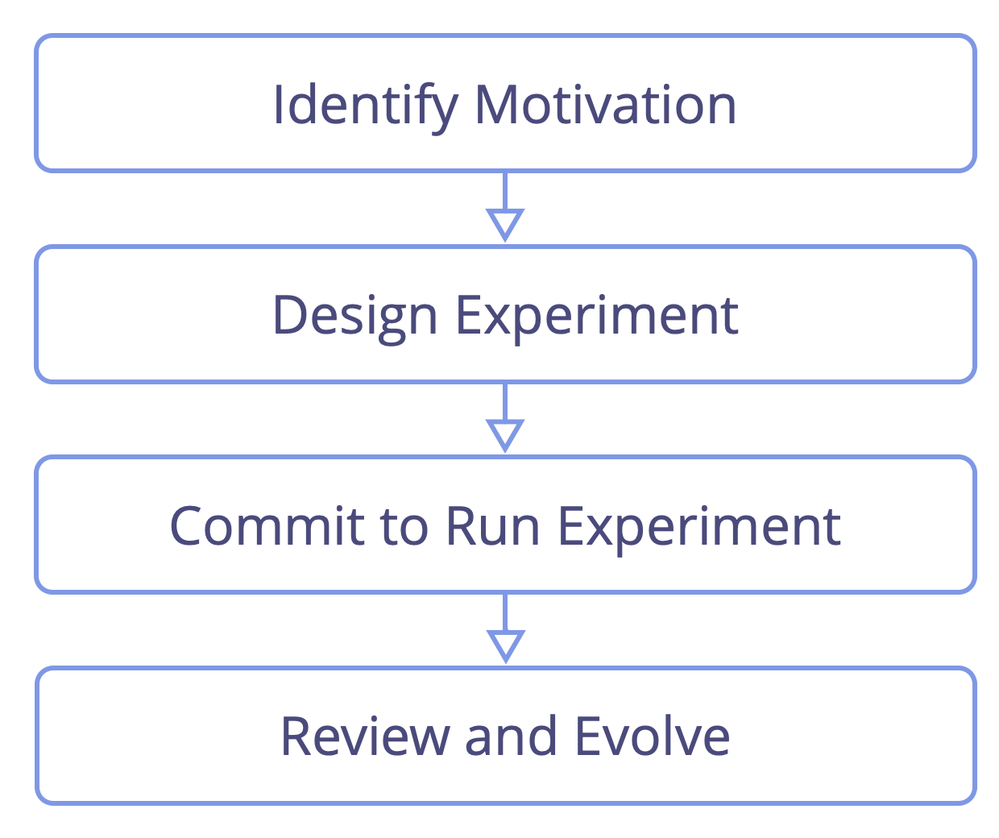
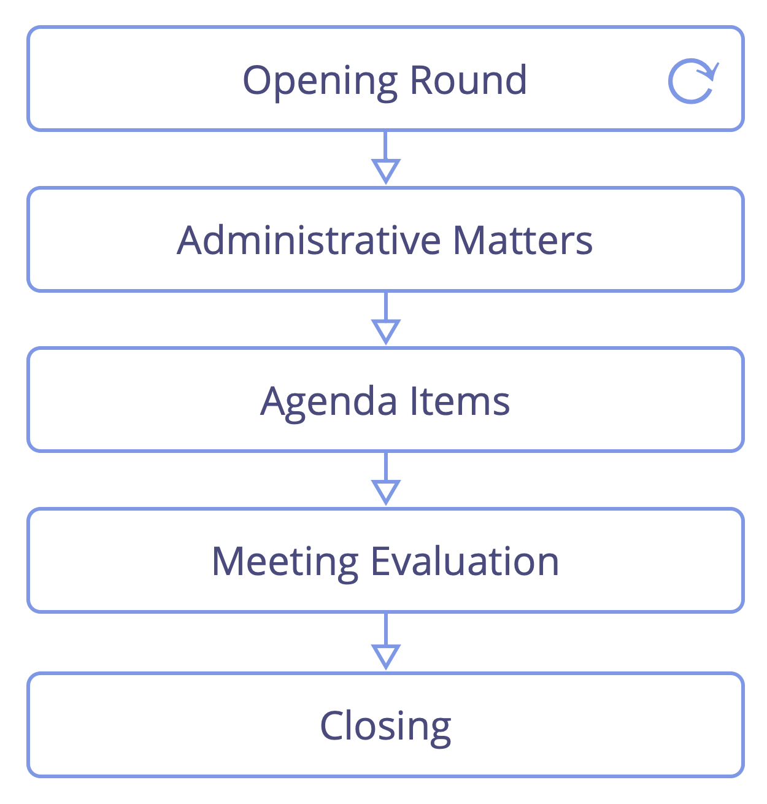
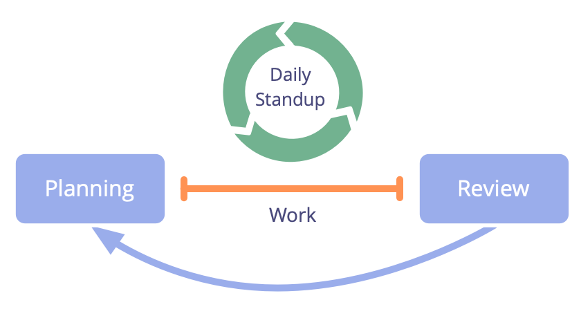
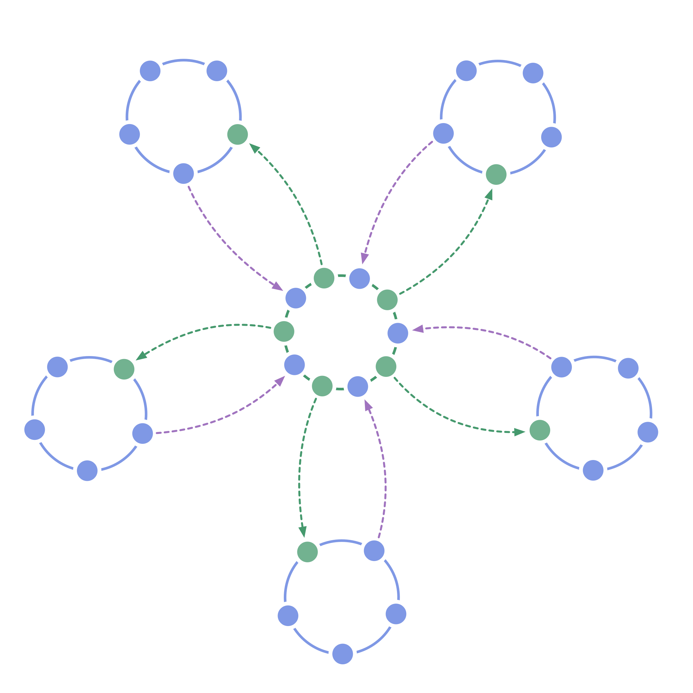
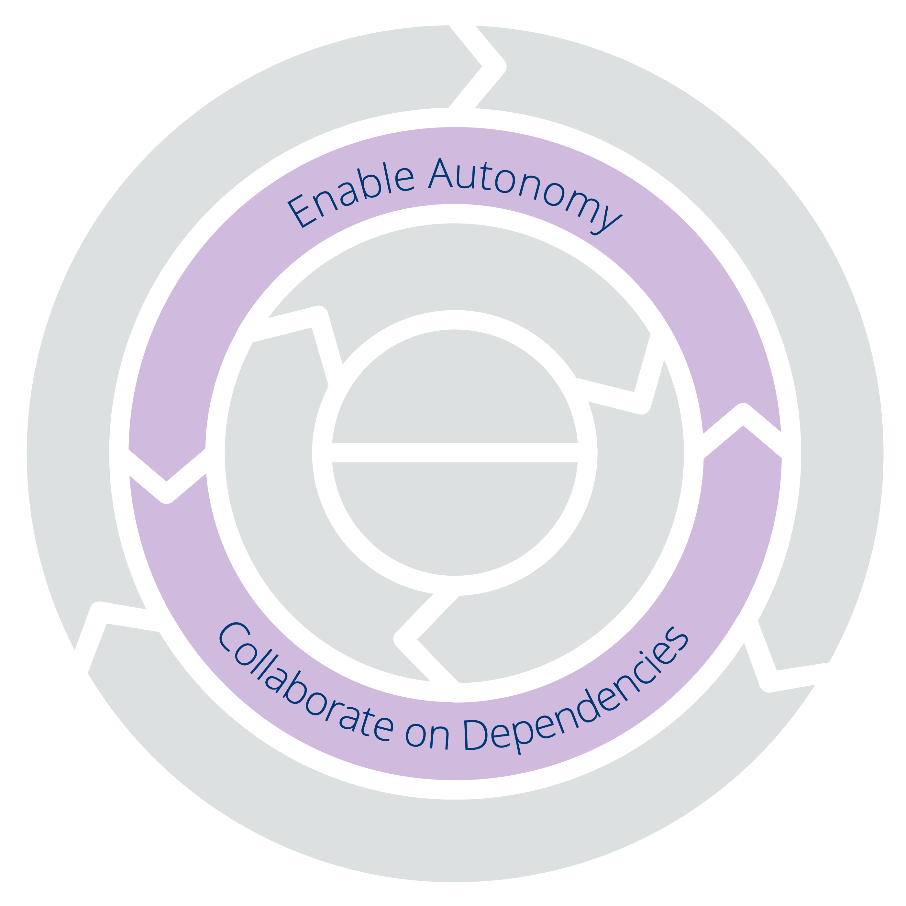

## Що таке Соціократія 3.0?

Соціократія 3.0 - також відомая як "S3" — це <a href="glossary.html#entry-social-technology" class="glossary-tooltip" data-toggle="tooltip" title="Соціальні технології: Соціальна технологія - це будь-який процес, техніка, метод, навичка або будь-який інший підхід, який люди можуть використовувати для впливу на соціальні системи - організації, суспільства, громади тощо - з метою сприяння досягненню спільних цілей і спрямування змістовної взаємодії та обміну.">соціальна технологія</a> для розвитку гнучких і стійких організацій будь-якого розміру, від невеликих стартапів до великих міжнародних мереж і міжвідомчої співпраці.

У цьому практичному посібнику ви знайдете вичерпну колекцію перевірених і випробуваних **концепцій, принципів і практик для підвищення ефективності, залученості та добробуту** в організаціях.

З моменту свого запуску у 2015 році патерни S3 допомагають людям у різних організаційних контекстах отримувати найкращі результати від співпраці. Від стартапів до малого та середнього бізнесу, великих міжнародних організацій, фінансованих інвесторами та неприбуткових організацій, сімей та громад.

Використання S3 може **допомогти вам досягти ваших цілей** і успішно орієнтуватися в складних ситуаціях. Ви можете впроваджувати зміни крок за кроком, **без необхідності раптової радикальної реорганізації** або складати довгостроковий план змін:

-   Просто почніть з визначення ваших найбільших потреб і виберіть одну або кілька практик чи рекомендацій, які допоможуть вам у цьому.
-   Працюйте у власному темпі та розвивайте свої навички та компетенції на ходу.

**Незалежно від вашої посади в організації**, ви знайдете багато перевірених ідей, які є актуальними та корисними для вас.

**Соціократія 3.0 є вільною програмою** та поширюється на умовах ліцензії Creative Commons Free Culture License.

### Як допомагає Соціократія 3.0?

S3 - це трансформаційна технологія як для окремих людей, так і для цілих організацій, яка допоможе вам з'ясувати, як відповісти на найбільші виклики, що стоять перед вашою організацією, скористатися можливостями, з якими ви стикаєтесь, і вирішити найбільш застарілі проблеми.

Соціократія 3.0 розроблена для того, щоб бути гнучкою і підтримувати експерименти та навчання. Ви можете взяти все, що вам потрібно, адаптувати речі до свого контексту і збагатити свій існуючий підхід.

S3 інтегрує основні концепції та практики гнучких методологій, дбайливого менеджменту, Канбан (та KMM), Дизайн Мислення, Teal Organizations та сімейства методів управління на основі соціократії (SCM/Dynamic Governance, Holacracy® та ін.). Він є безкоштовним і сумісним з будь-якими гнучкими або бережливими фреймворками, включаючи, але не обмежуючись Scrum та його різноманітними фреймворками масштабування.

### Підхід до організаційних змін на базі патернів

S3 пропонує підхід до організаційних змін, заснований на патернах.

**Паттерн** - процес, практика або вказівник, який служить шаблоном для успішного реагування на певний тип виклику або можливості. Патерни S3 виявляються шляхом спостереження за людьми, які працюють разом в організаціях, щоб вирішувати проблеми та реагувати на можливості, з якими вони стикаються. Коли ви бачите, що ваші звичні способи роботи не дають результатів, яких ви очікували або на які сподівалися, ви можете звернутися до S3, щоб знайти шаблони, які можуть допомогти.

Патерни є модульними та адаптивними, їх можна використовувати незалежно, і вони взаємно підсилюють, доповнюючи один одного, коли використовуються в комбінації. Патерни S3 можна розвивати та адаптувати для задоволення ваших конкретних потреб.

У цьому посібнику патерни згруповані за темами в одинадцять категорій, щоб допомогти вам легше знайти ті, які будуть корисними для вас:

- Створення сенсу та прийняття рішень
- Побудова Організацій
- Взаємний розвиток
- Помічники Співтворчості
- Побудова організацій
- Залучення до S3
- Визначення угод
- Формати зустрічі
- Практики проведення зустрічей
- Організація роботи
- Структура Організації

Надаючи меню патернів на вибір відповідно до потреб, S3 заохочує органічний, **ініціативний підхід до змін без величезних попередніх інвестицій**. Він зустрічає людей там, де вони є, і допомагає їм рухатися вперед, залучаючи патерни у власному темпі та відповідно до їхнього унікального контексту.

### Що в цьому посібнику?

У цьому практичному посібнику ви знайдете:

-   Корисні концепції, які допоможуть вам **зрозуміти суть вашої організації** та ефективно комунікувати про те, де потрібні зміни.
-   **органічний, ітеративний підхід до змін**, який зустрічає людей там, де вони перебувають, і допомагає їм рухатися вперед у власному темпі та відповідно до їхнього унікального контексту і потреб.
-   **Сім основних принципів** гнучкої та соціократичної співпраці
-   Послідовна колекція **70+ практик і рекомендацій**, які допоможуть вам зорієнтуватися в складних ситуаціях і покращити співпрацю:
    -   **Прості, фасилітовані формати**, які допомагають командам використовувати колективний інтелект групи та поступово обробляти наявну інформацію для безперервного вдосконалення робочих процесів, продуктів, послуг і навичок.
    -   **Групові практики**, щоб допомогти організаціям найкраще використовувати таланти, які вони вже мають, через **людей, які підтримують один одного** у розвитку навичок, підзвітності та залученості.
    -   Прості **інструменти для з'ясування того, хто чим займається**, звільняючи людей від необхідності приймати рішення і діяти самостійно, наскільки це можливо, в межах чітко визначених обмежень, які дозволяють експериментувати і розвиватися.
    -   Патерни для **виведення організаційної структури за межі ієрархії** у гнучкі, децентралізовані мережі, де потік інформації та впливу безпосередньо сприяє створенню цінності.
-   **Common Sense Framework**, інструмент для розуміння команд і організацій та з'ясування того, як почати роботу з S3.
-   **Глосарій** з поясненнями всіх термінів, з якими ви можете бути незнайомі.

Цей практичний посібник з Соціократії 3.0 пишеться і публікується трьома співрозробниками Соціократії 3.0.

Відповідно до мислення, що лежить в основі S3, ця книга завжди буде роботою в процесі, яка росте і змінюється в міру того, як ми будемо вчитися у людей, які експериментують з S3 в організаціях по всьому світу. З моменту запуску 5 років тому ми випускали по кілька оновлень на рік і продовжимо це робити в найближчі роки.

Незважаючи на те, що деякі розділи в цій книзі короткі і можуть бути не зовсім зрозумілими, зміст та пояснення були достатніми для багатьох людей, щоб почати працювати з S3 і досягти позитивних змін у своїх організаціях. Сподіваємося, він стане вам у пригоді.

### Впливи та Історія Соціократії 3.0

Буквальне значення терміну **соціократія** - "правління товаришів": *socio* - від латинського *socius* - означає "супутник", або "друг", а суфікс *-cracy* - від давньогрецького κράτος (krátos) - означає "влада", або "правління".

Слово "соціократія" з'явилося в 1851 році, коли **Огюст Конт** запропонував застосувати науковий підхід до суспільства: державою має керувати група вчених, які є експертами з питань суспільства (яких він називав "соціологами"). На його думку, це майбутнє, хоча ще й недосяжне, але неминуче.

Кілька десятиліть потому **Лестер Френк Ворд** використав слово "соціократія", щоб описати правління людей, які мають стосунки один з одним. Замість того, щоб мати соціологів у центрі, він хотів дати більше влади і відповідальності людині, він уявляв соціологів у ролі дослідників і консультантів.

У 1926 році голландський педагог-реформатор і квакер **Кіс Боке** заснував школу-інтернат, засновану на принципі консенсусу. Співробітники та учні розглядалися як рівноправні учасники в управлінні школою, всі рішення мали бути прийнятними для всіх. Він побудував цю версію соціократії на квакерських принципах і практиках і описав соціократію як еволюцію демократії у своєму есе 1945 року "Демократія, якою вона могла б бути".

**Джерард Енденбург**, також Квакер і учень школи Буке, хотів застосувати соціократію в сімейному бізнесі "Енденбург Електротехнік". Він створив і розвинув *Метод Організації Кола (SCM)* (пізніше він став "Соціократичним Методом"), інтегрувавши форму соціократії Бека з інженерією та кібернетикою. У 1978 році Енденбург заснував Соціократичний Центр в Утрехті (зараз це Соціократичний Центр у Роттердамі) як засіб просування соціократії в Нідерландах та за їх межами. З 1994 року організації в Нідерландах, що використовують SCM, звільнені від законодавчої вимоги мати раду працівників.

Наприкінці 1990-х і на початку 2000-х років кілька не голландськомовних людей познайомилися з соціократією, але лише в 2007 році, коли **Шерон Віллінс і Джон Бак** випустили свою книгу "Ми народ", соціократія стала широко доступною для англомовного світу, а звідти почала мігрувати в кілька інших мов.

Соціократія довела свою ефективність для багатьох організацій та спільнот по всьому світу, але вона ще не стала вірусною.

У 2014 році ** Джеймс Пріст і Бернхард Бокельбрінк ** об'єдналися, щоб спільно створити навчальні ресурси під ліцензією Creative Commons, синтезувавши ідеї Соціократії, Гнучкості та Бережливості. Вони виявили, що організації будь-якого розміру потребують гнучкого меню практик і структур - відповідно до їхнього конкретного контексту - які уможливлюють еволюцію більш соціократичного і гнучкого підходу для досягнення більшої ефективності, узгодженості, самореалізації та добробуту. Перша версія **Соціократії 3.0.** була запущена в березні 2015 року.

**Ліліана Девід** приєдналася до команди невдовзі після цього. Разом вони регулярно співпрацюють, щоб зробити S3 доступним і застосовним для якомога більшої кількості організацій, а також надають ресурси на умовах **Creative Commons Free Culture License** для людей, які хочуть вивчати, застосовувати та розповідати іншим про Соціократію_3.0.

#### Рух Соціократія 3.0

Зі зростанням інтересу до Соціократії 3.0 швидко зростає спільнота людей з різним досвідом - консультантів-новаторів, коучів, фасилітаторів навчання та людей, які застосовують S3 у різних контекстах, - які поділяють високу оцінку трансформаційного потенціалу Соціократії 3.0, що допомагає організаціям та їхнім членам процвітати. Багато хто люб'язно присвячує частину свого часу експериментуванню з S3 і ділиться інформацією про нього, а також співпрацює, щоб вчитися один в одного і документувати досвід, щоб інформувати про постійний розвиток і еволюцію S3 і його різноманітних застосувань.

### Чому "3.0"?

Соціократія як форма правління згадується з 1851 року. Згодом вона була розроблена та адаптована багатьма різними людьми та організаціями, в тому числі Джерардом Енденбургом, Групою Соціократії (TSG) та Брайаном Робертсоном (HolacracyOne).

Проте за межами Нідерландів соціократія донедавна залишалася майже невідомою.

Ми любимо соціократію, тому що бачимо, як організації та їхні члени процвітають, коли використовують її елементи для збагачення або трансформації того, чим вони займаються зараз.

Ми також любимо гнучку методику, lean, Канбан, Core Protocols, NVC та багато інших ідей. Ми віримо, що світ стане кращим, коли більше організацій навчиться черпати з цього рогу достатку чудових практик, які з'являються у світі сьогодні, і навчиться синтезувати їх з тим, що вони вже знають.

Тому ми вирішили присвятити частину нашого часу розробці та розвитку Соціократії, інтегруючи її з багатьма іншими потужними ідеями, щоб зробити її доступною та застосовною для якомога більшої кількості організацій.

З цією метою ми визнаємо цінність сильної ідентичності, радикально іншого способу розповсюдження та адаптації *Методу Соціократичної Колової Організації* для покращення його застосовності.

#### Назва

Назва "*Соціократія 3.0*" демонструє як повагу до роду, так і до значного кроку вперед.

Це також допомагає уникнути сприйняття нас як таких, що неправильно представляють *Метод Організації Соціократичного Кола* (SCM), який просуває The Sociocracy Group.

#### Нова Модель Розповсюдження

*Соціократія 3.0* використовує децентралізовану модель розподілу. Це зміна парадигми в тому, як соціократія приноситься людям та організаціям, і це те, що може бути близьким багатьом людям.

Ми підтримуємо "вірусне" поширення за допомогою двох ключових стратегій:

* **Соціократія 3.0 є відкритою:** Ми хочемо заохочувати зростання яскравої екосистеми застосувань і різновидів соціократії, де люди діляться та обговорюють свої ідеї та адаптації, які вони роблять для свого конкретного контексту. З цією метою Соціократія 3.0 робить акцент на донесенні основних принципів і відкрито запрошує до творчості кожного, щоб реміксувати, розширювати та адаптувати речі відповідно до своїх потреб.
* **Соціократія 3.0 є безкоштовною:** Щоб усунути бар'єр входу для людей та організацій, ми надаємо безкоштовні ресурси під *Creative Commons Free Culture License* для вивчення, практики та викладання *Соціократії 3.0*. Кожен може використовувати наші ресурси без нашого явного дозволу, навіть у комерційному контексті, або як основу для створення власних ресурсів, за умови, що він ділиться своїми новими ресурсами під тією ж ліцензією. Ми очікуємо і підтримуємо інші організації, консультантів, коучів, фасилітаторів навчання та тренерів, які наслідуватимуть наш приклад і також випустять свої ресурси.

#### Еволюція Методу Організації Соціократичного Кола

Можливо, нам потрібно це пояснити: Соціократія 3.0 не націлена конкретно на існуючу спільноту людей, які вивчають *Метод Організації Соціократичного Кола*, або на Групу Соціократії (TSG). *Метод Організації Соціократичного Кола* (SCM) вже добре розроблений, і багато людей, здається, в основному задоволені ним.

Проте, з нашого безпосереднього досвіду, навіть для тих організацій, які чули про соціократію, існує багато перешкод для того, щоб стати інвестованими. З *Соціократією 3.0* ми активно працюємо над вирішенням та усуненням того, що стоїть на шляху.

##### Зменшення Ризиків та Спротиву

*Соціократія 3.0* зустрічає організації там, де вони є, і веде їх на шлях постійного вдосконалення. Ніяких радикальних змін чи реорганізацій не відбувається. *Соціократія 3.0* надає набір незалежних і заснованих на принципах моделей, які організація може застосовувати одну за одною, щоб стати більш ефективною. Всі патерни стосуються набору основних принципів, тому їх можна легко адаптувати до контексту.

##### Зміщення Фокусу з Цілі (або Мети) на Потреби

*Соціократія 3.0* переносить основний фокус з бачення, місії, цілей чи завдань на джерело мотивації та спрямовує організацію на пошук і вирішення того, що їй потрібно. Організації, які вже керуються потребами, цінностями або клієнтоорієнтованістю, знайдуть його відразу ж доступним.

##### Коротко про головне

Якщо дивитися на норми, то *Метод Організації Соціократичного Кола* може виглядати великим і страшним. Фокусуючись лише на необхідному, *Соціократія 3.0* пропонує легкий підхід, який можна адаптувати та розвивати за необхідності.

Це не означає, що все просто: вибір на користь *Соціократії 3.0* вимагає інвестицій у навчання та відмову від навчання. Ось чому важливо залучати лише те, що вам потрібно, адже немає сенсу щось змінювати, якщо те, що ви робите, вже достатньо добре.

##### Інтеграція з Гнучким та Бережливим Мисленням

*Метод Організації Соціократичного Кола* є "порожнім" методом, коли мова йде про діяльність і створення культури тісної співпраці. Багато організацій вже впроваджують або віддають перевагу бережливому та гнучкому мисленню для операційної діяльності та співпраці. Ми вважаємо, що це чудова ідея, тому *Соціократія 3.0* розроблена для легкого впровадження в бережливих та гнучких організаціях.

##### Новий Шлях Розвитку Організаційної Структури

Організаційна структура згідно з *Методом Організації Соціократичного Кола* моделюється на основі ієрархії доменів. Ми бачимо дедалі більше спільних багатосторонніх середовищ і потребу в ширшому розмаїтті патернів для організаційної структури. Еволюція організаційної структури відбувається природним чином, коли потік інформації та впливу в організації поступово приводиться у відповідність до потоку цінностей. *Соціократія 3.0* пропонує різноманітні структурні патерни, які можна комбінувати для гнучкої еволюції структури за потреби.

## Сім принципів

Соціократія 3.0 побудована на семи фундаментальних принципах, що дозволяють соціократичну та гнучку співпрацю. Оскільки сім принципів відображені у всіх патернах, розуміння цих принципів є корисним для прийняття і має першочергове значення для адаптації патернів Соціократії 3.0.

Практика Соціократії 3.0 допомагає людям оцінити важливу цінність цих основних принципів - як для окремих осіб, так і для організацій - і сприяє їх інтеграції в організаційну культуру.

**_Принцип ефективності_:**

***Приділяйте час лише тому, що наближає вас до досягнення загальних цілей вашої організації**, щоб ви могли найкращим чином використовувати свій обмежений час, енергію та ресурси.*

**_Принцип згоди_:**

***Висловлюйте, шукайте і вирішуйте заперечення проти рішень і дій,** щоб зменшити потенціал для небажаних наслідків і знайти гідні шляхи вдосконалення.*

**_Принцип емпірицизму_:**

***Перевіряйте всі припущення, на які ви покладаєтесь, за допомогою експериментів та постійного перегляду**, щоб швидко вчитися, осмислювати речі та орієнтуватися в складних ситуаціях якомога ефективніше.*

**_Принцип Постійного Вдосконалення_:**

***Регулярно аналізуйте результати своєї роботи, а потім поступово вдосконалюйте те, що ви робите, і те, як ви це робите, на основі отриманих знань**, щоб ви могли адаптуватися до змін, коли це необхідно, і підтримувати або підвищувати ефективність з плином часу.*

**_Принцип Еквівалентності_:**

***Залучайте людей до прийняття та розробки рішень, які впливають на них**, щоб підвищити рівень залученості та підзвітності, а також використовувати розподілений інтелект для досягнення та розвитку ваших цілей.*

**_Принцип прозорості_:**

***Записуйте всю інформацію, яка є цінною для організації, і робіть її доступною для кожного в організації, якщо немає причин для конфіденційності**, щоб кожен мав інформацію, необхідну для розуміння того, як виконувати свою роботу таким чином, щоб зробити найефективніший внесок у загальну справу.*

**_Принцип Відповідальності_:**

***Відповідайте, коли щось потрібно, робіть те, про що домовилися, і приймайте свою частку відповідальності за діяльність організації,** щоб те, що потрібно, було зроблено, ніщо не залишилося поза увагою, і кожен робив свій внесок у підвищення ефективності та доброчесності організації.*

### Принцип Ефективності

_**Приділяйте час лише тому, що наближає вас до досягнення загальних цілей вашої організації**, щоб ви могли найкращим чином використовувати свій обмежений час, енергію та ресурси._

Принцип ефективності спонукає нас свідомо думати про те, що ми робимо і як ми це робимо. Він закликає до цілеспрямованого розгляду наслідків наших дій, як зараз, так і в майбутньому, для наших організацій, а також для ширшого оточення і світу в цілому.

Прагнення до ефективності вимагає, щоб ми діяли з наміром мінімізувати відходи, усунути перешкоди і, де це можливо, поводилися так, щоб з часом створити найбільшу можливу цінність завдяки синергії нашої творчості, ресурсів, енергії та часу.

#### Поясніть чому

Ефективність починається з чіткого усвідомлення того, чому ви хочете щось зробити, і встановлення приблизного уявлення про те, чого саме ви хочете досягти. Визначення того, для чого існує організація, і цілей, яких вона намагається досягти, допомагає кожному краще зрозуміти, над чим він працює, і як він може зробити свій значущий внесок. Без такої ясності окремим людям важко вписати свою роботу в загальну картину. Також важче кваліфікувати та кількісно оцінити, що саме приносить цінність і яким чином.

#### Тримайте свої можливості відкритими

Існує багато способів досягти ваших цілей, і іноді ваш перший вибір може не відповідати потребам. Тримайте свої можливості відкритими, щоб не застрягти на певній траєкторії, коли ви дізнаєтесь про способи вдосконалення. Уникайте занадто швидкого зближення і використовуйте ітеративний підхід, коли це можливо. У складних ситуаціях знаходьте способи швидко перевіряти будь-які гіпотези, проводьте кілька невеликих експериментів, якщо це можливо, і подорожуйте легко, щоб мати змогу швидко переорієнтуватися.

#### Прагніть бути ефективними, ефективним способом

Ефективність - це досягнення бажаного результату, в той час як результативність - це виконання роботи з найменшими витратами зусиль, ресурсів і часу. Цілком можливо зробити "неправильну" річ дуже ефективно, тому перш ніж оптимізувати для ефективності, переконайтеся, що результат буде саме таким, як ви планували. Лише після цього шукайте вартісні вдосконалення, щоб досягти того ж результату в більш ефективний спосіб.

#### Розглядайте ширшу картину, відстежуйте, оцінюйте та вчіться

Будьте уважні до можливих побічних ефектів і непередбачуваних наслідків до, під час і після будь-яких втручань, які ви робите. Враховуйте прямі та непрямі витрати та негативні зовнішні ефекти і будьте готові розвивати або змінювати свою діяльність чи цілі, виходячи з того, що ви дізнаєтесь.

Існують шкали ефективності (і результативності), які можна оцінити лише тоді, коли ми розглядаємо ширший контекст і наслідки наших дій у часі. Іноді наша діяльність може досягти запланованих результатів у короткостроковій перспективі, але з несприятливими наслідками та прихованими витратами, які виявляються лише з часом.  Наприклад, великомасштабне індустріальне сільське господарство виробляє величезні врожаї дуже ефективно, але в довгостроковій перспективі воно призводить до критичного виснаження верхнього шару ґрунту і зростаючої залежності від добрив, інсектицидів і гербіцидів. Це може бути випадок короткострокового виграшу, але довготривалого болю.

У складних умовах іноді важко зрозуміти, що насправді означає ефективність. Враховуйте точку зору інших, навіть якщо ви приймаєте рішення для себе.  Максимально використовуйте досвід і знання, розподілені у вашій організації, і звертайтеся до людей з альтернативними точками зору. Обговорення ваших ідей з іншими може допомогти вам уникнути наслідків, яких ви б хотіли уникнути, і визначити вартісні шляхи вдосконалення.

Вирішіть, як ви будете вимірювати ефективність, і якщо ви співпрацюєте з іншими, розробіть і підтримуйте спільне розуміння того, що це буде означати. Встановивши чітке "_чому_" і визначивши результат, якого ви маєте намір досягти, подумайте, як ви будете вимірювати результати таким чином, щоб побачити, як ви просуваєтеся вперед (і чи корисно те, що ви робите взагалі!).

Ефективність іноді можна визначити лише ретроспективно. Звертайте увагу та обмірковуйте наслідки своїх дій, а потім використовуйте отримані знання, щоб підвищити свою ефективність наступного разу.

#### Пам'ятайте про залежності та обмеження

Прагніть звільнити всіх, щоб мати можливість діяти максимально автономно і робити те, що вам потрібно, щоб звільнити себе також. Чітко визначте всі необхідні залежності між окремими особами та командами, а також об'єднайтеся, щоб спільно створити та розвинути узгоджену систему для їх подолання, щоб ви могли швидко створювати цінність навіть тоді, коли залежностей не можна уникнути.

З'ясуйте всі обмеження, в яких вам доведеться працювати. Які внутрішні та зовнішні очікування, рекомендації чи правила? Як приховані чи явні цінності вашої організації та широкий контекст, в якому ви працюєте, уможливлюють чи обмежують рішення та дії, які ви ухвалюєте? Як ви будете діяти в певних рамках? З ким потрібно спілкуватися, якщо ви бачите аргументи на користь того, щоб щось змінити або зробити виняток із правила?

#### Розставляйте пріоритети та обирайте з розумом

Визначте пріоритети і дотримуйтеся їх, поки не з'являться причини для змін. Відволікання, перемикання контексту та відсутність перерв або вільного часу неминуче призведуть до втрат.

Окрім чіткого розуміння того, що ви РОБИТИМЕТЕ, також чітко усвідомлюйте, чого НЕ робитимете, і намагайтеся вирішувати перешкоди, коли вони виникатимуть.

### Принцип Консенту

_**Висловлюйте, шукайте і вирішуйте заперечення проти рішень і дій,** щоб зменшити потенціал для небажаних наслідків і знайти гідні шляхи вдосконалення._

Свідомий пошук заперечень - це спосіб скористатися колективним інтелектом, розподіленим по всій організації, і отримати користь від інсайтів, які ми могли б пропустити в іншому випадку. Вивчення пропозицій, рішень та діяльності через призму поглядів різних людей допомагає виявити причини, чому рішення або діяльність можуть призвести до наслідків, яких краще було б уникнути, і чи існують вартісні способи покращення ситуації.

Прийняття принципу консенсусу передбачає зміну фокусу у прийнятті рішень, зміщення намірів від спроб досягти згоди - чи всі з цим згодні? - до практики навмисної перевірки на наявність заперечень - чи є якісь аргументи, які показують, чому це недостатньо добре, недостатньо безпечно або що існують вартісні способи покращення?

Консенсус не означає, що всі беруть активну участь у прийнятті кожного рішення, оскільки це було б неефективно. Натомість корисно приймати рішення, які з часом максимально звільняють людей для прийняття рішень і дій, спрямованих на самостійне створення цінності. Однак це вимагає належної _прозорості_ і уважності з боку осіб, які приймають рішення, щоб інформувати та залучати людей, які зазнають впливу (так чи інакше), або запрошувати тих, хто може принести відповідний досвід або знання (див. _Принцип Рівнозначності_).

#### Запрошуйте інакомислення

У складних ситуаціях врахування різних точок зору, досвіду та знань - це простий, але ефективний спосіб виробити узгоджене спільне розуміння, на основі якого можна приймати більш ефективні рішення.

Розвиток культури, яка вітає інакомислення і де люди розглядають ці думки, щоб виявити будь-яку цінність, яку вони можуть принести, сприяє більшій залученості, психологічній безпеці та підтримці прийнятих рішень.

#### Перенесіть верховенство з людей на обґрунтовані аргументи

Якщо порівнювати наявні парадигми прийняття рішень, то суттєва різниця полягає в тому, де знаходиться кінцевий авторитет для прийняття рішення. В автократичних системах верховенство належить окремій особі або невеликій групі. У системі, керованій більшістю голосів, верховенство належить більшості (або тим, хто може переконати більшість у своїй позиції). У системі, яка прагне до консенсусу з одностайністю, верховенство належить тому, хто вирішує заблокувати пропозицію або існуючу угоду. У всіх трьох випадках рішення приймається незалежно від того, чи збігається мотив цих суб'єктів з інтересами системи, чи ні.

Коли група чи організація приймає принцип згоди, верховенство переходить від конкретної особи чи групи до обґрунтованих аргументів, які розкривають потенціал небажаних наслідків, яких краще було б уникнути, або до вартих уваги способів покращення. Таким чином, люди—незалежно від їхньої посади, рангу, функції чи ролі—не можуть блокувати рішення, що ґрунтуються виключно на думці, особистих уподобаннях чи ранзі. Консенсус запрошує всіх бути принаймні розсудливими, залишаючи при цьому простір для висловлення різних поглядів, думок та ідей.

#### Розрізняйте думку чи вподобання, та заперечення

Згода спирається на інтелект, розподілений по всій організації, не лише запрошуючи людей висловлювати можливі _заперечення_, але й пропонуючи їм дослідити ці аргументи, відкидаючи необґрунтовані, розвиваючи ті, які, на їхню думку, є лише частково правдивими, і виявляючи ті, які є обґрунтованими запереченнями. Тому, як правило, варто _тестувати аргументи чи кваліфікуються як заперечення_, і діяти лише з тими з них, які є запереченнями. Це допомагає уникнути марнування часу на аргументи, що ґрунтуються лише на думках, особистих уподобаннях чи упередженнях.

Аргументи, які кваліфікуються як заперечення — принаймні, на думку зацікавлених сторін — допомагають групі спрямувати свої зусилля на здійснення змін у тих сферах, де необхідно або варто адаптуватися та вдосконалюватися. Поступове вдосконалення, засноване на відкритті та навчанні, закладено в принципі консенсусу та є неминучим наслідком прийняття цього принципу.

Прийняття принципу консенсусу зміщує мету прийняття рішень у бік пошуку рішення, яке є достатньо добрим на цей час, і де немає очевидних вартісних покращень, які б виправдовували витрату додаткового часу. Такий підхід набагато ефективніший, ніж спроби досягти консенсусу за допомогою одностайності, коли метою є врахування особистих уподобань та ідей кожного.

#### Інтегруйте навчання на запереченнях

Заперечення інформують людей про те, що можна покращити. _Вирішення заперечень_ зазвичай означає розвиток (запропонованих) угод і зміну діяльності таким чином, щоб зробити цей аргумент недійсним. Іноді, однак, може бути причина, з якої більше користі можна отримати, якщо залишити все без змін, незважаючи на існування обґрунтованого заперечення. Зрештою, вирішення заперечень передбачає зважування всіх "за" і "проти" будь-якого рішення, як стосовно конкретної ситуації, на яку воно спрямоване, так і в контексті організації в цілому. У складних ситуаціях, як правило, не існує досконалих або абсолютно правильних рішень, є лише ті, які (принаймні поки що) здаються достатньо хорошими і достатньо безпечними, щоб їх спробувати. Часто все, що потрібно, - це досить хороший наступний крок, який дозволяє нам вчитися емпіричним шляхом, адаптувати і розвивати рішення з плином часу.

Така фасилітація природного та поступового навчання спирається на різноманітність знань, досвіду та експертизи, розподілених по всій організації. Це допомагає перейти від парадигми, заснованої на бінарному мисленні та поляризації (або/або), до безперервного процесу синергії (обидва/і), що з часом сприяє зміцненню стосунків між колегами.

#### Неявний Договір Консенсусу

Прийняття принципу згоди в команді або в організації в цілому має вплив на те, як люди підходять до прийняття рішень, діалогу та діяльності. Розгляньте можливість зробити цей неявний договір про консенсус явним, щоб підтримати членів організації у прийнятті та застосуванні принципу консенсусу:

1. За відсутності заперечень проти угоди, я маю намір виконувати цю угоду в міру своїх можливостей.
2. Як тільки мені стане про них відомо, я повідомлю про будь-які можливі заперечення проти (запропонованих) угод і діяльності тим, хто безпосередньо за них відповідає.
3. Я розглядатиму заперечення щодо пропозицій, угод та діяльності, за яку я відповідаю, і працюватиму над вирішенням заперечення, якщо зможу.
4. Я буду активно розглядати угоди, які підлягають перегляду, щоб перевірити наявність будь-яких можливих заперечень.

### Принцип Емпіризму

_**Перевіряйте всі припущення, на які ви покладаєтесь, за допомогою експериментів та постійного перегляду**, щоб швидко вчитися, осмислювати речі та орієнтуватися в складних ситуаціях якомога ефективніше._

Емпіризм — основа наукового методу — є важливим принципом, який необхідно прийняти, якщо ми хочемо ефективно орієнтуватися в складному світі. Складними є не лише середовища, в яких працюють організації, але й організація сама по собі є складною адаптивною системою. Знання про організаційну систему та її взаємодію часто є приблизними та сильно залежать від контексту.

Емпіризм може допомогти нам збільшити впевненість і зменшити самообман, щоб ми могли якнайкраще використовувати свій час. Намагаючись зрозуміти, що відбувається, чому це відбувається, що має відбуватися далі та що для цього потрібно, ми часто робимо висновки, не перевіряючи, чи припущення, на яких вони ґрунтуються, є правдивими та точними. У складних ситуаціях те, що ми сприймаємо як причинно-наслідковий зв'язок, часто може виявитися просто кореляцією або збігом, а результати втручань, які ми здійснюємо, завжди призводять до наслідків, які ми не могли передбачити.

Системи спостереження та вимірювання, а також використання експериментів для обґрунтування ітеративного підходу до змін підтримують безперервне навчання і допомагають організації постійно розвиватися, щоб залишатися ефективною та швидко реагувати на зміни.

#### Уточніть вашу гіпотезу

Гіпотеза - це попереднє пояснення зв'язку між конкретною причиною і наслідком, яке можна як перевірити, так і фальсифікувати. Вона є відправною точкою для експериментів, які підтверджують або спростовують цю гіпотезу.

У контексті організацій ви можете розробити гіпотези про те, як зміни в робочому процесі або в організаційній структурі підвищать ефективність або знизять витрати. Або про те, як перенесення зустрічі підвищить залученість, або як внесення певних змін до продукту приверне новий сегмент клієнтів, а існуючі клієнти залишаться задоволеними, і так далі.

Коли ви стикаєтеся з невизначеністю, це допомагає чітко сформулювати питання і припущення, які у вас є, і описати чітку гіпотезу, яка дозволить відповісти на ці питання і перевірити, чи є ваші припущення правдивими. Нечіткий або двозначний опис ускладнить або навіть унеможливить перевірку припущень, а спроба перевірити занадто багато припущень одночасно може завести вас на довгий шлях, на якому ви дізнаєтесь мало корисного. Менше часто означає більше.

Однією з життєво важливих навичок, яку слід розвивати під час планування експериментів, є здатність **відрізняти усталені знання від простих припущень**. Визнавши, чого ви ще не знаєте і що вважаєте більш-менш правдивим, ви можете визначити питання і припущення, навколо яких можна побудувати гіпотезу.

У складних доменах підхід, заснований на гіпотезах, покладається на експерименти для підтвердження або спростування гіпотез, щоб ви могли швидко знаходити життєздатні ідеї або фальсифікувати їх. Експерименти не лише допомагають ефективніше досягати того, що вам потрібно або чого ви бажаєте, але й можуть допомогти вам підтвердити свої припущення щодо того, які цілі варто ставити перед собою на початковому етапі.

#### Розробляйте хороші експерименти

Експеримент - це контрольоване випробування, покликане довести або спростувати гіпотезу. Експерименти дають вам змогу перевірити, як краще реагувати на виклики та можливості, з якими ви стикаєтесь. Результати часто дають вам можливість уточнити вашу гіпотезу або навіть розробити нові гіпотези, які ви можете перевірити за допомогою подальших експериментів.

Перш ніж розпочати експеримент, важливо повністю визначити та задокументувати його. В контексті організації, хороший експеримент складатиметься з переліку речей, які ви маєте зробити, і, якщо це буде корисно, як ви маєте це зробити, а також з переліку змінних, які ви відстежуватимете до, під час і/або після експерименту.

Визначте і задокументуйте конкретні пороги успіху і невдачі експерименту, пов'язані з вашими змінними, і додайте детальну інформацію про це до ваших критеріїв оцінювання. Зокрема, подумайте, що б ви прийняли як доказ того, що ваша гіпотеза є хибною. Під час експерименту уникайте внесення змін до нього, а якщо ви щось змінюєте, задокументуйте ці зміни, інакше ваші вимірювання можуть втратити сенс. Дуже важливо, щоб ви **виміряли перед початком експерименту**, щоб переконатися, що поріг успіху ще не досягнуто через те, що ви припустилися помилки у плануванні експерименту.

#### Ставтесь до рішень як до експериментів

У складній системі неможливо передбачити всі способи, якими ця система відреагує на певне втручання, пов'язане зі змінами. Тому ви можете застосувати концепцію експериментування і до того, як ви підходите до прийняття рішень. Важливо розглядати всі важливі операційні та управлінські рішення, які ви приймаєте, як експерименти, і документувати очікувані результати та критерії оцінки в кожному конкретному випадку. Приймайте по одному рішенню за раз, починаючи з того, що здається доречною або логічною відправною точкою, і розвивайте ці рішення ітеративно, спираючись на те, що ви дізналися.

### Принцип Постійного Вдосконалення

_**Регулярно аналізуйте результати своєї роботи, а потім поступово вдосконалюйте те, що ви робите, і те, як ви це робите, на основі отриманих знань**, щоб ви могли адаптуватися до змін, коли це необхідно, і підтримувати або підвищувати ефективність з плином часу._

У той час як принципи _Емпіризму_ та _Консенсусу_ розкривають можливості для навчання, Постійне Вдосконалення стосується того, що ми робимо з тим, що ми вивчаємо. Постійне вдосконалення стосується не тільки того, як ми здійснюємо нашу діяльність, але й управління. Все, від еволюції стратегій, політики, процесів та керівних принципів до розробки продуктів, послуг, компетенцій та навичок, ставлення та поведінки, обраних цінностей та інструментів - все це можна постійно вдосконалювати.

#### Використовуйте ітеративний підхід до змін

Еволюція часто є більш ефективною і стійкою, ніж революція, яка рідко буває необхідною або вартою, якщо ви не можете постійно вдосконалювати систему, коли це потрібно. Особливо в складному середовищі одночасне внесення багатьох змін до системи може призвести до безладу, який важко виправити. Наслідки більш масштабних втручань часто важко ефективно виміряти, особливо в складних випадках, а взаємозв'язок між причиною і наслідком буде важко, якщо взагалі можливо, визначити і оцінити.

Замість цього розгляньте можливість змінювати ситуацію поступово, щоразу, коли бачите можливість для невеликого і вартісного покращення, що значно зменшить потребу в масштабному втручанні. Це допоможе вам ефективно адаптуватися до мінливого середовища, підтримувати організацію та системи в належному стані і запобігти їхньому виходу з ладу, який дорого або навіть неможливо відремонтувати.

**Навіть коли потрібні великі зміни, робіть крок за кроком**, з'ясовуючи, як все має бути, і **коригуйте те, що ви робите, на основі того, чого ви навчилися**. З невеликими змінами припущення можна швидко перевірити, а збої легше контролювати. Коли невеликий експеримент зазнає невдачі, ви можете швидко навчитися і, за необхідності, використати отримані знання для розробки кращого експерименту. Коли великий експеримент зазнає невдачі, багато часу і зусиль може бути витрачено, але так нічого і не вивчено.

Майте на увазі, що якщо ви змінюєте кілька речей одночасно, ви, можливо, не зможете визначити, які з них призвели до ефектів, які ви бачите, тому **прагніть до однієї або лише кількох одночасних змін за раз**.

#### Відстежуйте, вимірюйте та змінюйте речі на основі того, що ви вивчаєте

**Визначте _очікувані результати_**, до яких, на вашу думку, призведуть зміни, і чітко визначте, як ви будете оцінювати те, що станеться. Вносячи зміни, чітко визначте, що саме ви хочете покращити. Які позитивні наслідки ви хочете посилити, а які негативні - послабити?

**Слідкуйте за наслідками своїх дій** і рефлексуйте над тим, що ви вивчаєте. Звертайте увагу на те, що відбувається насправді, і чи відповідають результати ваших втручань вашим припущенням і намірам. Це допоможе вам відстежувати, чи призвели ваші зміни до покращень взагалі.

Пам'ятайте, що навіть якщо іноді все йде не так, як ви очікуєте, це не обов'язково означає, що результати негативні. Іноді все відбувається не так, як ми припускали або планували. Всі результати допомагають нам вчитися. **Будьте відкриті до всього, що відбувається**, зважуйте всі "за" і "проти" будь-яких непередбачуваних наслідків, що виникають, і визнавайте, коли було б корисно зробити щось по-іншому або прагнути до інших результатів.

### Принцип Еквівалентності

_**Залучайте людей до прийняття та розробки рішень, які впливають на них**, щоб підвищити рівень залученості та підзвітності, а також використовувати розподілений інтелект для досягнення та розвитку ваших цілей._

Еквівалентність важлива в організаційних системах саме тому, що люди не є рівними один одному в різних аспектах і в залежності від контексту.

Еквівалентність підвищує залученість, надаючи людям, на яких впливають рішення, можливість певною мірою впливати на ці рішення.

Залучаючи людей до прийняття та розробки рішення, яке впливає на них, вони отримують глибше розуміння кінцевого рішення, ситуації, на яку воно спрямоване, а також всіх "за" і "проти", які були зважені в цьому процесі. Це також допомагає зробити системи більш відкритими та прозорими і зменшує ймовірність того, що інформація, важлива для прийняття рішення, буде пропущена або проігнорована. Залежно від рівня залучення, люди також можуть мати можливість формувати речі відповідно до своїх уподобань, і в будь-якому випадку, участь у прийнятті рішень призводить до більшого почуття відповідальності за те, що вирішується.

Люди з більшою ймовірністю беруть на себе відповідальність за виконання рішень, коли вони беруть участь у їх прийнятті. Це ще більше посилюється, якщо забезпечити, щоб зачеплені сторони мали вплив на подальшу адаптацію цих рішень, якщо вони виявлять причини, чому рішення більше не є достатньо добрим, або якщо вони знайдуть життєздатний спосіб щось покращити.

Рішення, які ми розробляємо разом, завжди будуть "_нашими_" рішеннями, тоді як рішення, прийняті іншими, завжди будуть "_їхніми_" і будуть оцінені та підтримані більшою чи меншою мірою іншими, залежно від їхніх особистих уподобань та точки зору.

Деякі рішення впливатимуть на велику групу людей, наприклад, на цілий відділ або навіть на організацію в цілому. Залучення тих, кого це стосується, до процесу прийняття рішень дасть переваги, які виходять далеко за межі рішення, про яке йдеться. Люди налагоджуватимуть зв'язки, довіру та матимуть більше відчуття спільності та приналежності. Для ефективного залучення великої кількості зацікавлених сторін до процесу прийняття рішень можна використовувати різноманітні методи групової фасилітації та онлайн-інструменти.

#### Делегуйте відповідальність і повноваження впливати

Щоб стати або залишатися ефективними, організації будь-якого розміру отримують вигоду від розподілу роботи та повноважень впливати на рішення, пов'язані з цією роботою, в межах всієї організації. Це допомагає усунути непотрібні залежності, щоб люди могли створювати цінність безперешкодно, не потрапляючи у вузькі місця, не чекаючи на ієрархію прийняття рішень або на внесок інших, більш віддалених від роботи людей.

У питаннях, які стосуються великої кількості людей, є сенс делегувати відповідальність за укладення та розвиток угод меншій групі, яка має необхідний досвід і знання, і яка потім може інформувати інших членів організації та консультуватися з ними в процесі прийняття рішень. За умови належної прозорості та певної проактивності в інформуванні людей, на яких впливають рішення, про все, що їм корисно знати, можливі заперечення з боку всіх зацікавлених сторін можна швидко виявити, кваліфікувати та, за необхідності, вирішити. Таким чином, еквівалентність дозволяє делегувати обов'язки окремим особам або невеликим групам, залишаючи при цьому всю систему відкритою для виявлення та використання колективного інтелекту кожного учасника.

Періодична ротація осіб, які беруть на себе провідну роль у прийнятті рішень, сприяє зміцненню довіри, відповідальності та більш широкому розумінню контексту, в якому приймаються рішення, оскільки все більше людей отримують досвід роботи в цій ролі.

#### Подумайте, хто і як має бути залучений до цього процесу

Усі рішення певною мірою впливають на кожного працівника організації, оскільки кожне рішення певним чином впливає на всю організацію в цілому. Еквівалентність у прийнятті рішень не означає, що кожен повинен постійно брати участь у прийнятті кожного рішення. Це також не означає, що кожна людина повинна мати однаковий вплив у кожному контексті, де це її стосується. Еквівалентність означає, що ті, на кого впливають рішення, мають принаймні можливість впливати на ці рішення на основі аргументів, які розкривають непередбачувані наслідки для організації, яких бажано уникнути, та/або вартісні способи покращення ситуації. Іншими словами, мінімальною вимогою для існування еквівалентності є вислуховування та розгляд будь-яких можливих заперечень, висловлених людьми, на яких впливають рішення, і робота над тим, щоб ці заперечення були вирішені.

Ступінь вартісного залучення залежить від контексту. З одного боку, може бути достатньо, щоб рішення, які впливають на інших, спочатку приймалися окремою особою або невеликою групою, а потім перевірялися на предмет наявності заперечень з боку тих, на кого вони впливають. З іншого боку, еквівалентність може проявлятися як повністю спільний процес, коли ті, кого це стосується, беруть участь у прийнятті рішень від початку і до кінця. Серединний шлях - це підхід на основі участі, який інформує людей про прогрес і запрошує їх робити конкретні внески на різних етапах цього шляху.

Еквівалентність повинна бути збалансована з _ Ефективністю_, яка забезпечується через _ Прозорість_ і обмежується _ Консенсусом_, щоб вона функціонувала якнайкраще. Важливо зважити переваги більшого чи меншого залучення, а також витрати ресурсів, енергії та часу.

Приймаючи будь-яке важливе рішення, варто запитати себе, хто, якщо взагалі хтось, повинен бути залучений до нього і в якій мірі? Подумайте про тих, на кого це рішення прямо чи опосередковано вплине, а також про тих, хто нестиме відповідальність за виконання вашого рішення. Хоча це безпосередньо не пов'язано з еквівалентністю, може також бути розумно розглянути тих, на кого рішення очевидно не вплине, але хто може зробити свій внесок своїм впливом, досвідом та знаннями.

#### Зробіть необхідну інформацію доступною

Для того, щоб люди могли робити ефективний внесок, їм потрібен доступ до відповідної інформації, що стосується рішення, про яке йде мова. Корисно розробити систему візуалізації важливих рішень та інформування про них інших. Прозорість і можливість відкритого діалогу про те, що відбувається в організації, допомагає побудувати спільне розуміння, яке, в свою чергу, сприяє прийняттю більш ефективних рішень.

#### Інвестуйте в навчання та розвиток

Залучаючи людей до прийняття рішень, кожен повинен розуміти, що таке заперечення і чим вони відрізняються від занепокоєння, думки чи вподобань - це допоможе людям зробити свій внесок у прийняття рішень більш значущим та ефективним чином. Впровадити способи збору будь-яких можливих заперечень, які висувають люди, і розробити систему, яка дозволить легко надавати їх людям, безпосередньо відповідальним за прийняття та розробку цих рішень.

У випадку, коли люди відповідають за укладання та розвиток угод разом на регулярній основі, інвестуйте в розвиток необхідних компетенцій та навичок кожного з них. Це включає в себе вивчення базових комунікативних навичок і розвиток вільного володіння будь-якими процесами прийняття рішень, які ви використовуєте.

#### Запрошуйте зовнішній вплив

Процес прийняття деяких рішень буде покращено завдяки залученню різних точок зору та досвіду. Коли ви шукаєте людей, які можуть принести цінну перспективу, враховуйте також ширшу організацію та ваше зовнішнє оточення. Хто володіє цінними знаннями або досвідом з інших підрозділів організації і хто є вашими клієнтами, інвесторами та іншими зацікавленими сторонами? На всіх цих людей так чи інакше впливають наслідки рішень, які ви ухвалюєте. Крім того, що ви відкриті для розгляду їхніх пропозицій і точок зору, можуть бути випадки, коли активне запрошення їхньої думки або залучення їх до певних рішень, які вам потрібно прийняти, допоможе вам знайти кращі способи досягнення ваших цілей.

### Принцип Прозорості

_**Записуйте всю інформацію, яка є цінною для організації, і робіть її доступною для кожного в організації, якщо немає причин для конфіденційності**, щоб кожен мав інформацію, необхідну для розуміння того, як виконувати свою роботу таким чином, щоб зробити найефективніший внесок у загальну справу._

Прозорість в організації допомагає людям зрозуміти, що відбувається, чого очікувати і чому все робиться саме так. Це зменшує невизначеність, підтримує довіру та надійність і сприяє підзвітності.

Належна прозорість означає, що люди або мають прямий доступ до потрібної їм інформації, або, принаймні, знають, куди звернутися чи до кого запитати, щоб отримати доступ до неї. Прозорість допомагає кожному зрозуміти, коли він може безпечно та ефективно приймати рішення і діяти самостійно, а коли йому потрібно залучити інших, щоб відреагувати на спільну залежність.

Прозорість допомагає нам вчитися один у одного та один з одним. Це допомагає зменшити ймовірність того, що маленькі проблеми переростуть у великі, оскільки ми швидше помічаємо помилки та негативні непередбачувані наслідки.

Прозорість сприяє постійному розвитку та підтримці злагодженої та адаптивної організації навчання. Доступ до актуальної інформації допомагає нам швидко виявляти важливі потреби та зміни і швидко реагувати на них.

#### Прояснити мотивацію для (більшої) прозорості

Прозорість - це засіб для досягнення мети, а не самоціль, тому якщо ви прагнете підвищити прозорість у своїй організації, знайдіть час, щоб з'ясувати причини для цього. Які виклики ви намагаєтесь вирішити, впроваджуючи більшу прозорість, та/або які можливості ви хочете використати?

Впроваджуйте більше прозорості у вашій організації як спосіб підтримати навчання та звільнити людей, а не як спосіб контролювати їх. Використовуйте це як спосіб підвищити продуктивність, а не змушувати людей відчувати себе небезпечно, бо вони бояться, що за ними стежать. Прозорість може сприяти співтворчості та інноваціям, але в контексті, де невдачі розглядаються як негатив, а не як можливість вчитися, вона перешкоджатиме бажанню людей ризикувати та експериментувати.

#### Розгляньте причини конфіденційності

Чітко визначайте інформацію, якою недоречно ділитися. Хоча секретність може асоціюватися з незаконними або сумнівними справами, існує багато законних причин для конфіденційності в організаціях.  Іноді секретність необхідна, наприклад, для захисту особистих даних і справ людей, безпеки активів або захисту інтелектуальної власності, яка допомагає організації досягати своїх цілей.

#### Визначте, яка інформація є цінною для запису та обміну

Уважно подумайте, яку інформацію варто записати. Цінна інформація, яку варто записати, зазвичай включає в себе наступне:

-   рішення, які були прийняті, разом з інформацією, на якій вони ґрунтувалися, хто їх прийняв і чому вони були прийняті
-   будь-яку інформацію, що допомагає людям приймати ефективні рішення, наприклад, деталі про контекст, вивчені можливості та будь-які важливі обмеження
-   інформацію, яка допомагає оцінити прогрес і результати, включаючи критерії оцінки, метрики, опис запланованих результатів і деталі будь-яких гіпотез, на основі яких приймаються рішення
-   інформація, яка зменшує невизначеність і підтримує розвиток довіри, наприклад, фінанси та плани на майбутнє
-   корисні ідеї та навчання
-   протокол зустрічі

#### Створити та підтримувати цілісну систему запису інформації

Документування відповідної інформації в узгоджений і доступний спосіб є постійним завданням, яке залежить від кожного працівника організації, який виконує свою роль. Розробка системи запису та обміну інформацією, а також підтримання її в актуальному стані потребує часу та зусиль. Обирайте інструменти, які спрощують створення, оновлення та перехресні посилання на записи, а також пошук і вилучення інформації, коли вона потрібна. Чітко визначте, яка інформація реєструється та оновлюється, ким і коли, і відповідно структуруйте записи. Не шкодуйте часу на регулярну перевірку своїх записів, переконайтеся, що ваша система залишається корисною, і зберігайте архів історичної інформації для довідок.

### Принцип Відповідальності

_**Відповідайте, коли щось потрібно, робіть те, про що домовилися, і приймайте свою частку відповідальності за діяльність організації,** щоб те, що потрібно, було зроблено, ніщо не залишилося поза увагою, і кожен робив свій внесок у підвищення ефективності та доброчесності організації._

Щоразу, коли ми є частиною системи (наприклад, організації, громади, сім'ї чи держави), наслідки наших дій чи бездіяльності впливатимуть на інших членів цієї системи в кращий чи гірший бік. Тому ми несемо певну відповідальність за благополуччя системи.

Зокрема, коли ми вирішуємо стати частиною організації, ми вступаємо в трансакційні відносини з іншими, де ми можемо очікувати на отримання чогось в обмін на турботу про одну або кілька конкретних потреб організації.

Обіцянка, яку ми даємо взяти на себе відповідальність за те, що потрібно зробити, створює залежність між нами і тими, хто залежить від виконання цієї обіцянки.

#### Визнайте спільну відповідальність

Наслідки нашої дії чи бездіяльності певним чином вплинуть на організацію, тому, стаючи частиною організації, ми беремо на себе певну відповідальність за благополуччя цілого. Багато обов'язків в організації важко передбачити, вони не визначені та не делеговані. Тому, коли члени організації усвідомлюють, що вони _поділяють відповідальність_ за організацію в цілому, вони більш схильні активізуватися, привертати увагу до важливих питань і брати на себе відповідальність, коли це необхідно. Проблеми та можливості з більшою ймовірністю будуть визнані та вирішені, і ви знизите ризик розвитку культури заплющування очей або, що ще гірше, культури звинувачення.

Багато обов'язків в організації зазвичай розподіляються шляхом _делегування_, тобто люди беруть на себе відповідальність за конкретну роботу і прийняття рішень. Кожного разу, коли одна сторона (<a href="glossary.html#entry-delegator" class="glossary-tooltip" data-toggle="tooltip" title="Делегатор: Особа або група, які делегують відповідальність за домен іншій(им) особі(ам).">делегатор</a>) делегує повноваження іншій стороні (<a href="glossary.html#entry-delegatee" class="glossary-tooltip" data-toggle="tooltip" title="Делегат: Особа або група, які приймають відповідальність за делегований їм домен, виконуючи роль хранителя або команди.">делегату</a>), відповідальність за результати розподіляється між обома сторонами. Це пов'язано з тим, що вибір і дії (або бездіяльність) будь-якої зі сторін впливатимуть на результати. Крім того, делегатор несе відповідальність за своє рішення делегувати ці обов'язки, а також за своє рішення про те, кому їх делегувати.

Хоча зазвичай продуктивно, коли делегати беруть на себе ініціативу у прийнятті рішень про те, як піклуватися про свій <a href="glossary.html#entry-domain" class="glossary-tooltip" data-toggle="tooltip" title="Домен: Окрема сфера впливу, діяльності та прийняття рішень всередині організації.">домен</a>, регулярне спілкування між делегатором і делегатом(ами) забезпечує ширшу перспективу, що, своєю чергою, сприяє стратегічному розвитку та ефективному виконанню роботи.

Коли люди вважають себе підзвітними лише за ті речі, які впливають на їхню безпосередню сферу відповідальності, багато речей, які потребують уваги, але не були делеговані нікому конкретно, або які здаються чужими проблемами, що потребують вирішення, залишаються поза увагою.

Щоразу, коли ви бачите важливу проблему, переконайтеся, що про неї подбали, або звернувши на неї увагу інших, хто буде нею займатися, або вирішивши її самостійно.

#### Зробіть ієрархію відповідальності чіткою

Більшість організацій мають ієрархію делегування повноважень, а отже, ієрархію відповідальності. Це означає, що відповідальність за результати розподіляється по всій організації, тоді як загальна відповідальність за цілісність організації покладається на того, хто несе юридичну відповідальність за цю організацію в цілому. У багатьох організаціях сьогодні це, як правило, вказує на те, що ієрархія керівництва повертається туди, де зупинився віз і нині там. Однак в інших контекстах, наприклад, у громаді, загальна підзвітність рівною мірою лежить на всіх, хто бере в ній участь.

Незалежно від конкретного організаційного контексту, чітке визначення ієрархії підзвітності є корисним, оскільки воно розкриває стосунки між делегатором і делегатом(и).

#### Перехід від "притягнення до відповідальності" до самовідповідальності

Принцип підзвітності стосується кожного. Вона сприяє переходу від підзвітності перед кимось, що часто призводить до культури страху і звинувачень, до культури самопідзвітності, коли кожен визнає вплив своїх дій і бездіяльності на інших і на систему в цілому, і діє відповідно до цього. У ваших стосунках з іншими людьми це стосується прийняття та виконання взятих на себе зобов'язань, управління очікуваннями, виконання того, на що ви погоджуєтесь, та відповідальності за невиконання зобов'язань.

#### Створювати умови, що сприяють процвітанню відповідальності

Простого роз'яснення того, що люди можуть і чого не можуть робити, недостатньо для заохочення культури, в якій підзвітність сприймається як належне. Насправді, це може мати протилежний ефект. Підвищити рівень самопідзвітності в організації можуть допомогти різні фактори:

-   **Залученість**: чим більше люди здатні впливати на рішення, які їх стосуються, тим більшим буде їхнє почуття причетності, і тим більша ймовірність того, що вони поділятимуть почуття відповідальності за результати (див. також: _Принцип Еквівалентності_).
-   **Доступ до інформації**: коли люди мають можливість дізнатися, що відбувається в організації та чому приймаються ті чи інші рішення, вони можуть зрозуміти, як вони можуть зробити найкращий внесок у загальну справу та бути активним і творчим членом організації (див. також: _Принцип Прозорості_)
-   **Безпека не погоджуватися**: коли люди можуть вільно висловлювати свою думку і вчаться слухати і не погоджуватися в конструктивний спосіб, організація може покладатися на ширший спектр поглядів, досвіду і знань, а люди почуватимуться в більшій психологічній безпеці і відчуватимуть себе більш захищеними і контрольованими. (див. також: _Принцип Згоди_)

#### Зробіть неявну відповідальність явною

Коли обов'язки нечітко визначені, це може призвести до помилкових припущень щодо того, хто за що відповідає, подвійної роботи, перетину людьми важливих кордонів або невжиття заходів у відповідь на важливі ситуації. Водночас, роз'яснюючи обов'язки, важливо уникати надмірного обмеження людей, оскільки це обмежує їхню здатність приймати важливі рішення, впроваджувати інновації та діяти. Це призводить до зниження їхньої готовності брати на себе відповідальність.

Занадто багато конкретики або занадто багато невизначеності щодо сфери повноважень, на які люди мають впливати, може призвести до вагань і марнотратства. А в гіршому випадку це може означати, що важливі речі взагалі не вирішуються.

_Визначення доменів_ дає змогу чітко окреслити сфери відповідальності та визначити, де лежить межа автономії людей.

#### Заохочуйте самовідповідальність

Щоб заохочувати культуру з високим рівнем самовідповідальності, зробіть свій внесок у створення робочого середовища, де люди добровільно беруть на себе такі обов'язки:

-   Дійте в межах будь-яких угод, що регулюють домени, за які ви відповідаєте, включаючи угоди, пов'язані з самою організацією, командами, до яких ви входите, і ролями, які ви виконуєте.
-   Дійте відповідно до будь-яких чітко визначених організаційних цінностей.
-   Будьте прозорими та активними у спілкуванні з тими, з ким ви поділяєте відповідальність, якщо ви розумієте, що те, про що ви домовилися, не є найкращим варіантом дій.
-   Знайдіть інших людей, які допоможуть вам, якщо ви виявите, що не в змозі впоратися зі своїми обов'язками.
-   Розривайте угоди, коли ви впевнені, що вигода для організації переважає витрати, пов'язані з очікуванням на внесення змін до цієї угоди. І беріть на себе відповідальність за будь-які наслідки, в тому числі за те, щоб якнайшвидше надавати допомогу тим, кого це стосується.
-   Говоріть, якщо ви з чимось не згодні або вважаєте, що це можна покращити, висуваючи можливі заперечення одразу, як тільки ви про них дізнаєтесь.
-   Проактивно реагуйте на ситуації, які можуть допомогти або зашкодити організації, або вирішуючи їх безпосередньо самі, або знаходячи людей, які можуть це зробити, і повідомляючи їм про це.
-   Прагніть зробити свій найкращий внесок, як через роботу, яку ви виконуєте, так і через те, як ви співпрацюєте або безпосередньо співпрацюєте з іншими.
-   Візьміть на себе відповідальність за своє постійне навчання та розвиток і підтримуйте інших робити те саме.

## Ключові концепції для прояснення смислів організацій

У цьому розділі ви дізнаєтеся про такі ключові поняття:

- Драйвер
- Домен
- Угода
- Заперечення
- Управління та Операції

Ви також дізнаєтеся, як ці поняття пов'язані з цінністю (і втратами), делегуванням (і підзвітністю), самоорганізацією, самоврядуванням і напівавтономією.

Коли люди розуміють ці поняття, це дає їм спільну мову для чіткого опису того, що відбувається в організації. Це допомагає покращити спільне розуміння та уможливлює конструктивний діалог про те, що потрібно зробити.

Якщо вам незрозумілі терміни, зверніться до словника в кінці.

### Драйвери

_**Драйвер** це мотив, який спонукає людину або групу реагувати на конкретну ситуацію._

Драйвери:

- може бути використаний для досягнення завдань, цілей, місії, бачення, мети
- може змінюватися з часом

#### Драйвери, Цінність і Втрати

_**Цінність** - це важливість, цінність або корисність чогось стосовно драйвера._

_**Втрати** - це все, що не потрібно - або що стоїть на шляху для (більш) ефективної відповіді драйверу._

Прийнявши концепцію цінності та втрат, багато практик та ідей з **ощадливого виробництва** та **ощадливої розробки програмного забезпечення** можуть бути використані організаціями, що впроваджують патерни S3:

- карта потоку цінності
- різні стратегії для усунення втрат
- Метод Канбан

### Домени

_**Домен**, це окрема сфера впливу, діяльності та прийняття рішень в організації._

Щоб краще використовувати свій обмежений час, енергію та ресурси, люди в організаціях розподіляють роботу між собою, створюючи ролі або формуючи команди, підрозділи чи відділи. У цьому процесі вони явно чи неявно визначають домени - окремі сфери відповідальності та автономії. Всі домени знаходяться в межах загального домену організації та можуть перетинатися та/або повністю міститися в інших доменах.

Мета будь-якої ролі чи команди - сприяти досягненню загальної мети організації, задовольняючи конкретні організаційні потреби. Неадекватно визначені домени зазвичай призводять до того, що зацікавлені сторони мають різні припущення щодо зони відповідальності та автономії. Як наслідок, страждає як співпраця, так і розподіл роботи через пропущені залежності, подвійну роботу або роботу, яка не виконується взагалі.

_Уточнення доменів_ робить контракт між *делегатом* (який делегує відповідальність за домен) і *делегатом(ами)* (яким делеговано домен) чітким, що дозволяє всім дізнатися про те, що працює, а що ні, і зрозуміти, хто за що несе відповідальність. Чіткий опис предметної області з достатнім рівнем деталізації є необхідною передумовою для того, щоб люди могли успішно оцінювати та постійно вдосконалювати свою роботу.

#### Оцінюйте та розвивайте домени регулярно

Розуміння людей про організацію обмежене, а навколишнє середовище постійно змінюється. Тому важливо, щоб делегат, делегат(и) та інші відповідні зацікавлені сторони регулярно знаходили час для оцінки та розвитку як дизайну домену, так і того, як люди відповідають за нього, оскільки їхнє розуміння домену поглиблюється.

Люди можуть чудово впоратися з обліковими записами в домені, але дизайн домену може бути примітивним або недосконалим. З іншого боку, навіть якщо дизайн домену поганий на першій ітерації, завдяки цьому процесу він з часом покращиться.

#### Делегувати Відповідальність для Доменів

_Делегування - це надання повноважень однією стороною (делегатом) іншій стороні (делегату) відповідати за домен (тобто виконувати певні дії та/або приймати певні рішення), за який делегат несе повну відповідальність._

Відповідальність за домени делегується групам або окремим особам, які потім діють у межах визначених обмежень своєї автономії та впливу.

Коли домен делеговано групі людей, вони стають <a href="glossary.html#entry-team" class="glossary-tooltip" data-toggle="tooltip" title="Команда: Група людей, які співпрацюють задля досягнення спільної мети (або рушійної сили). Зазвичай команда є частиною організації або формується як співпраця кількох організацій.">командою</a>, коли його делеговано окремій особі, вона стає <a href="glossary.html#entry-role-keeper" class="glossary-tooltip" data-toggle="tooltip" title="Хранитель ролей: Людина, яка бере на себе відповідальність за певну роль.">власником ролі</a>.

<a href="glossary.html#entry-delegatee" class="glossary-tooltip" data-toggle="tooltip" title="Делегат: Особа або група, які приймають відповідальність за делегований їм домен, виконуючи роль хранителя або команди.">Делегат(и)</a> може(уть) робити все, що, на його думку, допоможе йому досягти своєї мети, якщо тільки це не виходить за межі компетенції організації, не є явно забороненим, не порушує чиюсь іншу (чітку) компетенцію або не перешкоджає внеску інших людей в організацію якимось іншим чином.

**Примітка:** *Заборонені речі включають явні обмеження, викладені в описі домену, будь-які інші угоди, яких повинен дотримуватися делегат(и), а також законодавчі та нормативні вимоги.*

<a href="glossary.html#entry-delegator" class="glossary-tooltip" data-toggle="tooltip" title="Делегатор: Особа або група, які делегують відповідальність за домен іншій(им) особі(ам).">делегат</a> все ще зберігає загальну відповідальність за цей домен, розподіляє **ресурси** та часто визначає:

- **організаційну потребу**, для задоволення якої створено домен
- **ключові обов'язки** (ключові результати, будь-які критичні ризики для управління, інша важлива робота та прийняття рішень, що делегуються)
- **обмеження автономії та впливу** делегата(ів), зазвичай пов'язані з самою організацією (залежність, залученість делегата, звітність тощо).

#### Драйвери та Домени

Домен також можна розглядати стосовно до організаційного драйвера:

- **основний драйвер** домену - головний драйвер, за який відповідає делегат(и)
- список суб-драйверів, які можуть бути корисні для організації під час роботи з основним драйвером, серед яких: 
    - **основні обов'язки** (будь-які драйвери, що безпосередньо випливають з основного драйвера домену)
    - **залежності** та **зовнішні обмеження** (фактори, що стосуються інших доменів або середовища за межами організації), які обмежують автономію делегатів

### Заперечення

_**Заперечення** - це аргумент, пов'язаний з пропозицією, угодою, діяльністю або існуючим станом справ, який розкриває наслідки або ризики, яких ви хотіли б уникнути, або демонструє вартісні шляхи покращення._

Ви можете розглядати заперечення як простий інструмент для збору розподіленого інтелекту та покращення процесу прийняття рішень.

Пам'ятайте, що страх або небажання озвучувати заперечення може перешкодити людям, командам або всій організації досягати своїх цілей.

На кожній людині в організації лежить відповідальність озвучувати потенційні (можливі) заперечення на пропозиції, рішення, існуючі <a href="glossary.html#entry-agreement" class="glossary-tooltip" data-toggle="tooltip" title="Угода: Узгоджений з інструкцією, процесом, протоколом або політикою, призначеним для керування потоком цінностей.">домовленості</a> або дії.

Особи, які несуть відповідальність за певні дії або (пропоновані) домовленості, відповідальні також за *розгляд аргументів і роботу з озвученими запереченнями*, якщо це допоможе наблизитися до цілей організації.

При формулюванні потенційних (можливих) заперечень потрібно враховувати:

- чому <a href="glossary.html#entry-intended-outcome" class="glossary-tooltip" data-toggle="tooltip" title="Очікуваний результат: Очікуваний результат угоди, дії, проекту або стратегії.">очікуваний результат</a> не буде (повністю) досягнуто: **результативність**
- чому робота відповідно до пропонованого плану передбачає марнування ресурсів: **доцільність**
- негативні наслідки, які можуть виникнути десь іще (у тому ж <a href="glossary.html#entry-domain" class="glossary-tooltip" data-toggle="tooltip" title="Домен: Окрема сфера впливу, діяльності та прийняття рішень всередині організації.">домені</a>, в організації або за її межами): **побічний ефект**

Інформацію, що міститься в запереченнях, можна використовувати для поліпшення:

-   поточної та запланованої діяльності
-   виконання прийнятих рішень
-   поточних угод
-   пропозицій
-   загального розуміння драйверів

Створюйте культуру, в якій людям буде комфортно піднімати *потенційні* заперечення в будь-який момент, тоді вони зможуть спокійно ухвалювати рішення - *достатньо хороші на цей момент і достатньо безпечні, щоб пробувати*. Це, своєю чергою, створить перевагу до того, щоб випробовувати все на практиці, а не намагатися передбачити та врахувати всі можливі сценарії заздалегідь.

Залучайте широкий спектр точок зору і будьте готові ставити під сумнів свою власну думку, виявляти, що й коли змінювати, і кайфуйте від коротких ітерацій, проведення експериментів, отримуйте уроки з результатів ваших дій - у процесі руху.

#### Занепокоєння

**Не всі наведені аргументи є запереченнями, але вони можуть виявити занепокоєння:**

_**Занепокоєння** - це припущення, що не може (наприклад, зараз) бути підкріплене аргументацією або достатніми доказами, щоб довести його доречність або обґрунтованість тим, хто його розглядає._

Занепокоєні сторони можуть інформувати людей про шляхи подальшого розвитку угод, включаючи внесення змін до угоди, які зменшують занепокоєння, додавання певних критеріїв оцінювання або коригування частоти оцінювання. Висловлюйте занепокоєння, якщо вважаєте, що їх варто розглянути.

Визначає, чи є аргумент запереченням або занепокоєнням, іноді залежить від контексту.

Якщо є сумніви щодо того, чи є у вас заперечення чи занепокоєння, будьте активними та і запитайте інших щоб дізнатися, що вони думають. (див. _Перевіряйте, чи Кваліфікуються Аргументи як Заперечення_).

### Угода

_**Угода** це узгоджене керівництво, процес, протокол або політика, покликані керувати потоком цінностей._

Доступні рекомендації щодо того, чому, як і коли діяти, і що конкретно потрібно, сприяють ефективної співпраці.

Угоди створюються у відповідь на <a href="glossary.html#entry-organizational-driver" class="glossary-tooltip" data-toggle="tooltip" title="Організаційний драйвер: Драйвер - це мотив, який спонукає людину або групу реагувати на конкретну ситуацію. Драйвер вважається **організаційним драйвером**, якщо реагування на нього допоможе організації створити цінність, усунути втрати або уникнути непередбачуваних наслідків.">організаційні драйвери</a>, **регулярно переглядаються** і змінюються за необхідності.

**Загальна відповідальність** за угоду лежить на людях, які її укладають.

Угода може включати **делегування конкретних обов'язків** окремим особам або групам.

### Управління та Операції

Коли люди думають про управління, вони часто мають на увазі корпоративне управління - систему правил, практик і процесів, які використовуються для керівництва та управління компанією. Традиційно вважається, що багато з цих рішень приймають менеджери в управлінській ієрархії, але багато інших людей в організації також часто приймають або, принаймні, беруть участь у прийнятті управлінських рішень, незалежно від того, чи усвідомлюють вони це, чи ні. Управління відбувається не лише на організаційному рівні, але й у командах і навіть на індивідуальному рівні.

Більшість організацій та команд сьогодні отримують користь від розвитку здатності до колективного осмислення та використання різноманітних точок зору для ефективного прийняття та розвитку рішень, необхідних для орієнтації у складному світі.

Оскільки для ефективної роботи організації необхідно приймати так багато рішень, S3 прагне підвищити продуктивність, звільняючи людей, щоб вони могли робити та вирішувати якомога більше для себе, забезпечуючи при цьому злагодженість у співпраці для успішної та ефективної роботи організації.

Автономія окремих осіб і команд залежить від ясних <a href="glossary.html#entry-agreement" class="glossary-tooltip" data-toggle="tooltip" title="Угода: Узгоджений з інструкцією, процесом, протоколом або політикою, призначеним для керування потоком цінностей.">домовленостей</a> (наприклад, керівних принципів і обмежень), які підтримують безперебійну співпрацю між командами та окремими співробітниками, а також досягнення довгострокових і короткострокових цілей. Усі угоди регулярно переглядаються і поетапно розвиваються, завдяки чому вони зберігають свою актуальність у контексті загальної мети існування організації.

У той час як рішення короткострокового характеру можна легко змінити на місці, укладення більш тривалих угод, які обмежують поведінку та діяльність людей, часто виграє від більш партисипативного та обдуманого _процесу прийняття рішень_. Ці угоди включають, але не обмежуються такими питаннями, як: стратегія, пріоритети, розподіл обов'язків і повноважень впливу, робочі процеси та багато рішень щодо продуктів і послуг.

Такі угоди необхідно фіксувати, щоб їх не забути й ефективно _аналізувати_, а також щоб донести їх до людей, на яких ці угоди впливають (в ідеалі їх потрібно _залучати до створення та доопрацювання_ цих угод).

Тому важливо розрізняти дві категорії діяльності організації: управління та операційну діяльність.

_**Врядування** в організації (або сфері діяльності) - це процес постановки цілей, а також прийняття і розвитку рішень, які спрямовують людей на досягнення цих цілей._

_**Операційна діяльність** - це виконання роботи та організація повсякденної діяльності в межах обмежень, визначених керівництвом._

Для кожного <a href="glossary.html#entry-domain" class="glossary-tooltip" data-toggle="tooltip" title="Домен: Окрема сфера впливу, діяльності та прийняття рішень всередині організації.">домену</a> в організації існує *керівний орган*: люди, уповноважені укладати та розвивати угоди, які регулюють те, як люди, що виконують роботу в цьому домені, створюють цінність.

Існує багато способів розподілу роботи та управління. Іноді керівним органом є одна особа, наприклад, менеджер, який керує іншими. В інших випадках _група людей управляє сама собою_, і всі члени поділяють відповідальність за управління в межах свого домену.

**Управлінські рішення** встановлюють обмеження на діяльність і спрямовують майбутні рішення. Вони стосуються таких питань, як:

- Робочі процеси
- Політики та процедури щодо того, як люди працюють разом
- Організаційна структура: 
    - Розподіл обов'язків і повноважень впливати шляхом створення доменів і вибору людей, які будуть за них відповідати
    - Облік взаємозв'язків між командами
- Розподіл ресурсів
- Стратегія (для всієї організації, для команди, продукту або ролі), 
- Пріоритети та цілі
- Консеквенційні рішення щодо товарів, послуг, послуг, інструментів, технологій, безпеки та ін.

Залежно від контексту, команда може приймати управлінські рішення:

- у спеціальних _нарад з управління_, які плануються на регулярній основі
- на ходу, протягом робочого дня
- в одноразовій зустрічі для обговорення конкретної теми
- в інших типах зустрічей, таких як продуктові зустрічі, _планові зустрічі_ або _ретроспективи_ тощо

Де б і коли б ви не приймали управлінські рішення, варто подумати про те, щоб _ якось їх задокументувати_. Таким чином, ви зможете пам'ятати, про що домовилися, інші теж, і вам буде до чого повернутися, коли прийде час підбивати підсумки.

#### Пов'язані Поняття

**СамоВрядування:** Люди, які керують собою в межах певного домену.

**НапівАвтономія:** Автономія людей вирішувати для себе, як створювати цінність, обмежена обмеженнями їхньої сфери діяльності, а також запереченнями з боку делегата, представників або інших осіб.

**СамоОрганізація:** Будь-яка діяльність або процес, за допомогою якого люди організовують роботу. Самоорганізація відбувається в межах обмежень предметної області, але без прямого впливу зовнішніх агентів. У будь-якій організації чи команді самоорганізація співіснує із зовнішнім впливом (наприклад, зовнішні заперечення чи управлінські рішення, які впливають на домен).

Залежно від обмежень, заданих делегатором, у команди може бути більше або менше свободи займатися управлінням та ухвалювати рішення щодо організації операційної діяльності, відповідно, команди можуть бути більш-менш самокерованими та самоорганізованими.

## Патерни

S3 пропонує підхід до організаційних змін, заснований на патернах.

_**Патерн** - це процес, практика або настанова, яка слугує шаблоном для успішного реагування на певний тип виклику або можливості._

Патерни є модульними та адаптивними, їх можна використовувати незалежно, і вони взаємно підсилюють, доповнюючи один одного, коли використовуються в комбінації. Патерни S3 можна розвивати та адаптувати для задоволення ваших конкретних потреб.

У цьому посібнику патерни згруповані за темами в одинадцять категорій, щоб допомогти вам легше знайти ті, які будуть корисними для вас:

- [Створення сенсу та прийняття рішень](sense-making-and-decision-making.html)
- [Побудова Організацій](evolving-organizations.html)
- [Взаємний розвиток](peer-development.html)
- [Помічники Співстворення](enablers-of-co-creation.html)
- [Побудова організацій](building-organizations.html)
- [Залучення до S3](bringing-in-s3.html)
- [Визначення Угод](defining-agreements.html)
- [Формати зустрічі](meeting-formats.html)
- [Практики проведення зустрічей](meeting-practices.html)
- [Організація роботи](organizing-work.html)
- [Структура Організації](organizational-structure.html)

### Створення сенсу та прийняття рішень

#### Реакція на Організаційні Драйвери

З'ясуйте організаційні драйвери (тобто, що відбувається і що потрібно для організації) і реагуйте на них за необхідності.

Відповіді на <a href="glossary.html#entry-organizational-driver" class="glossary-tooltip" data-toggle="tooltip" title="Організаційний драйвер: Драйвер - це мотив, який спонукає людину або групу реагувати на конкретну ситуацію. Драйвер вважається **організаційним драйвером**, якщо реагування на нього допоможе організації створити цінність, усунути втрати або уникнути непередбачуваних наслідків.">організаційні драйвери</a> включають:

- пряму дію (<a href="glossary.html#entry-operations" class="glossary-tooltip" data-toggle="tooltip" title="Операційна діяльність: Виконання роботи та організація повсякденної діяльності в межах обмежень, визначених через управління.">операції</a>)
- організацію того, як буде виконуватися робота
- прийняття управлінських рішень

Реакція на організаційний драйвер зазвичай розглядається як експеримент, який оцінюється і розвивається з часом.

##### Кваліфікація Драйверів як Організаційних Драйверів

Драйвер - це мотив, який спонукає людину або групу реагувати на конкретну ситуацію. Драйвер вважається **організаційним драйвером**, якщо реагування на нього допоможе організації створити цінність, усунути втрати або уникнути непередбачуваних наслідків.

Простий спосіб визначити, чи належить драйвер до <a href="glossary.html#entry-domain" class="glossary-tooltip" data-toggle="tooltip" title="Домен: Окрема сфера впливу, діяльності та прийняття рішень всередині організації.">домену організації</a>, - це перевірити:

_Чи допоможе організації, якщо ми відреагуємо на цей драйвер? Чи не призведе це до непередбачуваних наслідків, якщо ми цього не зробимо?_

#### Навігація через Напруженість

Звертайте увагу на напруженість, яку ви відчуваєте у стосунках з організацією, досліджуйте причину і передайте всі виявлені вами організаційні драйвери людям, відповідальним за відповідний домен.

**Виклики та можливості** для організації виявляються, коли люди усвідомлюють причини, через які вони відчувають напруженість.

**Примітка:** У цьому контексті _напруженість_ - це особистий досвід: симптом дисонансу між сприйняттям ситуації людиною та її очікуваннями (або уподобаннями).

Щоб **виявити драйвери**, дослідіть, що стимулює напруженість, і опишіть, що відбувається і що потрібно. Іноді дослідження виявляє хибні уявлення, і напруга зникає.

При передачі драйвера в інший домен часто достатньо повідомити, що відбувається і чому ви вважаєте, що це важливо (вплив на організацію). Нехай відповідальні особи подумають про те, що потрібно і що з цим робити.

#### Опис Організаційних Драйверів

Опишіть драйвери організації, щоб їх зрозуміти, обговорити та запам'ятати.

Опис <a href="glossary.html#entry-organizational-driver" class="glossary-tooltip" data-toggle="tooltip" title="Організаційний драйвер: Драйвер - це мотив, який спонукає людину або групу реагувати на конкретну ситуацію. Драйвер вважається **організаційним драйвером**, якщо реагування на нього допоможе організації створити цінність, усунути втрати або уникнути непередбачуваних наслідків.">драйверів</a> може виконуватися групою осіб або окремою людиною. Залежно від їхньої точки зору, вони можуть вирішити пояснити драйвер як **проблему**, яку необхідно вирішити, або як **можливість**, яку можна використовувати.

Простий спосіб описати драйвер - це пояснити:

-   **Що відбувається …:**
    -   **поточна ситуація**
    -   **ефект** цієї ситуації на організацію
-   … і **, що необхідно:**
    -   **потреби** організації щодо цієї ситуації
    -   **вплив** від задоволення цієї потреби

Запишіть коротке, але вичерпне резюме. Інформації має бути достатньо, щоб читач зрозумів, чому потрібно вжити заходів або впровадити рішення.

Намагайтеся вкластися в одне або два речення, щоб інформацію можна було легко запам'ятовувати й обробляти.

Додаткова інформація про драйвер може зберігатися в журналі (логбуку).

##### Наприклад:

> _"На кухні безлад: немає чистих чашок, раковина переповнена посудом, неможливо швидко випити кави та повернутися до роботи. Нам потрібна кухня в придатному для використання стані, щоб ми могли зосередитися на нашій роботі"._

##### 1. Поточна Ситуація

> _"На кухні безлад: немає чистих чашок, раковина переповнена посудом..."_

Опишіть поточну ситуацію:

- Коротко фіксуйте суть того, що відбувається, і, якщо необхідно, контекст, в якому це відбувається.
- Будьте об'єктивними - описуйте спостереження та уникайте оцінок.

##### 2. Ефект:

> _"...неможливо швидко випити кави та повернутися до роботи"._

Поясніть ефект від цієї ситуації на організацію:

- Поясніть, **чому** ситуація потребує уваги: як вона впливає на організацію?
- Чітко вказуйте, чи є ефект актуальним або очікуваним.
- Поясніть виклики, втрати, можливості або здобутки.

##### 3. Потреба

> _"Нам потрібна кухня в придатному для використання стані"_

Поясніть <a href="glossary.html#entry-need" class="glossary-tooltip" data-toggle="tooltip" title="Потреба: Відсутність чогось бажаного або необхідного (потреба).">потребу</a> організації у зв'язку з цією ситуацією:

- **Потреба організації** - це все, що потрібно команді (або окремій особі) для ефективного управління <a href="glossary.html#entry-domain" class="glossary-tooltip" data-toggle="tooltip" title="Домен: Окрема сфера впливу, діяльності та прийняття рішень всередині організації.">доменом</a>.
- Будьте конкретними, чия це потреба ("нам потрібно", "їм потрібно", "мені потрібно").
- Якщо існує незгода про потребу, це допомагає дистанціюватися від конкретних рішень і зосередитися на тому, чого не вистачає організації в цій ситуації.

##### 4. Вплив

> _"щоб ми могли зосередитися на нашій роботі"._

Опишіть вплив від задоволення цієї потреби:

- Поясніть потенційні переваги, можливості або навіть <a href="glossary.html#entry-intended-outcome" class="glossary-tooltip" data-toggle="tooltip" title="Очікуваний результат: Очікуваний результат угоди, дії, проекту або стратегії.">бажаний результат</a> реагування на цю потребу.
- Вплив може бути очевидним або неявним, особливо коли наслідки поточної ситуації вже описані.

##### Перегляд Драйверів

Переконайтеся, що ви регулярно переглядаєте драйвери, щоб поглибити розуміння того, що відбувається і що потрібно.

Корисні запитання для перегляду драйвера:

-   Чи є опис ситуації (все ще) правильним?
-   Чи все ще ми пов'язуємо з ситуацією ті самі потреби?
-   Драйвер все ще знаходиться в нашому домені?
-   Чи зберігає драйвер своє значення?

#### Знаходження Консенсусу

(Фасилітований) груповий процес прийняття рішень: запрошуйте заперечення та розглядайте отриману інформацію і знання для подальшого розвитку пропозицій або існуючих домовленостей.

Консенсус запрошує людей (принаймні) бути розсудливими та відкритими до можливостей навчання та вдосконалення. Коли ви застосовуєте _принцип консенсусу_, ви погоджуєтесь навмисно шукати _заперечення_.

_**Заперечення** - це аргумент, пов'язаний з пропозицією, угодою, діяльністю або існуючим станом справ, який розкриває наслідки або ризики, яких ви хотіли б уникнути, або демонструє вартісні шляхи покращення._

Пропозиції стають <a href="glossary.html#entry-agreement" class="glossary-tooltip" data-toggle="tooltip" title="Угода: Узгоджений з інструкцією, процесом, протоколом або політикою, призначеним для керування потоком цінностей.">згодами</a>, коли вони вважаються достатньо хорошими на цей час і достатньо безпечними, щоб їх можна було спробувати до наступного перегляду. Заперечення заважають пропозиціям стати згодами, а занепокоєння - ні.

Приховування заперечень може зашкодити здатності окремих осіб, команд або всієї організації досягати своїх цілей.

Не всі наведені аргументи є запереченнями, але вони можуть виявити _занепокоєння_:

_**Занепокоєння** - це припущення, що не може (наприклад, зараз) бути підкріплене аргументацією або достатніми доказами, щоб довести його доречність або обґрунтованість тим, хто його розглядає._

##### Крок 1: Консенсус з Драйвером

_Переконайтеся, що <a href="glossary.html#entry-driver" class="glossary-tooltip" data-toggle="tooltip" title="Драйвер: мотив, який спонукає людину або групу реагувати на конкретну ситуацію.">драйвер</a> сформульований досить чітко і є релевантним для групи, щоб вона могла на нього відповісти._

** Фасилітатор запитує:** _Чи є якісь заперечення проти того, щоб цей драйвер був описаний достатньо чітко і релевантно для того, щоб ми могли на нього відповісти?_

**Примітка:** Якщо ви вже надали згоду драйверу на попередньому етапі процесу, немає необхідності повторювати цей крок тут. Однак, якщо хтось представляє пропозицію групі зацікавлених сторін, які не брали участі у її створенні, або якщо є люди, які тільки зараз долучаються до процесу прийняття рішень, перевірте, чи всі розуміють драйвер пропозиції, і переконайтеся, що вона описана достатньо чітко і є актуальною для присутніх, перш ніж розглядати саму пропозицію.

Як загальна рекомендація, намагайтеся виконати цей крок з платформами для зустрічей асинхронно, _до початку зустрічі_. Це дасть вам можливість заздалегідь внести будь-які уточнення і не витрачати дорогоцінний час на зустрічі.

У разі заперечень, які вказують на те, що:

-   **Драйвер описано недостатньо чітко:** витратьте час на уточнення та внесення будь-яких необхідних змін до того, як описано драйвер, доки не буде більше жодних заперечень. Якщо це не буде швидким рішенням, розгляньте можливість зробити це після зустрічі і відкладіть прийняття рішення доти, доки драйвер не прояснить ситуацію.
-   ** Драйвер не є релевантним для цієї зустрічі/групи:** передайте його відповідній особі або команді, або викиньте.

##### Крок 2: Представлення Пропозиції

_Поділіться пропозицією з усіма._

**Фасилітатор запитує автора(ів) пропозиції:** _Чи не могли б ви представити пропозицію всім?_

Автор(и) пропозиції (тюнери) представляють її групі, включаючи детальну інформацію про те, хто за що відповідає, пропоновану дату або частоту перегляду, а також будь-які визначені критерії оцінки.

**Підготовка:** Якщо можливо, розішліть пропозицію заздалегідь до зустрічі, щоб люди могли ознайомитися зі змістом, задати будь-які уточнюючі питання або навіть поділитися пропозиціями щодо покращення до початку зустрічі. Це економить дорогоцінний час зустрічей віч-на-віч на ті речі, які можна зробити за межами зустрічі.

Пропозиції, як правило, створюються особою або групою заздалегідь, але іноді виникають "на льоту".

Якщо ви презентуєте пропозицію, запишіть її, якщо можливо, поділіться нею з іншими заздалегідь і намагайтеся, щоб ваше пояснення було стислим і чітким. Опишіть його таким чином, щоб максимізувати ймовірність того, що інші зрозуміють, що ви пропонуєте, не потребуючи додаткових пояснень.

**Примітка:** Залучення зацікавлених сторін до створення пропозиції може підвищити рівень залученості та відповідальності за прийняті рішення, оскільки люди з більшою ймовірністю візьмуть на себе відповідальність за угоду, в створенні якої вони беруть участь. З іншого боку, спільне прийняття рішень вимагає від людей часу та зусиль, тому використовуйте його лише тоді, коли вигоди від нього варті того.

##### Крок 3: Розуміння Пропозиції

_Переконайтеся, що всі розуміють пропозицію._

**Фасилітатор запитує:** _Чи є запитання щодо розуміння цієї пропозиції, як вона написана тут? 

Це _не_ момент для діалогу про те, _чому_ пропозиція була складена певним чином, а просто для того, щоб перевірити, чи всі розуміють _що_ пропонується. Уникайте запитань типу "_чому_" і зосередьтеся на питаннях типу "_що ви маєте на увазі під ..._".

Уточнюючі запитання іноді допомагають змінити текст пропозиції, щоб зробити її більш зрозумілою. Ви можете використати цей час, щоб внести правки в пропозицію, якщо вона підтримує розуміння людей, але остерігайтеся змінювати те, що фактично пропонується на цьому етапі.

**Примітка:** Якщо група має досвід використання методу Прийняття Рішень Консенсусом, ви можете внести зміни до пропозиції на цьому етапі. Однак, якщо ви менш знайомі, будьте обережні, дуже ймовірно, що ви потрапите на ще одну сесію налаштування пропозиції, цього разу за участю всіх зацікавлених сторін. Ви ризикуєте змарнувати час, намагаючись досягти консенсусу, замість того, щоб продовжити процес і розвинути пропозицію на основі заперечень (на кроці 7).

**Поради Фасилітатору:**

-   Використовуйте раунд і запросіть тюнерів (або тих, хто створив пропозицію) відповідати на одне запитання за раз.
-   Відповідайте на будь-які питання "_чому_" або "_чому ні_" і нагадуйте людям, що мета цього кроку - просто забезпечити розуміння поточної пропозиції, а не те, чому пропозицію було складено саме так, а не інакше.

**Поради всім:**

-   Скажіть " _пас_", якщо у вас немає питання або ви не розумієте, в чому полягає ваше питання на даний момент.
-   Запитання та відповіді повинні бути короткими та по суті.
-   Уникайте преамбули і переходьте до суті, наприклад "_Ну, є одна річ, яка мені не зовсім зрозуміла, або, принаймні, я хочу переконатися, що я правильно розумію, це ..._" або "_Я не впевнений, як це сформулювати, але дозвольте мені спробувати_" і т.д.

##### Крок 4: Коротка Відповідь

_Зрозумійте, як ця пропозиція сприймається усіма._

**Фасилітатор запитує:** Які ваші думки та почуття щодо цієї пропозиції?

Вислухати кожного, хто ділиться своїми роздумами, думками та почуттями щодо пропозиції, допомагає розширити розуміння людей і розглянути пропозицію з різних точок зору.

Відповіді людей можуть містити корисну інформацію, а також вже можуть свідчити про занепокоєння чи можливі заперечення. На цьому етапі слухайте, але уникайте взаємодії з тим, що говорять люди. На цьому етапі важливо побачити пропозицію очима один одного.

Наприклад:

-   "_ Мені подобається, що він простий і зрозумілий. Це чудовий наступний крок._"
-   "_Я трохи стурбований тим, що це займе багато часу, в той час, як є й інші важливі справи, про які нам потрібно подбати._"
-   "_Я думаю, що тут не вистачає деяких важливих речей, наприклад, A і Б._"

**Поради Фасилітатору:**

-   Запрошую на раунд.
-   Вкажіть, наскільки "короткою" має бути "коротка відповідь"! Це багато в чому залежить від контексту і може варіюватися від одного речення до кількох хвилин часу кожної людини.

**Поради всім:**

-   Уникайте коментарів та відповідей на те, чим діляться люди.
-   Відрегулюйте свій внесок відповідно до часових обмежень.
-   У цьому раунді важливо почути щось від кожного, тому не оминайте їх увагою. Якщо вам бракує слів, ви можете сказати щось на кшталт "_Мені потрібно більше часу, щоб подумати про це_" або "_Я не впевнений, де я зараз перебуваю_".

##### Крок 5: Перевірте Можливі Заперечення

_Люди розглядають пропозицію, а потім вказують, чи є у них можливі заперечення або занепокоєння._

На цьому етапі потрібно просто визначити, хто має можливі заперечення чи занепокоєння. На наступному етапі заслуховуються аргументи.

**Якщо ви перейшли сюди з кроку 7 (Вирішення Одного Заперечення)**, перевірте, чи немає інших можливих заперечень проти **зміненої** пропозиції.

**Фасилітатор запитує:** _Чи є якісь заперечення або занепокоєння щодо цієї пропозиції?_.

**Пам'ятайте:** заперечення не зупиняють перетворення пропозиції на угоду, це роблять лише кваліфіковані заперечення. Занепокоєння вислуховуються на Кроці 9, після святкування досягнення згоди!

**Поради фасилітатору:**

Якщо для когось різниця між запереченнями та занепокоєнням все ще незрозуміла, нагадайте їм про це:

-   _**Заперечення** - це аргумент, пов'язаний з пропозицією, угодою, діяльністю або існуючим станом справ, який розкриває наслідки або ризики, яких ви хотіли б уникнути, або демонструє вартісні шляхи покращення._
-   _**Занепокоєння** - це припущення, що не може (наприклад, зараз) бути підкріплене аргументацією або достатніми доказами, щоб довести його доречність або обґрунтованість тим, хто його розглядає._
-   Пропозиції стають угодами, коли вони вважаються достатньо хорошими на цей час і достатньо безпечними, щоб їх можна було спробувати до наступного розгляду.

**Поради всім:**

-   Багато груп **використовують жести** для того, щоб швидко і чітко вказати, якщо хтось має якісь заперечення чи занепокоєння. Якщо ви новачок у цьому процесі і боїтеся, що на вас можуть впливати один з одним, зачекайте, поки всі будуть готові, а потім одночасно підніміть руки.
-   **Якщо ви сумніваєтеся** між можливим запереченням або занепокоєнням, поділіться ним як можливим запереченням, щоб інші могли перевірити, чи відповідає воно критеріям.

**Якщо ніхто не висловив жодних можливих заперечень, ви досягли згоди, переходьте до кроку 8 (Святкування)!**

##### Крок 6: Тест на Відповідність Одного Аргументу як Заперечення

_Використовуйте свій обмежений час і ресурси з розумом, перевіряючи, чи можна вважати аргументи запереченнями, і реагуючи лише на ті з них, які є такими._

Зазвичай найефективніше ** приймати по одному можливому запереченню** за раз, перевіряти, чи є воно запереченням, і якщо так, то вирішувати заперечення, перш ніж переходити до наступного аргументу.

** Порада Фасилітатору:** Якщо є кілька можливих заперечень, поясніть усім, що ви будете обирати по одній людині, щоб вона представила один аргумент. Поясніть усім, що якщо, вислухавши аргумент, хтось вважає, що було б ефективніше спочатку розглянути один зі своїх аргументів, він повинен про це сказати.

Переконайтеся, що аргумент показує, як залишення пропозиції без змін:

-   призведе до наслідків, яких ви хочете уникнути,
-   може призвести до наслідків, яких ви хочете уникнути, і є ризиком, на який ви не хочете йти,
-   або інформує вас про вартісний спосіб покращити шляхи досягнення ваших цілей.

Дивіться патерн _Тест чи Кваліфікуються Аргументи як Заперечення_ для отримання більш детальної інформації.

**Якщо аргумент не є запереченням, поверніться до кроку 5 (Перевірка можливих заперечень), інакше перейдіть до наступного кроку.**

##### Крок 7: Вирішіть Заперечення

_Вдосконалити пропозицію, спираючись на інформацію, отриману з заперечення, виявленого на попередньому кроці._

Дивіться патерн _Вирішення Заперечень_ для отримання детальної інформації.

Коли заперечення буде вирішено, **поверніться до кроку 5.**.

##### Крок 8: Святкування!

** Дивовижно! Ви ж домовилися! А з практикою ви станете ще швидшими! Знайдіть хвилинку, щоб визнати той факт, що угода була досягнута. Відсвяткуйте! 

##### Крок 9: Розгляньте Занепокоєння

Після святкування подумайте, чи варто висловити групі свої побоювання, перш ніж переходити до наступної теми. Якщо ні, то принаймні запишіть їх після зустрічі разом із критеріями оцінки цієї угоди. Інформація про занепокоєння може бути корисною для оцінки угоди, коли настане час її перегляду.

**Фасилітатор запитує тих, хто має занепокоєння:** _Чи є якісь занепокоєння, які варто вислухати зараз? Якщо ні, будь ласка, принаймні забезпечте, щоб вони були записані разом з критеріями оцінки цієї угоди._.

Іноді те, що хтось вважав занепокоєнням, виявляється запереченням. У цьому випадку ви можете вирішити проблему, внісши зміни до щойно укладеної угоди за допомогою процесу "Вирішення заперечень".

**Останнє Зауваження:**

Якщо ви вперше використовуєте метод Знаходження Консенсусу, ми рекомендуємо вам чітко дотримуватися процесу, поки ви не ознайомитеся з ним і не зрозумієте всі кроки. Коли у вас з'явиться більше досвіду, ви зможете перестрибувати між кроками, але на початку це може призвести до плутанини та навіть хаосу.

¹Наприклад, якщо під час раунду коротких відповідей прозвучало загальне занепокоєння, фасилітатор (або інший член групи) може запропонувати розвинути пропозицію на місці, включивши пункти, про які учасники самі здогадалися. У цьому випадку завжди спочатку перевірте, чи немає заперечень проти цього.

#### Тест чи Кваліфікуються Аргументи як Заперечення

Використовуйте свій обмежений час і ресурси з розумом, перевіряючи, чи можна вважати аргументи запереченнями, і діючи лише на ті з них, які є такими.

Коли хтось наводить аргумент на користь зміни чогось, переконайтеся, що цей аргумент показує, як залишення речей без змін призведе - або може призвести - до наслідків, яких ви хочете уникнути, або що він інформує вас про вартісний спосіб покращити те, як досягти поставлених цілей.

Вивчіть і доопрацюйте кожен аргумент, щоб виявити будь-які хибні уявлення або непорозуміння, а також усунути ті аспекти аргументу, які ґрунтуються лише на припущеннях, особистих уподобаннях або думках. Якщо ви встановили, що те, що залишилося від аргументу, кваліфікується як заперечення, перейдіть до _вирішення заперечення_.

##### Робота з аргументами

Для продуктивного діалогу корисно розуміти, що будь-який аргумент складається з серії **тверджень**: кожен аргумент містить одне або кілька **припущень**, які пропонуються як причини для прийняття **висновку**.

Кожне з положень аргументу можна ретельно перевірити окремо, і коли це буде зроблено, ми зможемо проаналізувати, чи витримує перевірку висновок, який випливає з цих положень, чи ні.

Це допомагає представити аргумент таким чином, щоб передумови та висновки були очевидними, наприклад, так:

1 Перша Передумова \
2 Друга Передумова \
– – – – – – – – \
**Отже**: Висновок

**Фасилітатор:** Запропонуйте групі перерахувати передумови і пояснити висновок, а потім зробіть висновки.

Іноді буває корисно записати цю інформацію на фліпчарті або цифровій дошці, або навіть у вигляді тексту в чаті.

Коли аргумент викладено таким чином, група може поставити запитання, щоб зрозуміти аргумент відповідно до кожного конкретного твердження, а також вказати на будь-які твердження, з якими вони не згодні. Кожну незгоду можна представити, використовуючи той самий метод, що описаний вище.

Коли ви дійшли згоди, позначте це як досягнуте, а коли діалог виявить приховані передумови, просто додайте їх до списку. Якщо передумова виявилася недійсною, видаліть її. Фіксація прогресу в такий спосіб допомагає переконатися, що всі учасники мають однакове уявлення про поточний стан аргументації.

**Коли згода здається недосяжною:** В умовах групової роботи іноді може виявитися неможливим негайно вирішити розбіжності щодо конкретної вимоги, пов'язаної з можливим запереченням, часто через те, що групі бракує даних, знань чи досвіду. Коли така ситуація виникає, один із способів впоратися з нею - переформулювати можливе заперечення навколо цієї конкретної невизначеності. Якщо змінений аргумент кваліфікується як заперечення, його можна вирішити шляхом внесення змін до пропозиції, додавши положення про встановлення фактів щодо спірної вимоги.

##### Процес перевірки того, чи можна вважати аргумент запереченням

Цей процес перевірки того, чи є аргументи запереченнями, є варіацією патерну _Вмотивоване прийняття рішень_.

**Крок 1:** Представте аргумент, який висувається як можливе заперечення.

**Крок 2:** Зрозумійте аргумент.

**Крок 3:** Перевірте, чи є незгода з твердженням, що аргумент кваліфікується як заперечення (наприклад, люди можуть показати це піднятою рукою). Причини таких незгод представлені в наступному кроці.

- Якщо немає незгод, **аргумент кваліфікується як заперечення**, і ви можете перейти до _вирішення заперечення_.
- В іншому випадку беріть по одній можливій незгоді за раз, та:

**Крок 4:** З'ясуйте причину незгоди:

- Якщо він демонструє, що початковий аргумент є хибним (повністю або частково) або що (незважаючи на його обґрунтованість) він не кваліфікується як заперечення, перейдіть до наступного кроку.
- В іншому випадку поверніться до кроку 3, щоб перевірити наявність подальших незгод.

**Крок 5:** Інтегруйте інформацію, отриману на попередньому кроці, з початковим аргументом:

- Якщо початковий аргумент все ще має певну вагу, доопрацюйте його, а потім перейдіть до кроку 3, щоб з'ясувати, чи є якась незгода з доопрацьованим аргументом.
- Інакше ви продемонстрували, що початковий **аргумент не є запереченням.**

Нижче ви знайдете більш детальну інформацію про те, як пройти кожен крок. Як і у випадку з усіма патернами в S3, ваш підхід до перевірки того, чи є аргументи запереченнями, може бути скоригований відповідно до вашого контексту.

###### Крок 1 Наведіть аргументи

*Представте висунутий аргумент як можливе <a href="glossary.html#entry-objection" class="glossary-tooltip" data-toggle="tooltip" title="Заперечення: Аргумент, пов&#x27;язаний з пропозицією, угодою, діяльністю або існуючим станом речей, який розкриває наслідки або ризики, яких ви хотіли б уникнути, або демонструє вартісні шляхи вдосконалення.">заперечення</a>*.

**Фасилітатор запитує** особу з можливим запереченням: *Поясніть, будь ласка, ваш аргумент.*

###### Крок 2 Зрозуміти аргумент

*Переконайтеся, що всі розуміють аргумент.*

**Фасилітатор запитує всіх:** *Чи маєте запитання, щоб зрозуміти аргумент?*.

0>Всім:</strong> Якщо ви не розумієте, втрутьтеся і задавайте уточнюючі питання. Той, хто представляє аргумент, пояснює далі, поки всі не зрозуміють.

###### Крок 3 Перевірка на незгоду з аргументом

*Люди розглядають аргумент, а потім вказують, якщо вони не згодні.*

**Всі:** поміркуйте самі, чи вважаєте ви, що наведений аргумент є запереченням, чи ні.

**Примітка:** Якщо група новачок у цьому процесі, фасилітатор може прямо запропонувати кожному поміркувати самостійно: *Як ви вважаєте, цей аргумент є запереченням? 

**Фасилітатор запитує**: *Хтось не погоджується повністю або частково, що цей аргумент є запереченням? Якщо так, підніміть, будь ласка, руку.*.

- Якщо ніхто не заперечує: **аргумент кваліфікується як заперечення.** Перейдіть до _вирішення заперечення_.
- Якщо хтось не згоден: переходьте до наступного кроку.

###### Крок 4: З'ясуйте причину незгоди

Виберіть одного з людей з піднятою рукою і, використовуючи той самий процес перевірки аргументів, які кваліфікуються як заперечення, визначте, чи є їхні причини незгоди вагомими чи ні:

**4.1. Поясніть причину незгоди**: Фасилітатор запрошує: *Поясніть, будь ласка, чому початковий аргумент є повністю або частково неправильним.*.

**4.2. Зрозуміти причину незгоди**: Фасилітатор запрошує: *Чи є запитання, щоб зрозуміти цей аргумент?*

**4.3. Перевірте наявність незгоди до незгоди:** Фасилітатор запитує: *Чи хтось не згоден з причиною цієї незгоди, повністю або частково?*.

- **Якщо ніхто не згоден**: аргумент для незгоди вважається вагомим. Перейдіть до кроку 5.
- **Якщо хтось не згоден**: з'ясуйте причини незгоди (див. крок 4), доки не знайдете аргумент, з яким ніхто не погодиться. Потім по черзі візьміть кожен попередній аргумент, перевіряючи, чи залишилося ще щось і/або чи потрібно його змінити або відкинути (див. крок 5 для інструкцій, як це зробити), поки не повернетеся до початкової незгоди.

###### Крок 5: Інтегруйте інформацію, отриману на попередньому кроці, з початковим аргументом

**Фасилітатор запитує** особу, яка представила початковий аргумент: *"Чи залишилося щось від вашого аргументу?"*.

Особа, яка висунула початковий аргумент, має можливість доопрацювати, перефразувати або перефразувати свій аргумент, або взагалі відмовитися від нього, якщо нічого не залишилося.

- Якщо початковий аргумент все ще має певну вагу, доопрацюйте його, а потім перейдіть до кроку 3, щоб з'ясувати, чи є якась незгода з доопрацьованим аргументом.
- Інакше ви продемонстрували, що початковий **аргумент не є запереченням.**

#### Вирішення Заперечень

Використовуйте інформацію, яку розкриває заперечення, щоб визначити шляхи розвитку пропозицій, домовленостей та дій до достатньо хорошого стану. 

Як правило, найефективніше **брати по одному <a href="glossary.html#entry-objection" class="glossary-tooltip" data-toggle="tooltip" title="Заперечення: Аргумент, пов&#x27;язаний з пропозицією, угодою, діяльністю або існуючим станом речей, який розкриває наслідки або ризики, яких ви хотіли б уникнути, або демонструє вартісні шляхи вдосконалення.">запереченню</a> за раз**, запропонувати поправку, вирішити всі заперечення проти цієї поправки, а потім продовжити з наступним запереченням проти всієї пропозиції в цілому.

Пропозиція стає угодою, коли всі заперечення вирішені.

Заперечення вирішуються шляхом внесення поправок до пропозиції. **Поправки** можуть містити:

- додавання, видалення та/або зміна чогось у пропозиції.
- відкладення вирішення певного заперечення пізніше. (Не забудьте уточнити, хто візьме на себе відповідальність за це, до якого часу і що буде після цього).
- альтернативна пропозиція або домовленість про (спів-)створення нової пропозиції в майбутньому (якщо це вважається більш ефективним, ніж продовження роботи над існуючою пропозицією).
- делегування завдання розглянути, дослідити та/або запропонувати поправку до одного або навіть кількох пов'язаних заперечень окремій особі або групі.
- залишити основну пропозицію без змін і відстежувати результат, оскільки зусилля або витрати на зміну ситуації для вирішення заперечення перевищують очікувані вигоди або переваги.
- просити представника про зворотний зв'язок або внесок (наприклад, під час узгодження стратегії для субдомену).
- візьміть ще трохи часу на роздуми, а потім поверніться до заперечення пізніше.
- тощо

Завжди є якийсь ітеративний наступний крок, який ви можете зробити! Навіть якщо пропозиція не повністю стосується <a href="glossary.html#entry-driver" class="glossary-tooltip" data-toggle="tooltip" title="Драйвер: мотив, який спонукає людину або групу реагувати на конкретну ситуацію.">драйвера</a>, досягнення згоди щодо **одного або декількох ітеративних наступних кроків** часто буває достатньо. Також іноді корисно розбити все на маленькі кроки, особливо коли ви маєте справу зі складними або заплутаними ситуаціями.

Заперечення можна вирішити, дотримуючись процесу, описаного в розділі _Прийняття Обґрунтованих Рішень_:

**Крок 1:** Висуньте пропозицію щодо поправки

**Крок 2:** Зрозуміти запропоновану поправку

**Крок 3:** Перевірте, чи є можливі заперечення проти запропонованої поправки, наприклад, за допомогою жестів. Можливі заперечення представлені в Кроці 4.

Якщо немає можливих заперечень, переходьте до кроку 6 ("Святкування"), в іншому випадку приймайте по одному можливому запереченню за раз, та:

**Крок 4:** Вислухайте аргументацію можливого заперечення і _визначте, чи є висунутий аргумент обґрунтованим_.

**Крок 5:** Інтегруйте всю інформацію, виявлену на попередньому кроці, щоб покращити запропоновану поправку, а потім поверніться до кроку 3.

**Крок 6:** Святкування! Ви погодили поправку, яка вирішує заперечення!

Нижче ви знайдете більш детальну інформацію про те, як пройти кожен крок. Цей процес можна повторювати до тих пір, поки всі заперечення не будуть вирішені. Як і у випадку з усіма шаблонами в S3, ваш підхід до вирішення заперечень може бути скоригований відповідно до вашого контексту.

##### Крок 1: Розробіть пропозицію щодо поправки

*Запропонуйте, як змінити пропозицію щодо вирішення заперечення на основі інформації, яку розкриває заперечення.*

Існує багато способів запропонувати поправку. Нижче наведено кілька типових варіантів, які ви можете використати. Ми рекомендуємо використовувати їх у тому порядку, в якому вони представлені: якщо перший варіант не працює, переходьте до наступного і так далі. Після того, як ви ознайомитеся з процесом, ви зможете одразу визначити, який варіант є більш придатним.

1. Запитайте людину, яка висуває заперечення: "*Чи маєте ви пропозицію щодо того, як змінити цю пропозицію, щоб вирішити це заперечення?*"
2. Запитайте групу: "*Хтось має пропозицію, як змінити цю пропозицію, щоб вирішити це заперечення?"*" і виберіть одного учасника, який представить свою пропозицію.
3. Якщо важко одразу запропонувати поправку, запросіть до діалогу на обмежений термін часу, щоб обмінятися думками, а потім запропонувати поправку, яка буде врахована.

Як та будь-яка інша пропозиція, пропозиція поправки дає вам відправну точку, яку потім можна вдосконалити, запросивши та вирішивши заперечення. (див. Крок 4:Тест на Відповідність Одного Аргументу як Заперечення)

Часто буває корисно повторити або підсумувати поправку і записати її, щоб усі бачили.

##### Крок 2: Розуміння поправки

*Переконайтеся, що всі розуміють запропоновану поправку.*

** Фасилітатор запитує:** * Чи є запитання щодо розуміння запропонованої поправки?*

Поради для всіх:

- Запитання та відповіді повинні бути короткими та по суті.
- На цьому етапі уникайте дискусій або висловлювання думок щодо обґрунтованості поправки. Сенс цього кроку полягає в тому, щоб переконатися, що запропонована поправка є зрозумілою.
- Додайте відповідні пояснення до письмової поправки.

##### Крок 3: Перевірте Наявність Можливих Заперечень

*Люди розглядають запропоновану поправку, а потім вказують, чи є у них можливі заперечення або занепокоєння.*

На цьому етапі потрібно просто визначити, хто має можливі заперечення чи занепокоєння. На наступному кроці заслуховуються аргументи.

**Фасилітатор запитує:** *Чи є якісь можливі заперечення або занепокоєння щодо цієї поправки?* (зверніть увагу, що йдеться про поправку, а не про всю пропозицію!)

Багато груп використовують жести, щоб швидко і чітко вказати, якщо хтось має якісь заперечення.

- Якщо у вас є заперечення проти запропонованої поправки, перейдіть до наступного кроку, Тест  на Відповідність Одного аргументу як Заперечення(посилання).
- Якщо ніхто не висловив можливих заперечень, переходьте до **Крок 6: Святкування**, оскільки ви погодили поправку.

##### Крок 4: Тест на Відповідність Одного Аргументу як Заперечення

Будь ласка, зверніться до _Тесту чи Кваліфікуються Аргументи як Заперечення_.

- Якщо аргумент прийнятний, перейдіть до **Кроку 5** (Вирішення одного Заперечення)
- Якщо аргумент не підходить, поверніться до **Кроку 3**, щоб перевірити, чи є ще якісь можливі заперечення проти запропонованої поправки.

##### Крок 5: Вирішіть одне Заперечення

*Повторіть процес: використовуйте патерн "Вирішити Заперечення", щоб вирішити одне заперечення проти поправки.*

Запропонуйте поправку до поточної поправки пропозиції! Майте на увазі, що запропонована поправка може містити пропозицію повністю замінити поточну поправку на іншу.

Як бачите, паттерн "Вирішити Заперечення" можна використовувати рекурсивно. Нижче ви знайдете ілюстрацію, яка показує, як це працює.

##### Крок 6: Святкування!

Ви погодили поправку, яка вирішує заперечення! Перш ніж рухатися далі, не забудьте оновити свою початкову пропозицію, щоб інтегрувати поправку, про яку ви домовилися.

#### Оцінка та Розвиток Угод

Постійно вдосконалюйте договірну базу та усувайте недоліки.

Регулярний перегляд угод є важливою практикою для організації, що навчається:

-   адаптувати угоди до мінливого контексту
-   інтегрувати навчання, щоб зробити їх більш ефективними

Переконайтеся, що всі <a href="glossary.html#entry-agreement" class="glossary-tooltip" data-toggle="tooltip" title="Угода: Узгоджений з інструкцією, процесом, протоколом або політикою, призначеним для керування потоком цінностей.">угоди</a> мають відповідну дату перегляду.

Оцінка угод може бути дуже простою - перевірити, чи угода все ще актуальна і чи немає заперечень проти того, щоб залишити її такою, якою вона є.

Угоди часто переглядаються на _Засіданнях Управління_, однак іноді ефективніше запланувати спеціальну сесію.

За необхідності відрегулюйте частоту перегляду, а за потреби - переглядайте раніше.

Елементи цього патерну також можуть бути використані окремими особами для оцінки рішень, які вони приймають.

##### Короткий Формат

-   _Як ця угода допомогла нам?_
-   _Чи є підстави видалити цю угоду?_
-   _Як можна вдосконалити цю угоду?_
-   Погодитись на наступну дату перегляду.

##### Розширений Формат

Підготовка:

-   Призначення дати перегляду.
-   Переконайтеся, що вся необхідна інформація доступна.

Наступні дії:

-   Погодитись на наступну дату перегляду.
-   Документуйте рішення і завдання та діліться ними з відповідними людьми.
-   Враховуйте вплив на будь-які пов'язані угоди.

#### Спільне Створення Пропозицій

Об'єднуйте людей у групи, щоб забезпечити співтворчість у створенні пропозицій у відповідь на організаційні драйвери: використовуйте ресурси колективного розуму, створюйте відчуття причетності та підвищуйте ступінь залученості й відповідальності.

Існує багато способів спільного створення пропозицій. Як правило, вони дотримуються схожого патерну:

1. Досягнення згоди щодо <a href="glossary.html#entry-organizational-driver" class="glossary-tooltip" data-toggle="tooltip" title="Організаційний драйвер: Драйвер - це мотив, який спонукає людину або групу реагувати на конкретну ситуацію. Драйвер вважається **організаційним драйвером**, якщо реагування на нього допоможе організації створити цінність, усунути втрати або уникнути непередбачуваних наслідків.">драйвера</a> (проблеми /можливості /потреби)
2. Дослідження питання та з'ясування обмежень
3. Створення ідей
4. Розробка пропозиції (часто в невеликій групі)

Один зі способів співтворчості - використання патерну S3 _Створення Пропозиції_.

Для етапів 2 і 3 можна використовувати класичні методи групової фасилітації або дизайн-мислення.

Крім особистих зустрічей цей процес можна застосовувати в онлайн-зустрічах. Можна застосовувати його в асинхронному режимі (і протягом тривалого періоду), щоб включити більшу кількість людей.

#### Формування Пропозиції

(Фасилітований) груповий процес для спільного створення відповіді на драйвер.

-   спирається на колективний інтелект і різноманітність поглядів у групі
-   залучає людей до спільного створення угод
-   сприяє підвищенню підзвітності та почуття відповідальності

_Формування Пропозиції_ також може використовуватися окремою особою.

##### Етапи Формування Пропозиції

**Консенсус з драйвером:** Коротко опишіть <a href="glossary.html#entry-organizational-driver" class="glossary-tooltip" data-toggle="tooltip" title="Організаційний драйвер: Драйвер - це мотив, який спонукає людину або групу реагувати на конкретну ситуацію. Драйвер вважається **організаційним драйвером**, якщо реагування на нього допоможе організації створити цінність, усунути втрати або уникнути непередбачуваних наслідків.">драйвер</a>. _Чи є цей драйвер важливим для нас, щоб відповісти на нього? Чи є якісь суттєві поправки до того, що було представлено?

**Глибоке спільне розуміння драйвера:** запропонувати основні питання, щоб зрозуміти драйвер більш детально.

**Збір рекомендації**, сформульовані у вигляді запитань щодо можливих рішень. Запитання або виявляють обмеження (запитання для збору інформації), або можливості (генеруючі запитання).

**Відповідайте** на будь-які запитання щодо збору інформації, якщо це можливо.

**Розставте пріоритети** рекомендації.

**Збір ідеї** як можливі складові пропозиції.

**Розробіть пропозицію** для драйвера, враховуючи креативні ідеї та інформацію, зібрану до цього часу. Зазвичай цим займається невелика група "тюнерів".

##### Вибір Тюнерів

Подумайте:

-   хто має бути там?
-   хто хоче там бути?
-   хто ще може зробити цінний внесок?
-   враховуйте досвід, погляд зі сторони та натхнення

Зазвичай достатньо від двох до трьох тюнерів. Перевірте, чи немає заперечень проти запропонованого тюнера(ів).

#### Прийняття Обґрунтованих Рішень

Вести продуктивний діалог, вивчаючи різні точки зору та знання учасників, щоб досягти згоди щодо того, що вважається життєздатним, релевантним, обґрунтованим або емпірично достовірним.

Існує багато шляхів, якими люди можуть дійти згоди з іншими (більшість, консенсус, авторитет і т.д.), але для будь-якого підходу, який використовує розум як основу для цієї згоди, вони, як правило, дотримуються схожої схеми _Прийняття Обґрунтованих Рішень_.

Прийняття Обґрунтованих Рішень описує процес, який використовують групи, застосовуючи аргументи, щоб перевірити, чи є пропозиція, існуюча угода або поправка достатньо хорошою, або чи є конкретний аргумент доречним, обґрунтованим або емпірично вірним.

##### Кроки процесу

**Крок 1: Представте** предмет дослідження (це може бути аргумент або пропозиція щодо подальших дій).

**Крок 2: Зрозумійте** тему (наприклад, за допомогою уточнюючих запитань).

**Крок 3: Перевірте**, чи хтось не погоджується з темою (тобто ставить під сумнів життєздатність пропозиції або обґрунтованість аргументу), наприклад, за допомогою знаків рукою. Будь-які непорозуміння пояснюються в Кроці 4. Якщо непорозумінь немає, ** переходьте до кроку 6** (Святкування), інакше вирішуйте по одному непорозумінню за раз, та:

**Крок 4: Диспут:** Вислухайте аргументацію непорозуміння і визначте, чи є висунутий аргумент обґрунтованим.

**Крок 5: Інтегруйте** будь-яку інформацію, отриману на попередньому кроці, щоб покращити тему, а потім поверніться до кроку 3.

<Крок 6: Святкування</strong> досягнення домовленості.

Те, як люди проходять кожен з цих етапів, залежить від культури, контексту, уподобань, кількості залучених людей, а також від того, чи спілкуються вони асинхронно, чи зустрічаються віч-на-віч.

##### Мапування Прийняття Обґрунтованих Рішень з іншими патернами в S3

Прийняття Обґрунтованих  Рішень відображено в усіх патернах процесу S3, які допомагають групам досягти згоди. Розуміння цієї мета-патерну допомагає людям більш ефективно їх застосовувати:

-   _Прийняття Рішення Шляхом Консенсусу_, для перевірки того, чи є пропозиція або існуюча угода достатньо хорошою та безпечною. І всередині нього - два вкладені патерни:
-   _Перевірка чи Кваліфікуються Аргументи як Заперечення_, для перевірки того, чи є аргументи запереченнями, і працювати лише з тими, що є такими.
-   _Вирішення Заперечень_, для використання інформації, виявленої в запереченнях, для укладання та розвитку угод.

Кожен з трьох процесів фокусується на дослідженні окремого суб'єкта:

-    У _Прийнятті Рішення Шляхом Консенсусу_ суб'єктом є **пропозиція**.
-    У _Первірки чи Кваліфікуються Аргументи як Заперечення_ суб'єктом є **аргумент**, який вказує на можливе заперечення.
-    У _Вирішенні Заперечень_ - суб'єктом є **запропонована поправка**.

#### Обрання Ролі

Груповий процес вибору людини на роль за силою аргументації.

Замість того, щоб просто призначати людей на _ролі_ або робити вибір лише на основі більшості, використовуйте процес вибору ролей, щоб:

- використовувати колективний інтелект, заслуховуючи та обговорюючи причини для номінацій
- підвищити відповідальність за рішення
- забезпечити підтримку носія ролі тими, кого це стосується.

Обов'язковою умовою процесу відбору є _чіткий опис _ <a href="glossary.html#entry-domain" class="glossary-tooltip" data-toggle="tooltip" title="Домен: Окрема сфера впливу, діяльності та прийняття рішень всередині організації."> домену цієї ролі</a>.

##### Обрання Ролі - Кроки

1. **Надайте Опис Ролі:** Якщо можливо, надішліть опис домену ролі заздалегідь.
2. ** Запис Номінацій:** Учасники записують свою номінацію на аркуші паперу. Люди можуть номінувати себе, іншу людину або відмовитися.
3. **Причини Призначень:** Кожна людина розповідає, кого вона призначила і чому.
4. **Збір Інформації:** Учасники діляться або запитують будь-яку інформацію, яка може допомогти групі зробити відповідний вибір.
5. **Зміни Кандидатур:** Перевірте, чи не хоче хтось змінити свою кандидатуру з огляду на причини та інформації, наданої до цього часу, і вислухайте причини кожної зміни.
6. ** Запропонуйте Кандидатуру** на цю роль: Фасилітатор керує процесом, щоб визначити відповідну кандидатуру на основі почутих аргументів, наприклад:
    -   пропонуючи кандидатуру самостійно або запитуючи когось із членів групи
    -   запрошуючи (деяких) кандидатів домовитися про те, кого слід запропонувати
    -   запрошуючи до групового діалогу, щоб допомогти виявити найсильнішу кандидатуру.
7. **Перевірка Заперечень:** Попросіть учасників (включаючи запропонованого кандидата) одночасно сигналізувати, чи є у них <a href="glossary.html#entry-objection" class="glossary-tooltip" data-toggle="tooltip" title="Заперечення: Аргумент, пов&#x27;язаний з пропозицією, угодою, діяльністю або існуючим станом речей, який розкриває наслідки або ризики, яких ви хотіли б уникнути, або демонструє вартісні шляхи вдосконалення.">заперечення</a>.
8. ** Розглянути та Вирішити Заперечення,** починаючи з будь-якого із запропонованих кандидатів. _Заперечення можуть бути вирішені_ багатьма способами, включно з внесенням змін до опису домену ролі або номінуванням когось іншого. Коли всі заперечення будуть зняті, ще раз запитайте (остаточного) кандидата, чи згоден він на цю роль.
9. ** Святкування:** Підтвердіть досягнення згоди та подякуйте особі, яка тепер виконуватиме цю роль.

Щоб не впливати на інших, утримайтеся від висловлення особистої зацікавленості або думки до того, як відбудеться відбір.

Іноді вибір ролі виявляє брак потенціалу, відповідного досвіду, якостей чи навичок. Після цього групі потрібно буде розглянути зовнішніх кандидатів, переглянути пріоритети або знайти альтернативний спосіб обліку домену.

Цей патерн також можна використовувати в будь-якій ситуації, коли потрібно вибирати між різними варіантами.

### Побудова Організацій

#### Уточнюйте та Розвивайте Домени

Чітко сформулюйте, а потім регулярно оцінюйте та розвивайте дизайн домену на основі навчання, щоб дати можливість тим, хто відповідає за домен, звітувати за нього якомога ефективніше.

Чітко розуміючи сферу відповідальності та автономії людей, можна підвищити ефективність, налагодити ефективну співпрацю та гнучкість всієї організації.

Щоб краще використовувати свій обмежений час, енергію та ресурси, люди в організаціях розподіляють роботу між собою, створюючи ролі або формуючи команди, підрозділи чи відділи. У цьому процесі вони явно чи неявно розробляють <a href="glossary.html#entry-domain" class="glossary-tooltip" data-toggle="tooltip" title="Домен: Окрема сфера впливу, діяльності та прийняття рішень всередині організації.">домени</a> - окремі сфери відповідальності та автономії.

Мета будь-якої ролі чи команди - сприяти досягненню загальної мети організації, задовольняючи конкретні організаційні потреби. Неадекватно визначені домени зазвичай призводять до того, що зацікавлені сторони мають різні припущення щодо зони відповідальності та автономії. Як наслідок, страждає як співпраця, так і розподіл роботи через пропущені залежності, подвійну роботу або роботу, яка не виконується взагалі.

Уточнення доменів робить контракт між <a href="glossary.html#entry-delegator" class="glossary-tooltip" data-toggle="tooltip" title="Делегатор: Особа або група, які делегують відповідальність за домен іншій(им) особі(ам).">делегатором</a> та <a href="glossary.html#entry-delegatee" class="glossary-tooltip" data-toggle="tooltip" title="Делегат: Особа або група, які приймають відповідальність за делегований їм домен, виконуючи роль хранителя або команди.">делегатом(ами)</a> чітким, що дозволяє всім дізнатися про те, що працює, а що ні, оскільки всі розуміють, хто за що відповідає. Чіткий опис предметної області з достатнім рівнем деталізації є необхідною передумовою для того, щоб люди могли успішно оцінювати та постійно вдосконалювати свою роботу.

Простий спосіб підтримати зацікавлені сторони у виробленні спільного розуміння різних аспектів домену - це створити **опис домену**, який містить інформацію про:

-   Основний драйвер (та/або Ціль)
-   Ключові Обов'язки
-   Залежності
-   Зовнішні Обмеження
-   Ключові Виклики
-   Ключові Результати
-   Компетенції, Якості та Навички
-   Ключові Ресурси
-   Обов'язки Делегатора
-   Ключові Метрики
-   Оцінювання

На мікросайті [S3 Canvas](http://s3canvas.sociocracy30.org/s3-delegation-canvas.html) ви можете знайти різноманітні шаблони, які можна використовувати для (спів)створення та документування описів доменів.

Розгляньте можливість створення доменів з мінімально необхідними обмеженнями і завжди вибирайте такі обмеження, які дозволяють людям створювати максимальну цінність.

Делегати можуть робити все, що, на їхню думку, допоможе їм досягти своєї мети, якщо це не виходить за межі домену організації, не є прямо забороненим, не порушує чийсь інший (явний) домен і не перешкоджає внеску інших людей в організацію будь-яким іншим чином. Заборонені речі можуть включати явні обмеження, викладені в описі домену, будь-які інші угоди, яких повинен дотримуватися делегат (делегати), або законодавчі та регуляторні вимоги.

##### Коли потрібно уточнити домени

Розгляньте можливість уточнення доменів, коли ви виявите, що зацікавлені сторони мають різні припущення щодо домену існуючої _ролі_, посади, команди, відділу чи підрозділу, або навіть щодо домену організації в цілому.

Як представник, з'ясуйте всі нові домени, які ви маєте намір делегувати.

При ретроспективному з'ясуванні доменів, які вже були делеговані людям, представник може отримати цінну інформацію, запросивши делегата (делегатів) спочатку описати домен зі своєї точки зору.

##### Регулярно оцінюйте та розвивайте домени

Розуміння людей про організацію обмежене, а навколишнє середовище постійно змінюється. Тому важливо, щоб делегат, делегат(и) та інші відповідні зацікавлені сторони регулярно знаходили час для оцінки та розвитку як дизайну домену, так і того, як люди відповідають за нього, оскільки їхнє розуміння домену поглиблюється.

Люди можуть чудово впоратися з обліком домену, але дизайн домену може бути примітивним або недосконалим. З іншого боку, навіть якщо дизайн домену поганий на першій ітерації, завдяки цьому процесу він з часом покращиться.

##### Визначити домен всієї організації

Всі домени в організації вкладені в загальний домен організації, який може бути розроблений навмисно на ранніх стадіях організації, або уточнений ретроспективно. Домен організації повинен давати можливість членам організації ефективно виконувати свою мету і, як правило, повинен розвиватися з часом.

Розгляньте можливість чіткого роз'яснення загального домену організації, якщо ви виявите, що ключові зацікавлені сторони мають різне розуміння цього домену, або коли необхідно внести зміни до цього домену. Для цього необхідно визначити загального представника організації.

Домен організації повинен бути розроблений з урахуванням потреб клієнтів та бізнес-моделі, а також враховувати обмеження навколишнього середовища (наприклад, правові, економічні, ринкові, конкурентні тощо).

Регулярно оцінюйте домен організації, щоб допомогти відповідальним за організацію швидко навчатися та адаптуватися.

Одним зі способів уточнення домену організації є заповнення [Організаційної Дошки S3](http://s3canvas.sociocracy30.org/s3-organization-canvas.html).

##### Корисні аспекти, які слід прояснити в описі домену

Під час уточнення домену важливо враховувати всі наведені нижче елементи. Залежно від вашої ситуації і того, на якому етапі життєвого циклу домену ви перебуваєте, ви можете описати кожну з них більш-менш чітко. Регулярно оцінюйте, перевіряйте припущення і прояснюйте ситуацію в міру того, як ви вчитеся.

###### Основний драйвер

Поясніть, як делегат(и) зробить(лять) свій внесок у загальну мету організації, уточнивши конкретну організаційну потребу, про яку він(и) подбає(ють).

Опишіть основний організаційний драйвер, на який будуть реагувати делегати, наприклад, використовуючи патерн _Опис Організаційних Драйверів_.

Намагайтеся вкластися в одне або два речення, щоб інформацію можна було легко запам'ятовувати й обробляти.

Додаткова інформація про драйвер може зберігатися в журналі (логбуку).

###### Ключові Обов'язки

Перелічіть усю важливу роботу та прийняття рішень, що делегуються, таким чином, щоб можна було виміряти успіх.

Ключові обов'язки - це ті обов'язки, які зацікавлені сторони вважають важливими для того, щоб делегат(и) міг(ли) успішно відповідати за домен.

Чітко опишіть, чому кожна з цих обов'язків важлива для організації та яку цінність для неї становить виконання цих обов'язків.

Обов'язки повинні бути конкретними і вимірюваними, щоб їх можна було переглядати і розвивати за потреби.

###### Залежності

Чітко визначте основні залежності між цим доменом та іншими частинами організації, щоб делегати могли співпрацювати в управлінні цими залежностями з іншими зацікавленими сторонами.

Враховуйте:

-   Розглянемо внутрішніх і зовнішніх клієнтів (тих, хто користується результатами роботи команди)
-   Постачальників продуктів або послуг, необхідних для роботи делегата(ів).
-   Спільні ресурси

###### Зовнішні Обмеження

Опишіть важливі обмеження автономії та впливу делегата(ів).

Зовнішні обмеження можуть бути фіксованими або регульованими. Вони можуть стосуватися вимог клієнтів, зовнішнього світу, інших важливих зацікавлених сторін в організації, загальних обов'язків, які може мати делегат (делегати), або переваг самого представника.

Кілька прикладів:

-   Конкретні рішення, що потребують дозволу
-   Юридичні, часові або бюджетні обмеження
-   Аудити та/або очікувана звітність
-   Стратегія представника та всієї організації
-   Організаційні цінності

###### Ключові Виклики

Які відомі або передбачувані проблеми, з якими можуть зіткнутися делегати під час звітування у цій сфері: щодо зовнішнього світу, решти організації, а іноді до конкретного делегата?

-   ризики та вразливості
-   змінні (наприклад, погода)
-   невизначеність і складність
-   брак навичок або ресурсів.

**Примітка:** завжди існують певні ризики, якими потрібно керувати. Спробуйте скласти щонайменше 3!

###### Ключові Результати

Що забезпечує команда або роль, щоб відповідати своєму головному драйверу, ключовим обов'язкам та основним викликам, що виникають?

Як представник, ретельно обміркуйте, до якої міри ви довіряєте розробку результатів делегатам, які потім можуть визначити результати і додати їх до опису домену пізніше. Дозволивши делегатам очолити розробку результатів, вони часто звільняють себе для того, щоб створювати цінність відповідно до своїх сильних сторін та інтересів.

Описуйте кожен результат з достатнім ступенем деталізації та переконайтеся, що результати є цінними для зацікавлених сторін, які їх отримують. Ви можете почати з одного-двох речень про кожен результат, але з часом вам може знадобитися _описати їх більш детально_.

###### Компетенції, якості та навички

Які компетенції, якості та навички необхідні - або принаймні бажані - для успішного ведення обліку в цьому домені?

###### Ключові Ресурси

Основні ресурси, які делегат(и) може(уть) використовувати для звітування про свій домен, наприклад, розподіл часу, бюджет, привілеї, приміщення, обладнання, програмне забезпечення і т.д.

###### Обов'язки Делегатора

Делегуючи домен іншим особам, делегатор все одно зберігає загальну відповідальність за домен і часто може зробити цінний внесок в облік цього домену.

Перелічіть точні обов'язки, які делегатор бере на себе для підтримки делегата(ів), що відповідають за цей домен.

Враховуйте:

-   Можливості для навчання та розвитку, а також підтримка, що пропонується делегатам.
-   Речі, необхідні для успішного обліку домену, які може зробити тільки делегатор.
-   Речі, які полегшують життя делегатів і варті того, щоб їх включити.

Опишіть обов'язки делегаторів в конкретних та вимірюваних термінах, щоб їх можна було переглядати та розвивати за потреби.

###### Ключові Метрики

Ключові <a href="glossary.html#entry-metric" class="glossary-tooltip" data-toggle="tooltip" title="Метрика: Кількісний показник, який використовується для відстеження та оцінки прогресу, оцінки результатів та визначення успіху">Метрики</a> - це статистичні дані, які слугують критично важливими показниками прогресу, стану здоров'я або ефективності проекту. Вони стосуються основного драйвера (та/або мети), ключових обов'язків, викликів, результатів та обов'язків делегаторів, визначених для цієї сфери.

Ключові метрики часто відстежуються та оцінюються. Вони є важливими критеріями для оцінювання результатів та успішності планових оцінок (див. розділ "Моніторинг та оцінювання" нижче).

Для кожної метрики розгляньте фактичні цифри, які відстежуються, а також значення цих цифр по відношенню до предметної області (цілі, прийнятний діапазон або толерантність).

Прагніть визначити прості та конкретні показники, які ви можете регулярно (бажано щодня) вимірювати.

###### Моніторинг та Оцінка

Регулярно оцінюйте результати діяльності в цьому домені та використовуйте те, що ви дізналися, щоб покращити створення цінності.

Під час оцінювання переконайтеся, що ви врахували такі аспекти:

-   Цінність, яку делегат(и) приніс(ли) організації, відповідаючи за домен.
-   Робочі процеси делегатів та їхня співпраця один з одним, з делегатором і з рештою організації.
-   Наскільки добре делегатор ставиться до своїх обов'язків.
-   Дизайн самого домену (і, можливо, дизайн інших пов'язаних доменів).
-   Компетенції та навички делегатів по відношенню до домену.
-   <a href="glossary.html#entry-strategy" class="glossary-tooltip" data-toggle="tooltip" title="Стратегія: Високорівневий підхід до того, як люди створюватимуть цінність для успішного обліку домену.">Стратегія</a>, якої дотримується делегат(и) для обліку цього домену.

Визначити:

-   Графік або періодичність проведення оцінок.
-   Інші корисні критерії оцінки на додаток до ключових показників.
-   Будь-які інші важливі аспекти, які слід врахувати під час оцінювання.
-   Хто має брати участь в оцінюванні.
-   Процес оцінювання (наприклад, _Колегіальний Огляд_).
-   Розгляньте можливість включення терміну (для ролі).

Обов'язково записуйте і відстежуйте, коли домен підлягає перевірці, і додавайте ці дати до свого _журналу (логбуку)_.

###### Додаткова Інформація

Подумайте також про те, щоб включити в опис домену наступну інформацію

-   Назва Домену
-   Делегатор (назва кола або ролі; наприклад, R&D, Керівник Проекту, Генеральний Директор тощо)
-   Делегат(и) (якщо вони відомі на цей час)
-   Дата останнього оновлення опису домену
-   Імена Авторів
-   Термін (для ролі)

#### Делегування Впливу

Розподіліть повноваження впливати на ситуацію, щоб люди могли самі ухвалювати рішення і діяти в межах встановлених обмежень.

<a href="glossary.html#entry-delegator" class="glossary-tooltip" data-toggle="tooltip" title="Делегатор: Особа або група, які делегують відповідальність за домен іншій(им) особі(ам).">Делегатор</a> може допомагати у створенні цінності <a href="glossary.html#entry-delegatee" class="glossary-tooltip" data-toggle="tooltip" title="Делегат: Особа або група, які приймають відповідальність за делегований їм домен, виконуючи роль хранителя або команди.">тим, кому делегуються</a> повноваження, у такий спосіб:

-   Ясно визначаючи <a href="glossary.html#entry-domain" class="glossary-tooltip" data-toggle="tooltip" title="Домен: Окрема сфера впливу, діяльності та прийняття рішень всередині організації.">домени</a> автономними та відповідальними
-   Надаючи можливості для навчання та розвитку
-   Забезпечуючи підтримку, якщо потрібно

Коригування обмежень слід проводити поступово, з урахуванням можливостей, надійності та підсумкового результату.

Домагайтеся якомога більшої децентралізації і зберігайте рівно стільки впливу, скільки необхідно.

#### Уточнення та Розробка Стратегії

_**Стратегія** - це високорівневий підхід до того, як люди створюватимуть цінність для успішного управління доменом._

Зазвичай ефективніше, якщо команда або носій ролі беруть на себе ініціативу в розробці власної стратегії.

Стратегія часто включає в себе опис <a href="glossary.html#entry-intended-outcome" class="glossary-tooltip" data-toggle="tooltip" title="Очікуваний результат: Очікуваний результат угоди, дії, проекту або стратегії.">очікуваного результату</a> реалізації цієї стратегії.

Оскільки <a href="glossary.html#entry-delegator" class="glossary-tooltip" data-toggle="tooltip" title="Делегатор: Особа або група, які делегують відповідальність за домен іншій(им) особі(ам).">делегатор</a> несе відповідальність за <a href="glossary.html#entry-domain" class="glossary-tooltip" data-toggle="tooltip" title="Домен: Окрема сфера впливу, діяльності та прийняття рішень всередині організації.">домени</a>, які він делегує, важливо, щоб він переглядав стратегію <a href="glossary.html#entry-delegatee" class="glossary-tooltip" data-toggle="tooltip" title="Делегат: Особа або група, які приймають відповідальність за делегований їм домен, виконуючи роль хранителя або команди.">делегата</a>, щоб перевірити її на наявність потенційних перешкод і запропонувати шляхи її покращення.

Стратегія - це спільна угода між делегатором(ами) та делегатом(ами), яка регулярно переглядається та оновлюється за необхідності (*змінна або постійна*)

Стратегії перевіряються та вдосконалюються шляхом експериментів та навчання.

#### Вирівнювання Потоку

Для підтримки безперервного потоку цінності перемістіть процес прийняття рішень ближче до місця створення цінності та відповідним чином вирівняйте потік інформації.

**Потік створення цінності:** Результати мандрують через організацію до клієнтів або інших зацікавлених сторін.

Досягти та підтримувати узгодженість потоку через постійний розвиток сукупності <a href="glossary.html#entry-agreement" class="glossary-tooltip" data-toggle="tooltip" title="Угода: Узгоджений з інструкцією, процесом, протоколом або політикою, призначеним для керування потоком цінностей.">угод</a> організації:

-   забезпечити, щоб усі рішення, які впливають на потік створення цінності, дійсно підтримували потік створення цінності
-   дати можливість людям з відповідними навичками та знаннями впливати на прийняття рішень
-   надавати будь-яку корисну інформацію
-   спрямовані на скорочення циклів зворотного зв'язку для посилення навчання.

Коли процес прийняття рішень відбувається близько до місця створення цінності, а потік інформації підтримує безперервний і стабільний потік цінності, потенціал для накопичення відходів зменшується.

#### Створіть Пулл-Систему для Організаційних Змін

Створіть середовище, у якому учасники організації можуть створювати зміни.

Зміни потрібні, коли в них є цінність:

-   Впроваджувати патерни, які допоможуть розв'язати поточні та важливі проблеми.
-   Не ламайте те, що вже працює!
-   Нехай кожен виконує посильну задачу...
-   … і підтримуй усіх, щоб вносити необхідні зміни в зручном темпі для роботи.

#### Карта Драйверів

Формат воркшопу для великих груп для спільного творення та самоорганізації у відповідь на складну ситуацію значного обсягу та масштабу.

Під час воркшопу зацікавлені сторони беруть на себе повну відповідальність за процес від початку до кінця, оскільки вони швидко просуваються від концепції до повноцінної співпраці.

Визначте відповідні зацікавлені сторони, складіть карту відповідних вимог і використовуйте її для визначення робочих елементів і рішень, які необхідно прийняти, розподіліть роботу і визначте початкову структуру для співпраці.

Ви можете використовувати Карту Драйверів для:

-   організації стартапів,
-   запуску проектів,
-   виявлення основних перешкод або можливостей,
-   реалізації стратегії
-   розробки організаційної структури, щоб краще сприяти потоку створення цінності.

Результатом воркшопу побудови карти драйверів зазвичай є:

-   розподіл роботи, класифікованої за низкою доменів, зосереджений навколо потреб зацікавлених сторін.
-   індивідуальна організаційна структура, яка об'єднує все це, включно із взаємопов'язаними доменами для управління залежностями.
-   перший проєкт пріоритетного управління та незавершених операцій для кожного ідентифікованого субдомену.
-   делегування впливу та розподіл людей за піддоменами шляхом самовідбору та висунення.

Хоча зіставлення драйверів часто використовують для ідентифікації та визначення нових доменів, існують також додатки для ідентифікації та розподілу керівних і операційних драйверів серед наявних доменів в організації, наприклад, коли ініціатива буде вирішуватися наявними командами в організації, або якщо група відчуває, що вони застрягли у своїй поточній структурі та шукають натхнення для поступової адаптації. Група може вирішити, чи будуть вони зіставлятися з наявними доменами і з'ясовувати, які нові їм потрібно буде створити, або навіть створити нову структуру з нуля.

У невеликій команді або групі (максимум 6-8 осіб), коли розподіл роботи не є пріоритетом, команда може використовувати лише кроки 1-5, щоб зрозуміти обсяг і заповнити операційний та управлінський беклог, а потім використати створення пропозиції або інший підхід для визначення стратегії та/або наступних кроків.

У підготовці:

-   Запрошуйте людей, які можуть зробити відповідний внесок у цей проект. Заздалегідь надішліть програму семінару.
-   Заздалегідь надішліть основний драйвер, з яким ви будете працювати, а у випадку існуючого домену - опис домену для проекту/ініціативи, щоб люди могли з ним ознайомитися. Постарайтеся вирішити будь-які заперечення до семінару.
-   Учасники можуть уже підготуватися, думаючи та записуючи ідеї та пов'язані з ними потреби.
-   Підготуйте плакат з описом домену для презентації на першому етапі. Для роботи вам також знадобляться папірці формату А5 і прямокутні наліпки, ручки та широка стіна.

##### Процесс Создания Карты Драйверов:

Ось які кроки потрібно виконати:

###### 1. Чому ми тут?

_Презентація та згода з основним драйвером_

-   Презентуйте групі основний драйвер
-   Консенсус з драйвером - _ Чи достатньо чіткий опис драйвера? Чи доречно нам відповідати на нього_?
-   Уточнити будь-які існуючі обмеження від делегата, наприклад, бюджет, термін виконання, очікування тощо. У випадку існуючого домену, надайте опис домену. Запропонуйте додаткові запитання, які допоможуть поглибити розуміння того, що відбувається і що потрібно.
-   Чітко сформулюйте рівень зобов'язань, який очікується від учасників. Напр.: очікується, що люди будуть тут тільки на час воркшопу, або на час проведення ініціативи тощо.
-   Записуйте всю важливу інформацію, що з'являється.

###### 2. На кого це вплине?

_На кого вплине наша реакція на основний драйвер? Подумайте, хто може допомогти / стати на шляху / отримати вигоду / втратити або зашкодити._

-   Напишіть список акторів на наліпках і вивісьте їх на дошці
-   Фокусуйтеся на реальних людях, на яких вплине ця ініціатива (групах або окремих особах), і уникайте припущень щодо майбутніх ролей (наприклад, _Менеджер Проекту_) або інших сфер (наприклад, _Маркетинг_) на даному етапі.

###### 3. Що потрібно?

_Розгляньте різних акторів і опишіть, що їм потрібно: що їм потрібно в контексті основного драйвера, і що нам потрібно від них?_

-   Запишіть кожну пропозицію на окремому стікері (картці потреб)
-   Опишіть потребу, а також очікуваний вплив реагування на цю потребу
-   Використовуйте формат _"Нам/їм потрібно..., щоб..."_.
-   Додайте ім'я актора у верхній лівий кут картки
-   Додайте своє ім'я у верхньому правому куті картки

###### 4. Визначте досвід та експертизу

_Визначте, хто має досвід або експертизу у реагуванні на ці потреби, щоб пізніше, коли люди реагуватимуть на конкретну потребу, вони знали, хто може зробити цінний внесок._

-   Знайдіть час, щоб ознайомитися з різними _картками потреб_.
-   Додайте своє ім'я до тих _карток потреб_, з якими ви маєте досвід або ідеї, як їх вирішити, щоб пізніше в процесі люди могли проконсультуватися з вами, якщо це буде корисно.
-   Подумайте про те, щоб додати імена людей, які не присутні, якщо ви вважаєте, що вони могли б зробити цінний внесок.
-   Запишіть імена цих людей внизу _картки потреби_.
-   Додавання вашого імені до картки на цьому етапі не означає, що ви берете на себе відповідальність за потребу, а лише те, що ви можете і хочете зробити свій внесок у пошук рішення, якщо це може бути корисним у майбутньому.

###### 5. Визначення Доменів

_Згрупуйте учасників кластеру та/або потреби відповідно до релевантності в узгоджені **домени** як відправну точку для сортування та визначення пріоритетів потреб. Подумайте, як оптимізувати наскрізну передачу цінності різним суб'єктам, яких ви визначили на кроці 2._

Способи визначення доменів:

-   Кластерні групи схожих акторів (актороцентричні)
-   Кластерні групи зі схожими потребами (орієнтовані на потреби)
-   Поєднання обох (вищезазначених) є поширеним випадком

Вважайте цей крок завершеним, як тільки ви домовилися про першу ітерацію змістовного розподілу роботи. Пам'ятайте, що ви можете вносити зміни до визначених вами доменів у будь-який час (пізніше під час воркшопу або після нього), тому вам потрібно лише націлитися на щось, що є достатньо хорошим для початку.

_Як фасилітатор, м'яко підтримуйте групу в її самоорганізації та пам'ятайте про людей, які припиняють розмову. Цей процес часто включає фазу, яка здається хаотичною для деяких учасників, що може викликати у них дискомфорт. Щоб перевірити, чи досягнуто результату, попросіть заперечення проти доменів, яких поки що достатньо._

###### 6. Заповніть та визначить Домени

_Люди об'єднуються в менші команди навколо різних доменів, потім визначають домен і дають йому назву._

-   Сформуйте невелику команду навколо доменів відповідно до досвіду та інтересів
-   Додайте принаймні 1 або 2 людей з кваліфікацією в першу чергу. Використовуйте інформацію на картах,
-   Перевірте, чи всі домени достатньо враховані
-   У кожній групі:
    -   узгодьте назву для домену.
    -   У кожній групі визначте основний драйвер для домену (і складіть короткий опис домену, якщо це допоможе).
-   Нарешті, попросіть кожну групу коротко представити свій домен, і під час кожної доповіді зверніть увагу на залежності та будь-яке дублювання цих доменів.

На цьому етапі деякі люди можуть блукати між доменами, поки не знайдуть той, до якого, на їхню думку, вони можуть зробити свій внесок.

###### 7. Уточніть Беклоги

_Організуйте роботу, яка чекає на вас у кожному з доменів, розставте пріоритети та чітко опишіть їх._

-   Для кожного домену скопіюйте шаблон нижче на фліпчарт
-   Відсортуйте всі потреби, що залишилися, у два беклоги на фліпчарті:
    -   бэклог операційної діяльності: потреби, на які можна вплинути
    -   беклог управління: потреби, які б виграли від рішення або потребують його прийняття
-   Об'єднуйте та перефразовуйте картки за потреби, щоб опис на кожній з них був зрозумілим. У разі сумнівів проконсультуйтеся з автором карти.
-   Визначте пріоритетність карток на кожній дошці.
-   Архівуйте всі картки "потреб", які здаються вам зайвими.
-   Розгляньте домен, опишіть і визначте пріоритетність інших потреб, які, можливо, не були ідентифіковані.
-   Передайте картки, які здаються підзвітними іншому домену, на його адресу.
-   Відкладіть картки, що стосуються кількох доменів. Ви можете розібратися з ними на Кроці 8.

_Як фасилітатор процесу мапування драйверів, забезпечте місце для збору карток, що стосуються різних доменів, щоб їх можна було опрацювати пізніше._

Регулярно робіть паузи для обміну звітами між різними доменами. Примітка: Деякі домени можуть розпадатися, змінюватися або зливатися з іншими.

###### 8. Підключіть домени

_Створіть структуру для управління залежностями та вирішення питань, які виходять за рамки одного домену або стосуються всієї організації_

-   Для нової організації або проекту розгляньте _Кола делегатів_, _Службові кола_ або _Подвійні зв'язки між доменами_.
-   Для існуючих організацій також розгляньте можливість підключення до існуючих доменів в організації.

###### 9. Що ще?

_Знайдіть момент і перевірте, чи нічого не забули._

Що ще потрібно врахувати...

-   ...для безпечного виконання?
-   ...щоб задовольнити основний драйвер?

###### 10. Відсвяткуйте!

_Знайдіть момент, щоб відсвяткувати свої досягнення у створенні вашої організації чи ініціативи!_
	

#### Відкриті Системи

Цілеспрямовано підтримуйте спілкування з людьми за межами вашої системи та вчіться у них.

Окремі особи, команди і цілі організації можуть визнати взаємозалежність і навмисно запрошувати людей з-поза меж своєї системи, щоб вони принесли **знання, досвід і вплив**, щоб допомогти у прийнятті рішень і підтримати колективне навчання.

-   **Зовнішні експерти** можуть запропонувати зовнішній погляд і принести знання, розуміння та навички
-   **Представники зацікавлених сторін** можуть інформувати та впливати на прийняття рішень таким чином, щоб сприяти досягненню загальних цілей (див. _Залучення Зацікавлених Сторін_)

### Взаємний розвиток

#### Звернення про допомогу

Простий протокол для навчання, обміну навичками та налагодження зв'язків, з повагою до волі людей.

Запитайте когось: "*Чи не хотів би ти допомогти мені з ...*?" Людина приймає або відмовляється простим "*так*" або "*ні*".

- якщо запит відхилено, особа, яка запитує, приймає відповідь без переговорів або запиту
- якщо запит незрозумілий, зверніться за додатковою інформацією
- якщо ви приймаєте запит про допомогу, підтримайте свого колегу якнайкраще, наскільки це можливо

#### Зворотний Зв'язок від Колег

Запросіть будь-кого з членів вашої організації дати вам конструктивний зворотній зв'язок про вашу роботу в ролі або в команді, про вашу загальну участь і внесок, або про будь-яку іншу сферу, яку ви хотіли б розвивати.

Перед запрошенням подумайте, хто може і хоче надати потрібний вам зворотній зв'язок, і визначте відповідну тривалість - зазвичай достатньо 15 або 30 хвилин.

Заплануйте сесію заздалегідь, щоб ваш колега міг підготуватися до зустрічі, і виділіть час для себе після сесії, щоб вирішити, як ви будете діяти на основі отриманого зворотного зв'язку.

У запрошенні вкажіть тему, на яку ви хочете отримати відгук, і поясніть, що ви шукаєте як **подяки**, так і **реальні пропозиції щодо покращення**.

Під час самої сесії:

- робіть нотатки, щоб забезпечити запам'ятовування деталей
- подумайте про те, щоб повторити отриманий зворотний зв'язок своїми словами, щоб перевірити точність вашого розуміння
- розгляньте можливість поставити уточнюючі запитання, щоб краще зрозуміти зворотній зв'язок, якщо ви не розумієте, що саме мається на увазі 

Уникайте обговорювати чи оцінювати отриманий вами відгук і не забувайте подякувати колезі за те, що він знайшов час, щоб надати вам свій відгук.

Після сесії перегляньте свої записи і вирішіть для себе, що ви будете робити з отриманим зворотним зв'язком. Чи хочете ви поділитися своїм рішенням з колегою, вирішуйте самі.

#### Колегіальний Огляд

Підтримуйте один одного, щоб вчитися і розвиватися в тих ролях і командах, в яких ви служите.

Виконавець ролі — або команда — керує експертною оцінкою, організовуючи процес і виступаючи першим на кожному етапі.

Переконайтеся, що ви запросили людей з додатковими перспективами для участі в рецензуванні, а також _фасилітатора_.

Коли ви висловлюєте подяку або пропонуєте покращення, обов'язково враховуйте наступні аспекти:

- **цінність**, яку делегат приніс організації, відповідаючі за <a href="glossary.html#entry-domain" class="glossary-tooltip" data-toggle="tooltip" title="Домен: Окрема сфера впливу, діяльності та прийняття рішень всередині організації.">домен</a>.
- **Робочі процеси** носія ролі або команди та їхня **співпраця** з <a href="glossary.html#entry-delegator" class="glossary-tooltip" data-toggle="tooltip" title="Делегатор: Особа або група, які делегують відповідальність за домен іншій(им) особі(ам).">делегатором</a> та іншими відповідними зацікавленими сторонами, а також - у випадку команди - один з одним.
- Наскільки добре **делегатор** виконує свої обов'язки.
- **дизайн самого домену** (та можливо, дизайн інших пов'язаних доменів).
- **Компетенції та навички** виконавця ролі або команди щодо домену.
- **<a href="glossary.html#entry-strategy" class="glossary-tooltip" data-toggle="tooltip" title="Стратегія: Високорівневий підхід до того, як люди створюватимуть цінність для успішного обліку домену.">Cтратегія</a>** якої дотримується виконавець ролі або команда для відповідальності за цей домен.

#### План Розвитку

План розробки більш ефективних способів обліку домену, узгоджений між делегатором і делегатом.

План розвитку може бути створений для особи, яка виконує певну роль, або для команди (наприклад, відділу, _кола_ або _відкритої команди_).

Розвиток може відбуватися у формі уточнення _опису драйвера_ і <a href="glossary.html#entry-domain" class="glossary-tooltip" data-toggle="tooltip" title="Домен: Окрема сфера впливу, діяльності та прийняття рішень всередині організації.">домену</a>, внесення змін до <a href="glossary.html#entry-strategy" class="glossary-tooltip" data-toggle="tooltip" title="Стратегія: Високорівневий підхід до того, як люди створюватимуть цінність для успішного обліку домену.">стратегії</a>, нових або оновлених угод і конкретних дій, які необхідно виконати, як в межах домену делегатора, так і в межах домену делегата.

План розвитку (і будь-які супровідні рекомендації щодо змін в описах домену і <a href="glossary.html#entry-driver" class="glossary-tooltip" data-toggle="tooltip" title="Драйвер: мотив, який спонукає людину або групу реагувати на конкретну ситуацію.">драйвера</a>) вимагає згоди як від <a href="glossary.html#entry-delegatee" class="glossary-tooltip" data-toggle="tooltip" title="Делегат: Особа або група, які приймають відповідальність за делегований їм домен, виконуючи роль хранителя або команди.">делегата</a>, так і від <a href="glossary.html#entry-delegator" class="glossary-tooltip" data-toggle="tooltip" title="Делегатор: Особа або група, які делегують відповідальність за домен іншій(им) особі(ам).">делегатора</a>.

### Помічники Співстворення

#### Творча Участь

Зобов'язуйтеся робити все можливе, щоб діяти та взаємодіяти таким чином, щоб забезпечити ефективну співпрацю.

_"Чи є моя поведінка в цей момент найбільшим внеском, який я можу зробити в ефективність цієї співпраці?"_

Творча участь може включати переривання, заперечення або розрив <a href="glossary.html#entry-agreement" class="glossary-tooltip" data-toggle="tooltip" title="Угода: Узгоджений з інструкцією, процесом, протоколом або політикою, призначеним для керування потоком цінностей.">угод</a>.

_Творча участь_ - це **індивідуальне зобов'язання**:

-   активно ** розглядати та виконувати всі досягнуті домовленості <0> найкращим чином, враховуючи обставини, що склалися</li>
-   **розвивати усвідомлення та розуміння** індивідуальних і колективних потреб
-   **підвищити рівень необхідних навичок**
-   **підтримувати інших** для творчої участі
-   за необхідності доводити до відома інших перешкоди та пропозиції щодо покращення, якщо це необхідно</ul>

##### Переваги Творчої Участі

Творча участь:

- уможливлює спільне створення та еволюцію угод
- допомагає рости сильнішим командам
- розвиває відповідальність перед самим собою, доброчесність та довіру
- формує культуру взаємної підтримки та тісної співпраці
- посилюється, коли її підтримують багато людей

##### Творча участь: Самооцінка

-   Як я можу підтримати себе та інших, щоб брати участь більш творчо?
-   Де моя взаємодія з іншими є некорисною або неефективною?
-   Які домовленості мені важко виконувати? Що я можу зробити, щоб це вирішити?
-   Які навички я можу розвинути, щоб допомогти собі брати участь більш творчо?
-   Що означає мистецька участь у:
    -   моїй повсякденній діяльності?
    -   співпраці та взаємодії з іншими?
    -   відношенні до організації?
    -   стосунках з нашими клієнтами чи замовниками?
    -   відношенні до ширшого середовища?

#### Прийняття Семи Принципів

Узгодьте співпрацю з Сімома принципами.

Прийняття Семи Принципів зменшує кількість необхідних явних угод і спрямовує адаптацію шаблонів S3 до контексту організації.

Цінності організації повинні охоплювати Сім Принципів.

#### Домовитися Про Цінності

Цілеспрямовано розвивайте культуру у вашій організації.

_**Цінності **- це принципи, які керують поведінкою. Цінності визначають сферу дії та етичні обмеження._

-   кожен член привносить в організацію власні цінності, засновані на особистому досвіді та переконаннях
-   команда або організація може ** вибрати колективне прийняття цінностей**, щоб керувати своєю співпрацею

Цінності дають орієнтири для визначення відповідних дій, навіть за відсутності явних <a href="glossary.html#entry-agreement" class="glossary-tooltip" data-toggle="tooltip" title="Угода: Узгоджений з інструкцією, процесом, протоколом або політикою, призначеним для керування потоком цінностей."> угод</a>.

Колективне прийняття набору цінностей підтримує ефективність організації, та:

-   зменшує ймовірність **нерозуміння**
-   допомагає **узгодити** процес прийняття рішень та дії
-   **залучає нових членів, партнерів та клієнтів**, які поділяють погляди організації

Вибрані значення - це угода, яка виграє від **регулярного перегляду**.

#### Залучення Зацікавлених Сторін

Залучайте людей до прийняття рішень, які їх стосуються, щоб підтримувати еквівалентність і підзвітність, а також збільшувати кількість доступної інформації з цього питання.

Для великих груп:

-   організуйте процес у кілька етапів і створіть менші групи, які обиратимуть делегатів.
-   використовуйте онлайн-інструмент і проводьте асинхронний, _таймбоксований_ і поетапний процес

Розгляньте можливість залучення тих, кого це стосується, до перегляду та розробки рішень.

#### Розірвання Угод

Розірвання угод, коли ви впевнені, що вигода для організації переважає вартість очікування на внесення змін до цієї угоди, і берете на себе відповідальність за будь-які наслідки.

Розірвання <a href="glossary.html#entry-agreement" class="glossary-tooltip" data-toggle="tooltip" title="Угода: Узгоджений з інструкцією, процесом, протоколом або політикою, призначеним для керування потоком цінностей.">угод</a> іноді є **необхідним**, але може мати **ціну** для спільноти.

Будьте відповідальні за:

-   **прибирання** перешкод
-   подальші дії якнайшвидше з тими, кого це стосується
-   **зміну угоди** замість того, щоб постійно її порушувати

#### Прозора Зарплата

Створіть справедливу формулу оплати праці та зробіть її прозорою.

Прозора заробітна плата (також відома як "відкрита заробітна плата") - це практика визначення винагороди кожного працівника відповідно до набору правил - _формули заробітної плати_ - замість того, щоб робити винагороду предметом індивідуальних переговорів між роботодавцем і працівником. Формула заробітної плати - і часто також індивідуальна компенсація - є прозорою для всіх членів організації, а іноді й для громадськості.

Прозора формула заробітної плати повинна відповідати контексту організації та сприйматися як достатньо справедлива всіма зацікавленими сторонами.

Сприйняття справедливості варіюється від людини до людини та залежно від контексту, тому створення формули заробітної плати вимагає вироблення спільного розуміння того, що вважається справедливим.

Приймаючи рішення (або узгоджуючи формулу заробітної плати для організації чи відділу), врахуйте наступні моменти:

- якою буде відповідна фіксована гарантія прожиткового мінімуму
- як розрахувати компенсацію відповідно до потреб, інвестицій, продуктивності чи заслуг
- як розподілити прибуток організації та покрити збитки відповідно до очікувань і потреб різних зацікавлених сторін.

Вирішіть, як поводитися з винагородою за зміну ролей, і _розробіть стратегію_ переходу до нових контрактів і компенсаційних угод.

#### Договір для Успішної Співпраці

Підтримуйте успішну співпрацю з самого початку та розбудовуйте довіру між сторонами шляхом спільного створення взаємовигідних та юридично обґрунтованих контрактів.

**Контракт** - це сукупність обіцянок, які дві або більше сторін погоджуються зробити юридично обов'язковими, тобто якщо ці обіцянки порушуються, постраждала сторона отримує доступ до правових (або альтернативних) засобів правового захисту.

Розвиток спільного розуміння потреб та очікувань має важливе значення для успішної співпраці.

Під час переговорів та узгодження контракту моделюйте культуру співпраці, якої ви хочете досягти, і будуйте позитивні стосунки з іншими залученими сторонами.

Цей патерн стосується договорів, пов'язаних із співпрацею навколо будь-якої бізнес-транзакції між організацією та іншими сторонами (наприклад, працівниками, консультантами, постачальниками послуг, акціонерами або клієнтами). Це особливо актуально для договорів, які мають значний вплив на майбутнє організації або одного з її партнерів, наприклад:

- трудові договори та договори із зовнішніми підрядниками або консультантами, які виконують _допоміжні функції_ (включаючи будь-яку угоду, яка призводить до зміни винагороди або робочого часу)
- договори, що регулюють співпрацю з клієнтами, продавцями або постачальниками послуг
- акціонерних угод

**Примітка:** Багато угод про співпрацю в організації не потребують спеціальних договорів, оскільки вони вже регулюються існуючими договорами або підпадають під їх дію.

##### Критерії успіху в переговорах про укладення контракту

Під час переговорів про укладення контракту переконайтеся, що:

- спільне розуміння причини співпраці, а також очікуваного результату та важливих обмежень
- всі сторони розуміють, чого від них очікують
- всі сторони, яких стосується договір, беруть участь у створенні договору та укладають його добровільно
- очікування реалістичні
- угода вигідна для всіх сторін
- кожен має намір дотримуватися досягнутої домовленості

Якщо з якихось причин один або декілька з цих критеріїв не можуть бути виконані, ймовірно, буде розумно не продовжувати роботу.

##### Співтворчість у створенні контракту

Спосіб ведення переговорів про укладення контракту може суттєво сприяти зміцненню довіри між сторонами. Підходьте до укладання контрактів з точки зору укладання угоди між партнерами, а не супротивниками: спільно створюйте контракт, адаптуйте його до конкретного контексту та забезпечте його юридичну надійність.

- у контракті мають бути відображені всі очікування сторін, кожне з яких має бути пояснене з достатньою мірою деталізації
- використовувати чітку і просту мову, зрозумілу всім сторонам, і недвозначно викладати правові наслідки
- якщо вам потрібно використати специфічні технічні або юридичні терміни, з якими сторона може бути незнайома, поясніть їх у глосарії, який є частиною договору
- проконсультуйтеся з юристом, який підтримує культуру, до якої ви прагнете, і є компетентним у сфері бізнесу, про який ви ведете переговори

##### При Співтворчості у Створенні Контракту:

- переконайтеся, що всі сторони мають делегацію, яка включає представництво всіх зачеплених <a href="glossary.html#entry-domain" class="glossary-tooltip" data-toggle="tooltip" title="Домен: Окрема сфера впливу, діяльності та прийняття рішень всередині організації."> доменів</a> (наприклад, не тільки продажів, але й розробки/виробництва/підтримки тощо)
- чітко опишіть культуру, яку ви хочете розвивати, враховуючи спільні точки зору та будь-які культурні відмінності між сторонами
- викладіть причини запропонованої співпраці, а також прозорість щодо очікувань та потреб усіх сторін
- розкривайте всю необхідну інформацію (якщо це необхідно згідно з угодою про нерозголошення)
- спочатку узгодьте умови взаємовідносин та очікування всіх сторін, а потім подумайте, як зробити їх юридично обґрунтованими
- складіть перелік конкретних законів та нормативно-правових актів, яким має відповідати контракт
- проводьте переговори в кілька ітерацій, даючи час для обмірковування наслідків і пропонування поправок
- вести протокол кожної зустрічі, щоб зменшити ймовірність виникнення непорозумінь

##### Підтримуйте Повний Життєвий Цикл Співпраці:

Будь-який договір може бути змінений у будь-який час за умови, що всі підписанти згодні на це. Однак це значно зменшує потенціал для конфлікту в майбутньому, якщо врахувати в контракті повного життєвого циклу співпраці:

- створення умов для успішного початку роботи, визначивши процедури вступу на посаду
- випробувальний термін, під час якого всі сторони можуть спробувати співпрацю, а також чіткий протокол того, як кожна зі сторін може розірвати контракт під час випробувального терміну
- визначення та передбачення в контракті регулярні оглядові зустрічі, на яких підписанти збираються разом, щоб обмінятися досвідом та вирішити, як можна внести зміни до контракту, щоб адаптувати його до мінливого контексту
- включення процедур на випадок порушення контракту
- можливості використання альтернативних засобів вирішення спорів, наприклад, медіації, примирення або арбітражу
- можливість обмеження контракту фіксованим терміном, після закінчення якого він втрачає чинність і може бути поновлений у разі потреби

##### Культура

Кожен контракт впливає на культуру співпраці, яку він регулює, навіть якщо здається, що він лише описує потреби, *які* необхідно задовольнити:

- навмисно створюйте культуру співпраці, яку ви хочете бачити, включаючи очікування щодо *як* все має бути зроблено
- узгодити договір з організаційною культурою (всіх сторін) та вимогами законодавства
- створювати контракти, які забезпечують і заохочують підзвітність

Якщо ви виявили, що стандартні контракти у вашій галузі не відповідають культурі, яку ви хочете створити, створіть власне сховище шаблонів контрактів та положень і подумайте про те, щоб поділитися ним з іншими, щоб ви могли використати минулий досвід при створенні нових контрактів.

#### Роль Підрядника

Застосовуйте патерн ролей до зовнішніх підрядників.

-   пояснити та описати <a href="glossary.html#entry-organizational-driver" class="glossary-tooltip" data-toggle="tooltip" title="Організаційний драйвер: Драйвер - це мотив, який спонукає людину або групу реагувати на конкретну ситуацію. Драйвер вважається **організаційним драйвером**, якщо реагування на нього допоможе організації створити цінність, усунути втрати або уникнути непередбачуваних наслідків.">драйвер</a> для _ролі_
-   створити _опис домену_
-   якщо є цінним, впровадити процес відбору
-   розглянути можливість обмеження терміну дії контракту, після чого він може бути переглянутий і продовжений у разі необхідності
-   вбудовувати регулярні _колегіальні огляди_

Зовнішні підрядники погоджуються взяти на себе цю роль.

**Дивіться також:** _Договір для Успішної Співпраці_

#### Статут

Закріпіть принципи та патерни S3 у своїх внутрішніх документах, якщо це необхідно для захисту <strong>правової цілісності</strong> та <strong>організаційної культури</strong>.

Враховуйте:

-   згоду та еквівалентність при прийнятті рішень
-   процес відбору на керівні посади
-   організаційну структуру, <a href="glossary.html#entry-values" class="glossary-tooltip" data-toggle="tooltip" title="Цінності: Ціннісні принципи, які керують поведінкою. Не плутати з &quot;цінністю&quot; (в однині) в контексті драйвера.">цінності</a> та <a href="glossary.html#entry-principle" class="glossary-tooltip" data-toggle="tooltip" title="Принцип: Основна ідея або правило, яке керує поведінкою, пояснює або контролює те, як щось відбувається або працює.">принципи</a>
-   вплив власників або акціонерів
-   розподіл прибутків і витрат

### Побудова організацій

#### Коло

_**Круг** - це самоврядна і напівавтономна команда рівноцінних людей, які, взаємно співпрацюючи, відповідають за домен.
_

Коло:

- може бути постійним або тимчасовим
- може бути <a href="glossary.html#entry-self-organization" class="glossary-tooltip" data-toggle="tooltip" title="Самоорганізація: Будь-яка діяльність або процес, за допомогою якого люди організовують роботу. Самоорганізація відбувається в межах обмежень предметної області, але без прямого впливу зовнішніх агентів. У будь-якій організації чи команді самоорганізація співіснує із зовнішнім впливом (наприклад, зовнішні заперечення чи управлінські рішення, які впливають на домен).">самоорганізованим</a>
- Відповідає за власний розвиток і свій корпус <a href="glossary.html#entry-agreement" class="glossary-tooltip" data-toggle="tooltip" title="Угода: Узгоджений з інструкцією, процесом, протоколом або політикою, призначеним для керування потоком цінностей.">угод</a>

- **напів-автономія:**
    
    - Члени кола діють у межах обмежень їхнього <a href="glossary.html#entry-domain" class="glossary-tooltip" data-toggle="tooltip" title="Домен: Окрема сфера впливу, діяльності та прийняття рішень всередині організації.">домену</a>
    - Кожне коло може створювати <a href="glossary.html#entry-value" class="glossary-tooltip" data-toggle="tooltip" title="Цінність: Важливість, цінність або корисність чогось по відношенню до водія. Також &quot;принцип певної значущості, який керує поведінкою&quot; (здебільшого вживається у множині, &quot;цінності&quot; або &quot;організаційні цінності&quot;).">цінність</a> самостійно
- **самоврядування:** 
    - Члени кола постійно разом вирішують, як відповідати за домен, і встановлюють обмеження на те, як і коли відбуватимуться дії. 
- **Рівноцінність членів кола:** 
    - Усі члени кола рівною мірою відповідають за <a href="glossary.html#entry-governance" class="glossary-tooltip" data-toggle="tooltip" title="Врядування: Процес постановки цілей, прийняття та розвитку рішень, які спрямовують людей на досягнення цих цілей.">управління</a> доменом цього кола

#### Роль

Делегуйте відповідальність за домен окремим особам.

Роль - це зона відповідальності (<a href="glossary.html#entry-domain" class="glossary-tooltip" data-toggle="tooltip" title="Домен: Окрема сфера впливу, діяльності та прийняття рішень всередині організації.">домен</a>), яка <a href="glossary.html#entry-delegation" class="glossary-tooltip" data-toggle="tooltip" title="Делегування: Надання повноважень однією стороною (делегатом) іншій стороні (делегату) відповідати за домен (тобто робити певні дії та/або приймати певні рішення), за який делегат несе повну відповідальність.">делегується</a> окремій людині (**зберігач ролі**), наділеній правом самостійно вирішувати та діяти в межах обмежень домену цієї ролі.

Зберігач ролі визначає <a href="glossary.html#entry-strategy" class="glossary-tooltip" data-toggle="tooltip" title="Стратегія: Високорівневий підхід до того, як люди створюватимуть цінність для успішного обліку домену.">стратегію</a> того, як він відповідатиме за свій домен. Під час розроблення стратегії він взаємодіє з <a href="glossary.html#entry-delegator" class="glossary-tooltip" data-toggle="tooltip" title="Делегатор: Особа або група, які делегують відповідальність за домен іншій(им) особі(ам).">делегатом</a>.

Роль - це простий спосіб для організації (або <a href="glossary.html#entry-team" class="glossary-tooltip" data-toggle="tooltip" title="Команда: Група людей, які співпрацюють задля досягнення спільної мети (або рушійної сили). Зазвичай команда є частиною організації або формується як співпраця кількох організацій.">команди</a>) делегувати повторювані завдання або певну сферу роботи та прийняття рішень одному з її членів.

- люди можуть брати відповідальність за кілька ролей
- замість створення нової команди іноді зручніше передати одну роль кільком людям 
- зберігачі ролі обираються методом консента і на обмежений термін
- колеги допомагають один одному зростати у своїх ролях

Виконавець ролі може вести <a href="glossary.html#entry-backlog" class="glossary-tooltip" data-toggle="tooltip" title="Беклог: Перелік (часто пріоритизований) незавершених елементів роботи (очікуваних кінцевих результатів або драйверів), які необхідно виконати/вирішити.">беклог</a> з управління та журнал (<a href="glossary.html#entry-logbook" class="glossary-tooltip" data-toggle="tooltip" title="Журнал: (Цифрова) система для зберігання всієї інформації, необхідної для управління організацією.">логбук</a>), щоб фіксувати те, що відбувається, і вдосконалюватися у створенні <a href="glossary.html#entry-value" class="glossary-tooltip" data-toggle="tooltip" title="Цінність: Важливість, цінність або корисність чогось по відношенню до водія. Також &quot;принцип певної значущості, який керує поведінкою&quot; (здебільшого вживається у множині, &quot;цінності&quot; або &quot;організаційні цінності&quot;).">цінності</a>

**Примітка:** У S3 керівні принципи, процеси або протоколи, створені людиною в ролі, вважаються угодами.

#### Посилання

Увімкніть потік інформації та впливу між двома командами.

Команда обирає одного зі своїх членів як представника її інтересів в обговоренні <a href="glossary.html#entry-governance" class="glossary-tooltip" data-toggle="tooltip" title="Врядування: Процес постановки цілей, прийняття та розвитку рішень, які спрямовують людей на досягнення цих цілей.">управлінських</a> рішень, ухвалюваних іншою командою.

#### Двонаправлений (подвійний) зв'язок

Увімкніть <em>двосторонній</em> потік інформації та впливу між двома командами.

Кожна з двох взаємозалежних команд обирає представника, які беруть участь в ухваленні <a href="glossary.html#entry-governance" class="glossary-tooltip" data-toggle="tooltip" title="Врядування: Процес постановки цілей, прийняття та розвитку рішень, які спрямовують людей на досягнення цих цілей.">управлінських</a> рішень іншою командою.

Двонаправлений зв'язок забезпечує рівноцінність двох команд і може використовуватися для отримання цінної інформації в ієрархічних структурах.

#### Представник

Виберіть члена команди для участі у прийнятті управлінських рішень в іншій команді, щоб уможливити потік інформації та вплив.

Представники (а саме - зв'язки):

- представляють інтереси однієї <a href="glossary.html#entry-team" class="glossary-tooltip" data-toggle="tooltip" title="Команда: Група людей, які співпрацюють задля досягнення спільної мети (або рушійної сили). Зазвичай команда є частиною організації або формується як співпраця кількох організацій.">команди</a> в іншій команді
- обираються на обмежений термін
- беруть участь у **прийнятті рішень в управлінні** командою, з якою вони пов'язані, і можуть: 
    - пропонувати пункти для включення до порядку денного
    - брати участь у формуванні пропозицій
    - Висувати <a href="glossary.html#entry-objection" class="glossary-tooltip" data-toggle="tooltip" title="Заперечення: Аргумент, пов&#x27;язаний з пропозицією, угодою, діяльністю або існуючим станом речей, який розкриває наслідки або ризики, яких ви хотіли б уникнути, або демонструє вартісні шляхи вдосконалення.">заперечення</a> проти пропозицій та існуючих <a href="glossary.html#entry-agreement" class="glossary-tooltip" data-toggle="tooltip" title="Угода: Узгоджений з інструкцією, процесом, протоколом або політикою, призначеним для керування потоком цінностей.">угод</a>

#### Відкрита Команда

Навмисно реєструйте домен за запрошенням, а не за призначенням, і просіть запрошених зробити свій внесок, коли вони можуть.

_**Відкрите коло**, це група людей, яких запрошують зробити свій внесок у роботу та управління доменом, коли вони можуть це зробити._

<a href="glossary.html#entry-delegator" class="glossary-tooltip" data-toggle="tooltip" title="Делегатор: Особа або група, які делегують відповідальність за домен іншій(им) особі(ам).">Делегат</a> домену створює запрошення, яке уточнює:

- <a href="glossary.html#entry-primary-driver" class="glossary-tooltip" data-toggle="tooltip" title="Основний драйвер: Основний драйвер для домену - це головний драйвер, на який реагують люди, що відповідають за цей домен.">основний драйвер</a>, ключові обов'язки та обмеження домену відкритого домену
- хто запрошується до участі (члени відкритої команди)
- обмеження, пов'язані з участю делегата в <a href="glossary.html#entry-governance" class="glossary-tooltip" data-toggle="tooltip" title="Врядування: Процес постановки цілей, прийняття та розвитку рішень, які спрямовують людей на досягнення цих цілей.">управлінні відкритою командою</a>

Залежно від обмежень, встановлених делегатом, учасники можуть тільки <a href="glossary.html#entry-operations" class="glossary-tooltip" data-toggle="tooltip" title="Операційна діяльність: Виконання роботи та організація повсякденної діяльності в межах обмежень, визначених через управління.">організовувати та виконувати роботу</a> або брати участь в управлінні.

Делегат відповідає за проведення регулярних оглядів для підтримки ефективності роботи та прийняття будь-яких рішень у відкритій команді.

#### Коло Підтримки

Складіть разом команду рівноцінних людей які мають мандат на набір конкретних вимог, визначених делегатом.

Команда помічників:

- дозволяє <a href="glossary.html#entry-delegator" class="glossary-tooltip" data-toggle="tooltip" title="Делегатор: Особа або група, які делегують відповідальність за домен іншій(им) особі(ам).">делегату</a> розширити свої можливості
- може бути самоорганізованою або діяти під керівництвом _координатора_, обраного делегатом
- керується делегатом
- отримує переваги від чітко визначеного <a href="glossary.html#entry-domain" class="glossary-tooltip" data-toggle="tooltip" title="Домен: Окрема сфера впливу, діяльності та прийняття рішень всередині організації.">домену</a>

Учасники команди помічників:

- можуть пропонувати заперечення на рішення делегата, які на них впливають
- можуть додавати пункти в <a href="glossary.html#entry-governance-backlog" class="glossary-tooltip" data-toggle="tooltip" title="Беклог Управління: Видимий, пріоритетний список елементів (драйверів), які пов&#x27;язані з управлінням доменом і потребують уваги.">беклог управління</a>, який веде делегат
- можуть запропонувати обрати _представника_ для участі у прийнятті управлінських рішень делегата

### Залучення до S3

#### Адаптувати Патерни до Контексту

Адаптуйте та розвивайте патерни S3 відповідно до вашого конкретного контексту.

Переконайтеся, що всі зацікавлені сторони:

- розуміють, чому зміна патерну необхідна (або корисна)
- присутні або представлені під час ухвалення рішення про те, як його змінити
- використовують принципи S3 як керівництво для адаптації.

Проведіть достатню кількість експериментів із методами пристосування для того, щоб дізнатися про переваги та потенційні пастки.

Поділіться досвідом успішного застосування зі спільнотою S3.

#### Будьте змінами

Подавайте приклад.

Ваша поведінка і дії мають відповідати тій поведінці та тим діям, яких ви очікуєте від інших людей.

#### Запрошуйте до Змін

Поясніть причину змін і запросіть людей до участі.

Запрошення, а не нав'язування змін допомагає зменшити опір і дає змогу людям самостійно приймати рішення.

Запрошуючи до участі:

- чесно і прозоро поясніть причини змін
- проясніть очікування та обмеження
- уникайте примусу та маніпуляцій
- враховуйте весь скепсис і сумніви

Включіть людей, які беруть участь та впливають на регулярну оцінку результатів.

#### Відкритий Простір для Змін

Запросіть усіх створити та провести експерименти для розвитку організації.

- проясніть <a href="glossary.html#entry-organizational-driver" class="glossary-tooltip" data-toggle="tooltip" title="Організаційний драйвер: Драйвер - це мотив, який спонукає людину або групу реагувати на конкретну ситуацію. Драйвер вважається **організаційним драйвером**, якщо реагування на нього допоможе організації створити цінність, усунути втрати або уникнути непередбачуваних наслідків.">драйвер</a> змін
- заплануйте регулярні події відкритого простору: 
    - запросіть всіх учасників до створення та проведення експериментів
    - Визначити обмеження для експериментів, що сприятимуть розвитку соціократичного та гнучкого складу розуму (наприклад, принципи S3)
    - перегляд та вивчення експериментів у наступному відкритому просторі

#### Безперервне Вдосконалення Робочого Процесу

Виявіть драйвери та створіть засновану на метриках пулл-систему для організаційних змін шляхом постійного вдосконалення та покращення робочого процесу.

- впроваджуйте принцип консента і патерн _Рух через Напруженість_, щоб забезпечити розвиток робочого процесу в команді
- якщо це корисно, виберіть фасилітатора для ведення групових процесів і сформулюйте цінності, що зумовлюють поведінку
- ініціюйте процес безперервного поліпшення, використовуючи, наприклад, метод Канбан або регулярні _ретроспективи_
- Члени команди використовують патерни S3 при потребі
- Якщо це корисно, ітеративно поширюйте цей експеримент на інші команди
- Цілеспрямовано шукайте перешкоди

##### Втрати та Постійний Розвиток

_**Втрати** - це все, що не потрібно - або що стоїть на шляху для (більш) ефективної відповіді драйверу._

Втрати існують у різних формах та на різних рівнях абстракції (завдання, процеси, організаційна структура, ментальні моделі тощо).

Впровадження процесу постійного усунення втрат дає змогу забезпечити природний розвиток організації в напрямку більшої ефективності та адаптації до мінливого контексту.

### Визначення Угод

S3 пропагує підхід до прийняття рішень, заснований на гіпотезах.

#### Запис Угод

Записуйте деталі угод, які ви укладаєте, щоб потім можна було згадати їх, оцінити результат і розвивати угоду з часом.

_**Угода** це узгоджене керівництво, процес, протокол або політика, покликані керувати потоком цінностей._

**Примітка:** У S3 настанови, процеси або протоколи, створені людиною в ролі, також вважаються угодами.

Зберігайте записи про угоди в актуальному стані, наприклад, у <a href="glossary.html#entry-logbook" class="glossary-tooltip" data-toggle="tooltip" title="Журнал: (Цифрова) система для зберігання всієї інформації, необхідної для управління організацією.">журналі (логбуку)</a>.

##### Що записувати?

Записуйте угоди з достатнім ступенем деталізації, щоб потім можна було згадати важливу інформацію.

Принаймні, включайте опис драйвера, опис того, що було узгоджено, хто за що відповідає, критерії оцінювання та дату перегляду.

Залежно від обсягу та важливості угоди, розгляньте можливість включення всіх наведених нижче пунктів:

-   Назва угоди
-   _Опис драйвера_
-   Дата створення (та/або версія)
-   Дата закінчення або термін дії (якщо доречно)
-   Дата перегляду (або періодичність)
-   Хто несе відповідальність і за що?
-   Опис угоди, включаючи:
    -   Будь-які відповідні вимоги та очікування
    -   Пункти плану дій
    -   Ресурси
    -   Обмеження
    -   _Очікувані результати_
    -   _Результати діяльності_
    -   Обґрунтування
-   _ Критерії оцінювання_ (і потенційні <a href="glossary.html#entry-concern" class="glossary-tooltip" data-toggle="tooltip" title="Занепокоєння: Припущення, яке не може (наприклад, зараз) бути підкріплене аргументацією або достатніми доказами, щоб довести його доречність або обґрунтованість тим, хто його розглядає."> занепокоєння</a>)
-   Додаток (у разі необхідності)
    -   Довідкова інформація
    -   Попередні версії угод
    -   Посилання на джерела

#### Прояснення Очікуваних Результатів

Чітко формулюйте очікувані результати угод, заходів, проектів і стратегій.

Узгодьте та запишіть стислий опис очікуваного результату.

Запланований результат може бути використаний для визначення _Критеріїв Оцінювання_ та <a href="glossary.html#entry-metric" class="glossary-tooltip" data-toggle="tooltip" title="Метрика: Кількісний показник, який використовується для відстеження та оцінки прогресу, оцінки результатів та визначення успіху">Метрик</a> для аналізу фактичного результату.

#### Опис кінцевих результатів (продуктів)

Чітко опишіть будь-які результати (продукти), пов'язані з угодою щодо підтримки спільного розуміння очікувань.

_**Результат** - це продукт, послуга, компонент або матеріал, що надається у відповідь на організаційний драйвер._

При описі кінцевих результатів (продуктів):

- включайте необхідну кількість деталей
- посилайтеся на інші документи, якщо вони є корисними або необхідними

Чіткий опис кінцевих результатів (продуктів) може бути корисним для покращення комунікації та співпраці всередині організації, із замовником та зовнішніми партнерами.

**Приклад:** Популярним способом опису кінцевих результатів (продуктів) у програмній інженерії є так звані **користувацькі історії**, які фокусуються на потребах користувачів щодо програмної системи. Користувацькі історії розробляються в діалозі між замовником (або його представником, менеджером продукту або "власником продукту") і розробником (розробниками) програмного забезпечення. Зазвичай записується одне речення, щоб нагадати команді про потреби користувачів, а також критерії прийняття - перелік вимог до нової функції, які замовник потім використає на нараді, щоб вирішити, чи прийме він нову функцію в тому вигляді, в якому вона буде надана.

#### Критерії Оцінювання

Розробіть чітко визначені критерії оцінки, щоб визначити, чи мали дії за угодою бажаний ефект.

- обирайте **прості та однозначні** критерії та документуйте їх (щоб уникнути дискусій або непотрібного діалогу при перегляді ваших <a href="glossary.html#entry-agreement" class="glossary-tooltip" data-toggle="tooltip" title="Угода: Узгоджений з інструкцією, процесом, протоколом або політикою, призначеним для керування потоком цінностей.">угод</a>)
- визначити **дієві <a href="glossary.html#entry-metric" class="glossary-tooltip" data-toggle="tooltip" title="Метрика: Кількісний показник, який використовується для відстеження та оцінки прогресу, оцінки результатів та визначення успіху">метрики</a>** для постійного відстеження ефектів та виявлення відхилень від <a href="glossary.html#entry-intended-outcome" class="glossary-tooltip" data-toggle="tooltip" title="Очікуваний результат: Очікуваний результат угоди, дії, проекту або стратегії.">очікуваного результату</a>
- розглянути можливість додавання критеріїв, які б чітко визначали, коли результат угоди вважатиметься **неуспішним**
- переглядаючи угоду, розгляньте можливість **розвитку критеріїв оцінювання** на основі того, що ви дізналися

#### Журнал (Логбук)

Підтримуйте цілісну та доступну систему, яка зберігає всю інформацію, необхідну для співпраці.

Журнал (логбук) - це (цифрова) система для зберігання всієї інформації, необхідної для управління організацією та її командами. Журнал (логбук) є доступним для всіх членів організації, а інформація зберігається конфіденційною лише тоді, коли на це є вагомі підстави.

Поширеними платформами для журналів є вікі (наприклад, [DokuWiki](https://www.dokuwiki.org/), [MediaWiki](https://www.mediawiki.org/), [Confluence](https://www.atlassian.com/software/confluence)), Системи Управління Контентом (наприклад, [Wordpress](https://wordpress.org/)), [G Suite](https://gsuite.google.com), [Evernote](https://evernote.com/business) або навіть [Trello](https://trello.com/).

##### Зміст Журналу (Логбука)

Контент, що стосується всієї організації:

- <a href="glossary.html#entry-primary-driver" class="glossary-tooltip" data-toggle="tooltip" title="Основний драйвер: Основний драйвер для домену - це головний драйвер, на який реагують люди, що відповідають за цей домен.">основний драйвер</a>, <a href="glossary.html#entry-strategy" class="glossary-tooltip" data-toggle="tooltip" title="Стратегія: Високорівневий підхід до того, як люди створюватимуть цінність для успішного обліку домену.">стратегія</a> та організаційні <a href="glossary.html#entry-values" class="glossary-tooltip" data-toggle="tooltip" title="Цінності: Ціннісні принципи, які керують поведінкою. Не плутати з &quot;цінністю&quot; (в однині) в контексті драйвера.">цінності</a>
- організаційна структура (<a href="glossary.html#entry-domain" class="glossary-tooltip" data-toggle="tooltip" title="Домен: Окрема сфера впливу, діяльності та прийняття рішень всередині організації.">домени</a> та зв'язки між ними)
- <a href="glossary.html#entry-agreement" class="glossary-tooltip" data-toggle="tooltip" title="Угода: Узгоджений з інструкцією, процесом, протоколом або політикою, призначеним для керування потоком цінностей.">угоди</a>

Вміст, що стосується певної команди або <a href="glossary.html#entry-role" class="glossary-tooltip" data-toggle="tooltip" title="Роль: Домен, який делегується окремій особі, яка потім стає хранителем ролі.">ролі</a>:

- опис домену та стратегія
- угоди (включно з описами доменів <a href="glossary.html#entry-delegatee" class="glossary-tooltip" data-toggle="tooltip" title="Делегат: Особа або група, які приймають відповідальність за делегований їм домен, виконуючи роль хранителя або команди.">делегатів</a>, стратегіями та _планами розвитку_)
- <a href="glossary.html#entry-backlog" class="glossary-tooltip" data-toggle="tooltip" title="Беклог: Перелік (часто пріоритизований) незавершених елементів роботи (очікуваних кінцевих результатів або драйверів), які необхідно виконати/вирішити.">беклоги</a> та інша інформація, що стосується роботи та <a href="glossary.html#entry-governance" class="glossary-tooltip" data-toggle="tooltip" title="Врядування: Процес постановки цілей, прийняття та розвитку рішень, які спрямовують людей на досягнення цих цілей.">управління</a>.

#### Відповідальний за Ведення Журналу (Логбука)

Виберіть члена вашої команди, який буде відповідати за ведення актуальних записів всієї інформації, необхідної команді.

Відповідальний за ведення журналу відповідає за ведення <a href="glossary.html#entry-logbook" class="glossary-tooltip" data-toggle="tooltip" title="Журнал: (Цифрова) система для зберігання всієї інформації, необхідної для управління організацією.">журналу (логбука)</a> команди шляхом:

- запису деталей <a href="glossary.html#entry-agreement" class="glossary-tooltip" data-toggle="tooltip" title="Угода: Узгоджений з інструкцією, процесом, протоколом або політикою, призначеним для керування потоком цінностей.">угод</a>, описів <a href="glossary.html#entry-domain" class="glossary-tooltip" data-toggle="tooltip" title="Домен: Окрема сфера впливу, діяльності та прийняття рішень всередині організації.">доменів</a>, _відборів_, дат оцінювання, протоколів зустрічей і т.д.
- організації відповідної інформації та покращення системи, коли це є цінним.
- підтримання записів в актуальному стані
- забезпечення доступу до нього всіх членів команди (і, за домовленістю, всієї організації).
- участі у всіх технічних аспектах ведення журналу

### Формати зустрічі

#### Ретроспектива

Присвятіть час осмисленню минулого досвіду, навчанню та вирішенню, як покращити робочий процес.

-   результат: зміни в робочому процесі, нові завдання, <a href="glossary.html#entry-agreement" class="glossary-tooltip" data-toggle="tooltip" title="Угода: Узгоджений з інструкцією, процесом, протоколом або політикою, призначеним для керування потоком цінностей.">узгодження</a> на льоту та <a href="glossary.html#entry-organizational-driver" class="glossary-tooltip" data-toggle="tooltip" title="Організаційний драйвер: Драйвер - це мотив, який спонукає людину або групу реагувати на конкретну ситуацію. Драйвер вважається **організаційним драйвером**, якщо реагування на нього допоможе організації створити цінність, усунути втрати або уникнути непередбачуваних наслідків.">драйвери</a>, що потребують узгодження
-   фасилітована зустріч (~1 година)
-   регулярні інтервали (1-4 тижні)
-   адаптуватися до ситуації та контексту

##### П'ять Етапів Ретроспективної Зустрічі

1. Підготуйтеся до роботи
2. Зберіть дані
3. Генеруйте інсайти
4. Вирішіть, що робити
5. Закрийте ретроспективу

Багато різних заходів для кожного етапу можна знайти на [plans-for-retrospectives.com](http://www.plans-for-retrospectives.com/).

#### Нарада Керівництва

Команди зустрічаються через регулярні проміжки часу, щоб вирішити, що робити для досягнення цілей, і встановити обмеження щодо того, як і коли це буде зроблено.

Зазвичай зустріч керівництва:

-   фасилітується
-   готується заздалегідь
-   _обмежені в часі_ тривалістю 90-120 хвилин
-   заплановані кожні 2-4 тижні

Типова нарада керівництва включає в себе наступні пункти:

-   відкриття: _співналаштування_ один з одним і налаштування на мету зустрічі
-   адміністративні питання
    -   перевірте наявність згоди з протоколом останньої зустрічі
    -   узгодження дати наступної зустрічі
    -   перевірте, чи не внесено до порядку денного пункти в останню хвилину, і чи є згода з порядком денним
-   питання порядку денного
-   _оцінка зустрічі_: поміркуйте над вашою взаємодією, відзначте успіхи та поділіться пропозиціями щодо вдосконалення
-   завершення: співналаштування один одного перед тим, як покинути зустріч

Типові питання порядку денного включають:

-   будь-які короткі звіти
-   Оцінка чинних <a href="glossary.html#entry-agreement" class="glossary-tooltip" data-toggle="tooltip" title="Угода: Узгоджений з інструкцією, процесом, протоколом або політикою, призначеним для керування потоком цінностей.">угод</a>, що потребують перегляду
-   підбір людей на ролі
-   нові драйвери, що вимагають прийняття рішень, в тому числі:
    -   _формування пропозицій_
    -   _укладання угод_
    -   _створення доменів_ та вирішення, як їх обліковувати (наприклад, нові _ролі_, _кола_, команди або _відкриті команди_)

#### Щоденний Стендап

Зустрічайтеся щодня, щоб організувати роботу, полегшити навчання та підвищити свою продуктивність і ефективність.

-   <a href="glossary.html#entry-timebox" class="glossary-tooltip" data-toggle="tooltip" title="Таймбокс: Фіксований період часу, зосереджений на певній діяльності (яка не обов&#x27;язково завершується до кінця таймбоксу).">обмежений у часі</a> (зазвичай 15 хвилин)
-   проводяться щодня в один і той самий час
-   команда збирається навколо видимої дошки/інструменту управління проєктом для:
    -   організації щоденної роботи
    -   усунення перешкод/блоків
    -   того щоб адаптувати існуючі <a href="glossary.html#entry-agreement" class="glossary-tooltip" data-toggle="tooltip" title="Угода: Узгоджений з інструкцією, процесом, протоколом або політикою, призначеним для керування потоком цінностей.">угоди</a> або створити нові угоди на місці

#### Зустрічі Планування Та Огляду

Люди зустрічаються через регулярні проміжки часу (1-4 тижні) на зустрічах у форматі з обмеженим часом, щоб спланувати та проаналізувати роботу.

**Зустріч з планування:** вибрати та оцінити робочі етапи для наступної ітерації.

**Оглядова зустріч:** переглянути завершені робочі елементи та прийняти рішення про доопрацювання і зміни для наступної ітерації.

#### Координаційна Зустріч

Зустрічатися на регулярній основі (зазвичай щотижня) для звітування та координації роботи в різних сферах.

-   сприяти проведенню зустрічі (<a href="glossary.html#entry-timebox" class="glossary-tooltip" data-toggle="tooltip" title="Таймбокс: Фіксований період часу, зосереджений на певній діяльності (яка не обов&#x27;язково завершується до кінця таймбоксу).">таймбокс</a> діалог і використовувати раунди, де це доцільно)
-   коли це корисно, складайте порядок денний перед зустріччю і заздалегідь ознайомте з ним учасників
    -   включіть деталі будь-яких передумов, які можуть допомогти учасникам підготуватися до зустрічі
    -   подальші питання порядку денного можуть виникати під час заслуховування звітів про стан справ

Пункти порядку денного:

- синхронізація та вирівнювання між доменами
- визначення пріоритетів та розподіл роботи
- реагування на перешкоди

### Практики проведення зустрічей

#### Раунди

Під час групової зустрічі ходіть по колу, даючи можливість кожному висловитися по черзі.

Раунди - це техніка групової фасилітації для підтримки рівноправності та ефективного діалогу.

Чітко визначте мету та очікуваний результат кожного раунду.

Сядьте в коло, починайте кожне коло з іншого учасника і змінюйте напрямок (за або проти годинникової стрілки), щоб урізноманітнити тих, хто говорить першим і останнім, а також порядок виступів.

#### Фасилітуйте Зустрічі

Виберіть когось, хто буде фасилітувати зустріч, щоб допомогти групі зосередитися, утримувати зустріч у потрібному руслі та розкрити творчий потенціал і мудрість учасників.

Перед кожною зустріччю готуйте порядок денний та обирайте фасилітатора, який:

- буде тримати простір, стежити за часом і орієнтуватися в порядку денному під час зустрічі
- буде фасилітувати відповідну вправу для кожної теми
- проводитиме _оцінювання_ в кінці зустрічі.

Подумайте про те, щоб обрати фасилітатора на певний термін. Навіть недосвідчений фасилітатор може змінити ситуацію на краще.

**Дивіться також:** _Підготовка До Зустрічей_, _Вибір Ролі_.

#### Підготовка До Зустрічей

Готуйтеся заздалегідь, щоб зробити зустрічі більш ефективними.

Деякі міркування щодо успішної підготовки зустрічі:

- з'ясувати та повідомити про <a href="glossary.html#entry-driver" class="glossary-tooltip" data-toggle="tooltip" title="Драйвер: мотив, який спонукає людину або групу реагувати на конкретну ситуацію.">драйвер</a>, та <a href="glossary.html#entry-intended-outcome" class="glossary-tooltip" data-toggle="tooltip" title="Очікуваний результат: Очікуваний результат угоди, дії, проекту або стратегії."> очікуваний результат</a> зустрічі
- вирішити, кого запросити
- створити порядок денний
- заплануйте зустріч заздалегідь, щоб люди мали час підготуватися
- оберіть відповідну тривалість зустрічі
- чітко визначити, хто буде _фасилітувати зустріч_, хто буде вести протокол і хто відповідатиме за подальші дії

##### Підготовка Порядку Денного

Залучайте людей до підготовки та визначення пріоритетів порядку денного та розсилайте його заздалегідь

По кожному пункту порядку денного узгодьте:

- драйвер
- бажаний результат
- процес
- час, який ви хочете на нього витратити
- що людям потрібно зробити для підготовки

##### Підтримка Підготовки Учасників

- розгляньте, що можна зробити заздалегідь, щоб підготуватися до зустрічі
- повідомляйте людей про будь-які очікування та передумови
- надавайте будь-які ресурси, які можуть знадобитися людям для підготовки

##### Як учасник

- розгляньте патерн _Творча Участь_
- ознайомтеся з порядком денним і подумайте, як ви можете зробити свій внесок до кожного пункту
- висловлюйте заперечення щодо порядку денного та, за можливості, вирішуйте їх до початку засідання
- перегляньте пропозиції щодо покращення, отримані під час останньої зустрічі, і подумайте, як **ви** можете на них вплинути

#### Відкриття

Допомагати людям усвідомлювати себе та інших, а також зосереджуватися, бути присутніми та залучатися.

Щоб відкритися, коротко розкажіть про те, що у вас відбувається і як ви почуваєтеся, розкриваючи думки, почуття, відволікаючі фактори або потреби.

Відкриття може відбуватися у формі вступного або заключного раунду групової зустрічі або просто короткого обміну думками під час зустрічі 1:1.

Ви також можете викликати групове відкриття під час зустрічі або навіть вибрати індивідуальне відкриття, якщо вважаєте, що це буде корисно для групи.

Під час групового відкриття дозволяйте людям пропускати участь, якщо вони хочуть.

Під час відкриття, в новій обстановці, люди також можуть назвати своє ім'я і звідки вони приїхали, щоб представитися. (Порада: уникайте розмов про функції, звання тощо, якщо для цього немає підстав).

#### Оцінка Зустрічей

Виділяйте час для навчання в кінці кожної зустрічі або семінару.

Перед закриттям зустрічі обміркуйте взаємодію, відзначте успіхи та обміняйтеся пропозиціями щодо вдосконалення.

- зарезервуйте 5 хвилин на 1 годину та 15 хвилин на цілоденний воркшоп
- записувати навчання та переглядати його перед наступною зустріччю

Короткі формати, які ви можете використовувати:

- більше/менше/почати/зупинити/тримати
- позитивні/критичні/пропоновані покращення

##### Оцінка Зустрічей: Довгий Формат

Попросіть кожного учасника в _раунді_ поміркувати над будь-якою або всіма наведеними нижче темами, коротко обмінявшись думками, і повідомити про ключові моменти, які ви хотіли б запам'ятати на наступний раз:

- ефективність та формат
- фасилітація та участь
- емоційний тон
- подяки та досягнення (мені сподобалося...)
- зростаючі переваги та пропозиції щодо покращення (я хотів би...)
- дикі ідеї та радикальні пропозиції (Що, якби...)

#### Організатор Зустрічі

Оберіть особу, яка візьме на себе відповідальність за підготовку та проведення зустрічей, семінарів чи інших заходів.

Людина може взяти на себе роль організатора зустрічі на певний захід або на кілька заходів протягом певного періоду часу.

##### Обов'язки Організатора Зустрічі

Підготовка:

- визначення цілей та результатів
- підготувати та розповсюдити порядок денний
- визначити та запросити учасників
- оцінити необхідний час і скласти графік зустрічі/семінару
- забронювати локацію (і транспорт, якщо потрібно)
- підготувати простір і надати необхідні матеріали та інформацію
- забезпечити вибір фасилітатора та секретаря для ведення протоколу, якщо це доречно

**Після зустрічі:** приберіть приміщення, поверніть ключі, зв'яжіть усі кінці з кінцями та забезпечте роздачу протоколів.

**Дивіться також:** _Фасилітація Зустрічей_, _Підготовка До Зустрічей_.

#### Фасилітатор з Питань Управління

Виберіть когось, хто буде фасилітувати наради з питань управління.

Фасилітатор з питань <a href="glossary.html#entry-governance" class="glossary-tooltip" data-toggle="tooltip" title="Врядування: Процес постановки цілей, прийняття та розвитку рішень, які спрямовують людей на досягнення цих цілей.">управління</a>:

-   забезпечує, щоб _засідання керівництва_ відбувалися за планом та оцінювалися
-   (зазвичай) обирається <a href="glossary.html#entry-team" class="glossary-tooltip" data-toggle="tooltip" title="Команда: Група людей, які співпрацюють задля досягнення спільної мети (або рушійної сили). Зазвичай команда є частиною організації або формується як співпраця кількох організацій.">командою</a> з її членів (і на певний термін)
-   ознайомлений з _Журналом (Беклогом) Управління_
-   часто запрошує інших фасилітувати деякі пункти порядку денного

Як фасилітатор управління, розгляньте можливість вивчення та використання наступних шаблонів від S3 для ефективного управління:

-   _Раунди_
-   _Формування Пропозиції_
-   _Знаходження Консенсусу_
-   _Обрання Ролі_
-   _Оцінка Зустрічей_
-   _Вирішення Заперечень_
-   _Колегіальний Огляд_

#### Беклог Управління

_Беклог в управління - це видимий, пріоритетний перелік питань (драйверів), які пов'язані з управлінням доменом і потребують уваги._

Беклог управління містить:

- питання, що потребують прийняття рішення
- пропозиції щодо створення та розгляду
- відбір людей на ролі

**Примітка:** Майбутні звіти та угоди, що мають бути розглянуті, зазвичай додаються безпосередньо до порядку денного (а не до журналу (беклогу)).

### Організація роботи

#### Беклог

_**Беклог** (to-do-list) є списком (часто пріоритетних) незавершених робочих елементів (доставки), або (драйверів), які необхідно вирішити._

Подумайте про те, щоб зробити беклоги видимими не тільки для інших членів команди, а й для всієї організації.

Типи беклога включають:

- беклог <a href="glossary.html#entry-governance" class="glossary-tooltip" data-toggle="tooltip" title="Врядування: Процес постановки цілей, прийняття та розвитку рішень, які спрямовують людей на досягнення цих цілей.">управління</a> 
- операційний беклог
- _спринт_ беклог
- беклог продукту
- беклог перешкод

**Впровадження:**

- **аналоговий беклог:** стікери на стіні, або індексні картки, магніти та дошка
- ** цифровий беклог:** наприклад, [Google Sheets](https://www.google.com/sheets/about/), [Trello](https://trello.com/), [Kanban Flow](https://kanbanflow.com/), [Jira](https://www.atlassian.com/software/jira), [Asana](https://asana.com/).

Кожне завдання в (пріоритетному) беклогу, як правило, містить:

- **короткий опис** <a href="glossary.html#entry-deliverable" class="glossary-tooltip" data-toggle="tooltip" title="Результат: Продукт, послуга, компонент або матеріал, що надається у відповідь на організаційний драйвер.">продукту</a> або <a href="glossary.html#entry-organizational-driver" class="glossary-tooltip" data-toggle="tooltip" title="Організаційний драйвер: Драйвер - це мотив, який спонукає людину або групу реагувати на конкретну ситуацію. Драйвер вважається **організаційним драйвером**, якщо реагування на нього допоможе організації створити цінність, усунути втрати або уникнути непередбачуваних наслідків.">драйвера</a>
- **унікальний номер посилання** (або посилання) для кожного елемента роботи
- (**порядок елементів роботи**)
- **залежності** від інших робочих елементів або проектів
- **термін виконання** (за необхідності)
- (необов'язково) значення оцінки **цінності**
- (необов'язково) показник **інвестицій** (часто це оцінка часу або складності)

#### Пріоритетність Беклогів

Упорядковуйте всі незавершені робочі елементи спочатку з найважливішими, а потім підтягуйте робочі елементи зверху, коли з'являються нові можливості.

Не може бути двох однаково важливих пунктів, а це означає, що необхідно узгодити пріоритети і зробити складний вибір.

Пріоритетний <a href="glossary.html#entry-backlog" class="glossary-tooltip" data-toggle="tooltip" title="Беклог: Перелік (часто пріоритизований) незавершених елементів роботи (очікуваних кінцевих результатів або драйверів), які необхідно виконати/вирішити.">беклог</a> допомагає **зосередитися** на найбільш важливих завданнях.

#### Візуалізація Роботи

Підтримувати систему, яка дозволяє всім зацікавленим сторонам переглядати стан всіх робочих пунктів, які знаходяться на розгляді, в процесі виконання або завершені.

- цінно для <a href="glossary.html#entry-self-organization" class="glossary-tooltip" data-toggle="tooltip" title="Самоорганізація: Будь-яка діяльність або процес, за допомогою якого люди організовують роботу. Самоорганізація відбувається в межах обмежень предметної області, але без прямого впливу зовнішніх агентів. У будь-якій організації чи команді самоорганізація співіснує із зовнішнім впливом (наприклад, зовнішні заперечення чи управлінські рішення, які впливають на домен).">самоорганізації</a> та pull-систем
- система має бути доступною для всіх, кого вона стосується
- **аналог:** стікери на стіну, або індексні картки, магніти та дошка
- **цифрові:** [Trello](https://trello.com/), [Kanbanize](https://kanbanize.com/), [Leankit](https://leankit.com/), [Miro](https://miro.com), [Jira](https://www.atlassian.com/software/jira), [Google Sheets](https://www.google.com/sheets/about/) тощо.

##### Що треба відстежити:

- **типи робочих завдань** (наприклад, запит клієнта, завдання проекту, завдання звітності, доопрацювання)
- **дата початку** (і **дата завершення**, якщо необхідно)
- **пріоритети**
- **етапи** роботи (наприклад, "робити", "в процесі", "на розгляді" та "виконано")
- перешкоди/блоки
- хто над чим працює
- <a href="glossary.html#entry-agreement" class="glossary-tooltip" data-toggle="tooltip" title="Угода: Узгоджений з інструкцією, процесом, протоколом або політикою, призначеним для керування потоком цінностей.">угоди</a> та очікування, що керують робочим процесом (наприклад, визначення виконаної роботи, політика, стандарти якості)
- використовуйте кольори, символи, виділення тощо.

#### Система Витягування Завдань

Люди беруться за нову роботу, коли у них є можливості (замість того, щоб їм нав'язували або призначали роботу).

Розставляйте пріоритети, щоб гарантувати, що над важливими питаннями будуть працювати в першу чергу.

Втягування роботи запобігає перевантаженню системи, особливо коли _ робота в процесі (WIP) на людину або команду обмежена_.

#### Обмеження Роботи в Процесі Виконання

Обмежте кількість робочих елементів на будь-якому етапі робочого процесу.

Статус "у процесі" включає:

- кількість елементів у <a href="glossary.html#entry-backlog" class="glossary-tooltip" data-toggle="tooltip" title="Беклог: Перелік (часто пріоритизований) незавершених елементів роботи (очікуваних кінцевих результатів або драйверів), які необхідно виконати/вирішити.">беклогу</a>
- паралельні проекти або завдання для команд або окремих осіб
- продуктів у портфоліо

Якщо дія перевищує узгоджений ліміт незавершених робіт, це потрібно обговорити з командою, перш ніж продовжувати.

#### Дії Обмежені Часом

Встановіть часове обмеження, щоб залишатися зосередженим, зверніть увагу на час, який у вас є, і на те, як ви його використовуєте.

_**Таймбокс** - це фіксований період часу, витрачений на певну діяльність (яка не обов'язково має бути завершена до кінця таймбоксу)._

- щоб отримати користь від тайм-боксу, чітко визначте, чого ви хочете досягти
- домовитися про тривалість таймбоксу та візуалізувати час
- домовитися і домовитися про продовження таймбоксу до закінчення часу
- розбивати тривалі заходи на керовані таймбокси
- розглянути можливість частого перегляду прогресу
- розгляньте можливість обрати когось ("хранителя часу"), хто допомагатиме іншим не забувати про час

Ви можете вказати час:

- зустрічей, дзвінків, діалогів
- завдань
- експериментів
- спроб вирішити проблему
- перевірки електронної пошти
- перерв
- більш тривалий відрізок роботи (спринт)

#### Координатор

Особа, яка виконує роль координатора, відповідає за <strong>координацію діяльності домену</strong> і **обирається на обмежений термін.

Координатор може бути обраний самою командою або <a href="glossary.html#entry-delegator" class="glossary-tooltip" data-toggle="tooltip" title="Делегатор: Особа або група, які делегують відповідальність за домен іншій(им) особі(ам).">делегатором</a>.

Кілька координаторів можуть співпрацювати для синхронізації роботи в декількох <a href="glossary.html#entry-domain" class="glossary-tooltip" data-toggle="tooltip" title="Домен: Окрема сфера впливу, діяльності та прийняття рішень всередині організації."> доменах</a>.

Замість того, щоб обирати координатора, команда може вирішити самоорганізуватися.

### Структура Організації

Організаційна структура - це композиція <a href="glossary.html#entry-domain" class="glossary-tooltip" data-toggle="tooltip" title="Домен: Окрема сфера впливу, діяльності та прийняття рішень всередині організації.">доменів</a> та їхні зв'язки між собою. Вона відображає, де знаходиться влада, здатна впливати, і канали, якими протікає інформація та вплив.

Постійно розвивайте структуру вашої організації, щоб:

- підтримувати неперервний <a href="glossary.html#entry-flow-of-value" class="glossary-tooltip" data-toggle="tooltip" title="Потік створення цінності: Результати мандрують через організацію до клієнтів або інших зацікавлених сторін.">потік цінностей</a>
- забезпечити ефективну співпрацю щодо залежностей
- забезпечити доступність інформації для тих, хто її потребує
- розподіляти ресурси та владу для впливу відповідно до потреб

The basic building blocks for organizational structure are interdependent, connected domains.

Домени можуть бути пов'язані між собою, утворюючи ієрархію або **гетерархію** (так звану складну адаптивну систему або мережу, де можуть співіснувати декілька функціональних структур).

Соціократія 3.0 описує різноманітні **структурні патерни** для зростання організаційної структури.

- Структурні патерни S3 застосовуються до різних рівнів абстракції
- різні структурні патерни служать різним <a href="glossary.html#entry-driver" class="glossary-tooltip" data-toggle="tooltip" title="Драйвер: мотив, який спонукає людину або групу реагувати на конкретну ситуацію."> драйверам</a>
- структурні паттерни можна адаптувати та комбінувати за потребою
- Число патернів не кінцеве, з часом можуть бути відкриті нові патерни.

#### Делегатське Коло

Делегувати прийняття управлінських рішень, що стосуються кількох доменів, тим представникам, яких обирають ці домени.

Для прийняття <a href="glossary.html#entry-governance" class="glossary-tooltip" data-toggle="tooltip" title="Врядування: Процес постановки цілей, прийняття та розвитку рішень, які спрямовують людей на досягнення цих цілей.">управлінських</a> рішень від свого імені зацікавлені сторони надсилають _представників_, щоб сформувати коло делегатів.

Управлінські рішення, прийняті в колі делегатів, виконуються в різних <a href="glossary.html#entry-domain" class="glossary-tooltip" data-toggle="tooltip" title="Домен: Окрема сфера впливу, діяльності та прийняття рішень всередині організації.">доменах</a>, які він обслуговує.

Делегатські кола допомагають керувати організаціями відповідно до <a href="glossary.html#entry-flow-of-value" class="glossary-tooltip" data-toggle="tooltip" title="Потік створення цінності: Результати мандрують через організацію до клієнтів або інших зацікавлених сторін.">потоку цінностей</a> і вносять різноманітність поглядів у процес прийняття управлінських рішень.

Коло делегатів може залучати інших людей (наприклад, зовнішніх експертів) для допомоги у прийнятті конкретних рішень або навіть у якості членів кола.

#### Сервісне Коло

Аутсорсинг послуг, необхідних для двох або більше доменів.

Сервісне коло може бути наповнене учасниками <a href="glossary.html#entry-domain" class="glossary-tooltip" data-toggle="tooltip" title="Домен: Окрема сфера впливу, діяльності та прийняття рішень всередині організації.">доменів</a>, які вона обслуговує, та/або іншими людьми.

#### Персикова Організація

Створювати цінність у складних та конкурентних середовищах шляхом <em>децентралізації</em> (ресурсів та впливу) та <em>прямої взаємодії</em> між тими, хто створює цінність, та клієнтами, яких вони обслуговують.

Команди на периферії:

- створюють цінність шляхом прямого обміну із зовнішнім світом (клієнтами, партнерами, громадами, муніципалітетами тощо).
- розпоряджаються грошовими ресурсами та керують організацією

Центр надає внутрішні послуги для підтримки організації.

<a href="glossary.html#entry-domain" class="glossary-tooltip" data-toggle="tooltip" title="Домен: Окрема сфера впливу, діяльності та прийняття рішень всередині організації.">Домени</a> пов'язані між собою так, як це необхідно для передачі інформації та впливу, а також для підтримки співпраці навколо залежностей.

#### Двоспрямована Ієрархія

Делегувати всі повноваження щодо прийняття управлінських рішень самоврядним колам, пов'язаним подвійними зв'язками на всіх рівнях ієрархії, щоб перейти від традиційної ієрархії до структури, більш придатної для використання колективного інтелекту, забезпечення еквівалентності та розбудови залучення.

1. Передайте прийняття управлінських рішень від окремих осіб до команд, сформувавши <a href="glossary.html#entry-governance" class="glossary-tooltip" data-toggle="tooltip" title="Врядування: Процес постановки цілей, прийняття та розвитку рішень, які спрямовують людей на досягнення цих цілей.">самоврядні</a> <a href="glossary.html#entry-circle" class="glossary-tooltip" data-toggle="tooltip" title="Коло: Самокерована і напівавтономна команда рівноцінних людей, які, взаємно співпрацюючи, відповідають за домен.
">кола</a> на всіх рівнях вашої організації.
2. Члени кожного кола обирають одного зі своєї групи, який представлятиме їхні інтереси та братиме участь в <a href="glossary.html#entry-governance" class="glossary-tooltip" data-toggle="tooltip" title="Врядування: Процес постановки цілей, прийняття та розвитку рішень, які спрямовують людей на досягнення цих цілей.">управлінні</a> прийняттям рішень на наступному, вищому за рівнем колі, і навпаки.

Двоспрямована ієрархія:

- приносить рівноцінність в управління
- зберігає потенціал для функціональної ієрархії (якщо вона забезпечує потік цінності).

0>Дивіться також:</strong> _Коло_, _Подвійний Зв'язок_, _Представник_

#### Сервісна Організація

Співпраця з багатьма зацікавленими сторонами та узгодження дій для досягнення спільної мети (або цілей).

- покращує потенціал для еквівалентності між різними суб'єктами
- підвищує міжвідомчу/організаційну узгодженість
- підтримує міжвідомчу співпрацю між відомствами або організаціями з різними основними мотивами або такими, що перебувають у конфлікті
- підходить для разових проектів або постійної співпраці

**Примітка:** сервісну організацію іноді називають **опорною організацією**.

#### Фрактальна Організація

Кілька учасників (організацій або проектів) зі спільним (або подібним) основним рушієм і структурою можуть обмінюватися досвідом у різних функціональних сферах, узгоджувати дії та приймати управлінські рішення високого рівня (наприклад, загальну стратегію).

Створення фрактальної організації може дозволити великій мережі швидко реагувати на мінливі умови.

Якщо необхідно, шаблон можна повторити, щоб з'єднати кілька фрактальних організацій в одну.

##### Передумови

Фрактальна організація може бути утворена або декількома взаємозалежними організаціями, які мають спільний (первинний) <a href="glossary.html#entry-driver" class="glossary-tooltip" data-toggle="tooltip" title="Драйвер: мотив, який спонукає людину або групу реагувати на конкретну ситуацію.">драйвер</a>, або декількома філіями, відділами чи проектами в межах більшої організації.

Ці <a href="glossary.html#entry-constituent" class="glossary-tooltip" data-toggle="tooltip" title="Представник: Група (наприклад, коло, команда, відділ, філія, проект або організація), яка делегує повноваження представнику діяти від їхнього імені в інших групах або організаціях.">складові</a> (тобто організації, філії, відділи або проекти) повинні мати спільні функціональні <a href="glossary.html#entry-domain" class="glossary-tooltip" data-toggle="tooltip" title="Домен: Окрема сфера впливу, діяльності та прийняття рішень всередині організації.">домени</a> (наприклад, бухгалтерія, управління продуктами або розробка) принаймні в деяких - і, як правило, в більшості - функціональних <1>доменів</1>.

##### Рівні

Фрактальна організація має щонайменше три рівні:

- перший рівень: **складові** (тобто організації, філії, відділи або проекти)
- другий рівень: **функціональні _кола делегатів_** для обміну досвідом та укладання і розвитку угод від імені функціональних доменів
- третій рівень: **міжфункціональне коло делегатів** для укладання та розвитку угод у відповідь на драйвери, що впливають на загальну сукупність суб'єктів.

##### Формування Фрактальної Організації

1. Формування **другого рівня:** У кожній складовій, члени кожної спільної (і важливої) функціональної сфери вирішують, хто з них буде представляти їх у **функціональному колі делегатів**, де вони обмінюються знаннями та навчанням, а також сприяють укладанню та розвитку угод. Представники обираються на обмежений термін (після чого проводиться новий відбір).
2. Формування **третього рівня:** кола делегатів другого рівня обирають по одному делегату для формування **міжфункціонального кола делегатів**.

##### Вплив на організацію(ї)

Кожен учасник:

- отримує доступ до широкого спектру досвіду, мудрості та навичок для підвищення ефективності та інновацій.
- може ділитися ресурсами, інфраструктурою та досвідом з іншими учасниками відповідно до своїх можливостей та потреб

Другий і третій рівні:

- можуть тестувати рішення одночасно в декількох екземплярах конкретного функціонального домену, забезпечуючи широкий зворотний зв'язок і швидке навчання
- організовують, узгоджують і керують всією системою, зберігаючи при цьому автономію і самостійність окремих складових

## Common Sense Framework для організацій та команд

Ми спостерігаємо появу здорового глузду, який трансформує організації по всьому світу, надихаючи та дозволяючи людям будувати успішні організації, де процвітають і люди, і організація.

Ми виклали суть цього _здорового глузду_ у стислій системі для команд та організацій: **Common Sense Framework (CSF)**, це інструмент для формування сенсу, розроблений, щоб допомогти людям впоратися з викликами та можливостями, з якими вони стикаються. Він допомагає сформувати спільне розуміння загальної картини, визначити та пріоритезувати сфери потреб у команді та в організації в цілому, а також зрозуміти, на чому слід зосередитися далі.

Ми поєднали 10 принципів, які складають фреймворк, з патернами в S3, щоб ви могли використовувати CSF як посібник для визначення тих патернів, які допоможуть задовольнити ваші конкретні потреби.

CSF можна застосовувати в контексті розвитку окремих команд та організації в цілому. 

### Організація, де ОБИДВІ, і Люди, і Організація можуть Процвітати

**Перегляньте велику картинку - визначте, що потрібно - розставте пріоритети, вирішите з чого почати.**

Люди стикаються з багатьма викликами та можливостями в організаціях і визнають потенціал для покращення поточного стану речей, але вони не впевнені або не можуть дійти згоди щодо того, як і з чого почати та що робити, щоб рухатися вперед.

Їм потрібен простий спосіб сформувати спільне розуміння того, що відбувається в їхній організації й що потрібно зробити, щоб вони могли ефективно й стабільно реагувати на перешкоди й можливості, з якими вони стикаються.

**Common Sense Framework** (CSF) описує загальну картину того, що потрібно враховувати для розвитку та підтримки організацій, де можуть процвітати і люди, і організація, а також пропонує конкретні практики та інструменти, які можуть допомогти вам досягти цього.

**За допомогою 10 основних принципів**, які однаково стосуються як окремих команд, так і організації в цілому. Завдяки чому, можна розвивати наступне:

-   **сфокусованість на цінності** - зусилля людей спрямовані на створення цінності для організації, її членів, клієнтів та інших зацікавлених сторін.
-   **продуктивность** - організація ефективна в ідентифікації, розробці та забезпеченні необхідних продуктів та послуг, необхідних для досягнення своєї мети.
-   **адаптивність** - люди здатні ефективно виявляти та реагувати на організаційні потреби та змінювати контекст (як короткостроковий, так і довгостроковий).
-   **життєстійкість (резильентність)** - організація та її співробітники здатні справлятися з негараздами та невизначеністю, якщо це необхідно.
-   **взаємність** - організація та її співробітники взаємно збагачують одне одного: організація підтримує розвиток, добробут і успіх її співробітників, а співробітники працюють на розвиток, добробут і успіх організації.

### Десять Принципів для Розвитку Команд і Організацій

**Принцип 1 – Прояснити Мету:** _Переконатися, що всі розуміють, кому служить організація чи команда, чому та з якою метою, щоб кожен міг зосередитися та об'єднати свої зусилля на досягненні цієї мети._.

**Принцип 2 – Розробіть Стратегію:** _Розробіть стратегію, яка керуватиме створенням цінності, щоб усі поділяли спільний напрямок, а стратегія адаптувалася, якщо це необхідно для досягнення мети._.

**Принцип 3 - Фокусуватися на Цінності:** _Сфокусуйте свою щоденну роботу на створенні цінності, щоб робити те, що потрібно для досягнення вашої мети._.

**Принцип 4 – Відчувай і Реагуй:** _Визначайте перешкоди та можливості, розставляйте пріоритети та реагуйте на них, щоб за потреби адаптуватися або змінити напрямок і вдосконалитися там, де це можливо._

**Принцип 5 – Проводьте Експерименти** _Проведіть експерименти у відповідь на комплексні виклики, щоб з'ясувати, як можна наблизитися туди, куди ви хочете потрапити._

**Принцип 6 – Активуйте автономію** _Забезпечте людям і командам свободу для максимально автономного потоку створення цінності, так ви доставлятимете цінність швидко й уникатимете непотрібних залежностей._

**Принцип 7 – Співпрацюйте з Залежностями** _Разом створюйте та розвивайте цілісну систему для роботи з усіма залежностями, тоді ви зможете швидко постачати цінність навіть коли залежностей не уникнути._

**Принцип 8 – Вкладайтеся в Навчання** _Підтримуйте всіх співробітників у розвитку їхніх компетенцій і навичок, тоді їхній внесок буде цінним, а організація зможе розвиватися._

**Принцип 9 – Свідомо Розвивайте Культуру** _Спільно плекайте культуру співробітництва, де потенціал кожного може повністю розкритися, щоб створювати й підтримувати продуктивне робоче середовище, у якому всі співробітники залучені до робочого процесу._

**Принцип 10 – Будуйте Загальні Ментальні Моделі** _Вкладайтеся в обговорення поточної ситуації та створення загальних ментальних моделей, щоб кожен міг долучитися до змістовної розмови про те, що відбувається та що має бути зроблено, а в процесі поглибити своє розуміння того, як працює організація, що вона робить і чому._.

### Два Принципи для Орієнтації

#### Принцип 1 - Проясніть призначення (сенс)

**_Переконайтеся, що всі розуміють, для кого працює організація або команда, чому і з якою метою, щоб усі змогли зосередитися на реалізації цього призначення, об'єднавши зусилля._**

Основні патерни, які вам у цьому допоможуть:

-   _Опис організаційних драйверів_ - розуміння мотиву до дії у відповідь на конкретну ситуацію - важливий компонент для того, щоб зрозуміти, сформулювати та повідомити іншим мету (призначення) існування організації, команди чи відділу.

#### Принцип 2 - Розробіть стратегію

**_Розробіть стратегію для управління потоком створення цінності, щоб усі рухалися в одному напрямку і щоб стратегія змінювалася в міру потреби для досягнення цілей роботи організації (її призначення)._**

Основні патерни, які вам у цьому допоможуть:

-   _Чітко та Розвиток Домен_ - чітко визначена область впливу, діяльність та прийняття рішень є необхідною умовою для визначення ефективної стратегії організації, команди чи ролі.
-   _Роз'яснення очікуваних результатів_ - ясний опис очікуваного результату стратегії - необхідний компонент для спостереження й оцінювання її результативності та адаптації, коли це необхідно.
-   _Опис організаційних драйверів_ - без розуміння мотивації до дії в конкретній ситуації неможливо зрозуміти, сформулювати та повідомити іншим мету існування організації, команди чи відділу
-   _Уточнення та розвиток стратегії_ - залучення стейкхолдерів до створення та розвитку стратегії організації, команди або ролі сприяє створенню актуальної та результативної стратегії
-   _Оцінка та розвиток угод_ - завдяки огляду втілення стратегії та її розвитку в міру необхідності стратегія залишається корисною та актуальною для організації, команди або ролі.
-   _Критерії оцінки_ - визначення ясних критеріїв успіху або провалу необхідне для оцінки того, результативна стратегія чи ні.

### Три Принципи для Навігації

#### Принцип 3 - Концентруйтесь на цінності

**_Зосередьте повсякденну роботу на доставленні цінностей, щоб те, що ви робите, наближало вас до вашої мети (призначення)._**

Основні патерни, які вам у цьому допоможуть:

-   _Визначення та розвиток доменів_ - Визначення сфери впливу, діяльності та прийняття рішень, за які відповідає команда або особа, що виконує певну роль, дозволяє їм зрозуміти, яку цінність вони повинні створювати.
-   _Реакція на організаційні драйвери_ - розуміння того, на що потрібно реагувати і чому, а також забезпечення необхідних дій, дає змогу максимізувати потенціал для створення цінності.
-   _Пріоритизація беклога_ - розставлення пріоритетів у списку робочих завдань відповідно до їхньої цінності. Так стає очевидно, над чим потрібно працювати насамперед.
-   _Обмеження кількості незавершених завдань (WIP ліміти)_ - обмеження кількості паралельних робочих завдань для людей і команд допомагає підтримувати стабільний потік створення цінності та сприяє співпраці в разі, якщо якесь завдання буксує (заблоковане).
-   _ Щоденний стендап_ - щоденні зустрічі стендап створюють команді простір для організації того, як вони створюватимуть цінність у майбутній день
-   _Перевіряйте, чи кваліфікуються аргументи як заперечення_ - для кожного пропонованого аргументу, спрямованого проти рішення, необхідно упевнитися, що він справді вказує на доцільні поліпшення або оголює небажані наслідки, яких ви хочете уникнути, тоді ви збережете те, що ваша робота буде спрямована на створення цінності й ви не відволікатиметеся на необґрунтовані думки й особисті переваги.

#### Принцип 4 - Відчувайте (оцінюйте факти про ситуацію) і реагуйте

**_Виявляйте перешкоди та можливості, розставляйте серед них пріоритети та реагуйте на них, щоб адаптувати або змінювати робочі процеси (робити розворот, pivot) в міру потреби та покращувати те, що можете._**

Основні патерни, які вам у цьому допоможуть:

-   _Безперервне поліпшення робочого процесу_ - виховання звички до того, щоб постійно шукати можливості для поліпшення робочого процесу, допомагає розвивати навички виявлення та використання наявних можливостей.
-   _Опис організаційних драйверів_ - перш ніж реагувати на знайдену перешкоду або можливість, необхідно зрозуміти поточну ситуацію, а також причини, через які для організації має сенс реагувати.
-   _Управлінський беклог_ - завдяки пріоритизованому списку всіх перешкод і можливостей, які потребують управлінських рішень, усі важливі питання стають видимими, а також стає зрозумілим, на що реагувати насамперед.
-   _Навігація через напругу_ - коли всі в організації звертають увагу на ситуації, відмінні від очікуваних або бажаних, а також доносять цю інформацію до відома відповідальних осіб, потенціал виявлення перешкод і можливостей в організації реалізується по максимуму.
-   _Реакція на організаційні драйвери_ - якщо дії робляться тільки з приводу викликів і можливостей, цінних для організації, повернення на інвестиції обмежених часу, енергії та ресурсів досягає максимуму.

#### Принцип 5 - Проводьте експерименти

**_Проводьте експерименти у відповідь на комплексні виклики, щоб з'ясувати, як можна наблизитися туди, куди ви хочете потрапити._**

Основні патерни, які вам у цьому допоможуть:

-   _Опис організаційних драйверів_ - формування загальної ментальної моделі ситуації, на яку ви хочете відповісти, має важливе значення для успішного проєктування, запуску та подальшого аналізу, оцінки експериментів.
-   _Пояснення очікуваних результатів_ - без ясного опису очікуваного результату експерименту неможливо буде зрозуміти, чи був експеримент успішним і чи приніс очікуваний результат.
-   _Критерії оцінки_ - визначення ясних критеріїв, за якими експеримент буде визнано успішним, до запуску експерименту, допоможе виявити недоліки на етапі планування та ефективно оцінити отримані результати.
-   _Ухвалення рішень за згодою_ - ефективний груповий процес для розгляду пропозиції з різних точок зору і перевірки того, чи є експеримент достатньо хорошим і безпечним для проведення.
-   _Оцінка та розвиток угод_ - під час проведення експерименту необхідно регулярно проводити проміжний огляд, щоб виявити отримані результати та на підставі їх за потреби змінювати або навіть припиняти експеримент.
-   _Обмеження кількості незавершених завдань (WIP ліміти)_ - обмеження кількості експериментів, що проводяться одночасно, дає змогу уникнути перевантаження системи та підтримувати постійний потік створення цінності.
-   _Створіть систему, що витягує, для організаційних змін_ - якщо залучати та заохочувати людей проводити експерименти, коли вони виявляють організаційні потреби, та створювати для цього умови, організація розвиватиметься (адаптуватиметься) результативно та децентралізовано. 

### Два Принципи для Структури

#### Принцип 6 - Увімкнути Автономію

**_Забезпечте людям і командам свободу для максимально автономного потоку створення цінності, так ви будете доставляти цінність швидко й уникати непотрібних залежностей._**

Основні патерни, які вам у цьому допоможуть:

-   _Уточнення та Розвиток Доменів_ - Коли люди розуміють свої зони відповідальності, а також зони відповідальності інших людей, де вони знають, чого від них очікують і де вони залежні від інших.
-   _Пулл-Система для Роботи_ - люди можуть витягувати нові робочі елементи, коли у них є можливість, що усуває перевантаження і підвищує продуктивність.
-   _Делегування Впливу_ - Делегування роботи разом з повноваженнями приймати рішення, пов'язані з цією роботою, звільняє людей для створення цінності та усуває непотрібну залежність.
-   _Роль_ - Делегування людині автономії у прийнятті рішень і діях у чітко визначених межах звільняє людей від необхідності створювати цінності та дозволяє тим, хто делегує повноваження, зберігати стільки впливу, скільки це необхідно.
-   _Коло_ - Делегування команді автономії в організації та управлінні собою в межах чітко визначених обмежень звільняє команду для створення цінності та дозволяє тим, хто делегує ці повноваження, зберігати стільки впливу, скільки необхідно.
-   _Визначення та Розробка Стратегії_ - Стратегія створення цінності, розроблена окремою особою або командою та узгоджена з усіма відповідними зацікавленими сторонами, будує довіру та підтримує автономію.
-   _План розвитку_; Співпраця з відповідними зацікавленими сторонами над розробкою плану вдосконалення допомагає команді або окремій особі, яка виконує певну роль, розвивати свої навички та компетенції, а також зміцнює довіру між усіма зацікавленими сторонами.
-   _Вирівнювання потоку_ - Наближення процесу прийняття рішень до місця створення цінності зі збереженням впливу відповідних зацікавлених сторін підтримує потік створення цінності та усуває непотрібні залежності та затримки.

#### Принцип 7 - Співпраця з Залежностями

**_Співстворюйте та розвивайте цілісну систему, щоб впоратися з усіма залежностями, тоді ви зможете швидко постачати цінність навіть коли залежностей не уникнути._**

Основні патерни, які вам у цьому допоможуть:

-   _Навігація через Напругу_ – кожен в організації звертає увагу на залежності, максимізує потенціал для виявлення некерованих залежностей і реагування на них.
-   _Уточнення та Розвиток Доменів_ - Коли люди розуміють свої зони відповідальності, а також зони відповідальності інших людей, а ще вони зможуть зрозуміти, де буде необхідна співпраця для роботи із залежностями.
-   _Візуалізація Роботи_ - Візуалізація робочих елементів і залежностей між ними полегшує управління залежностями у співпраці з відповідними зацікавленими сторонами (стейкхолдерами).
-   _ Реагувати на Організаційні Драйвери_ Розуміння того, чому існує залежність, і забезпечення цього, є важливим для співпраці в управлінні залежностями або їх вирішенні.
-   _Залучайте Тих, кого це Стосується_ - Для ефективного подолання залежностей часто корисно зібрати точки зору всіх (відповідних) зацікавлених сторін і залучити їх до процесу прийняття рішень.
-   _Взаємозв'язок_ - Залежності між двома командами часто можна ефективно вирішити, відправивши _Представника_ до процесу прийняття рішень іншою командою, щоб забезпечити врахування всіх відповідних перспектив і спільну відповідальність за прийняття рішень.
-   _Делегатське Коло_ - Делегування повноважень укладати та розвивати угоди про те, як впоратися з конкретними залежностями між командами, колу представників, об'єднує відповідні точки зору і формує почуття причетності серед зацікавлених сторін.
-   _Вирівнювання Потоку_ - наближення процесу прийняття рішень до місця створення цінності, об'єднує людей для прийняття рішень у відповідь на конкретні залежності та усуває непотрібні вузькі місця в процесі прийняття рішень.
-   _Створення Пулл-Системи, для Організаційних Змін_ - якщо залучати людей до зміни організаційної структури та створювати для них відповідні можливості, вийде ефективно працювати із залежностями, за які ці люди спільно несуть відповідальність, і організація постійно еволюціонуватиме, стаючи дедалі більш цілісною та результативною.

### Три Принципи для Трансформації

#### Принцип 8 - Вкладайтеся в Навчання

**_Підтримуйте всіх співробітників у розвитку їхніх компетенцій і навичок, тоді їхній внесок буде цінним, а організація зможе розвиватися._**

Основні патерни, які вам у цьому допоможуть:

-   _Навігація через Напругу_ - якщо всі в організації звертають увагу на ситуації, де буде цінним розвиток компетенцій і навичок, то навчання буде відкаліброваним і спрямованим на підтримання постійного поліпшення.
-   _Оцінка Зустрічей_ - коротка оцінка наприкінці кожної зустрічі або навчальної сесії допомагає людям побачити свої сильні сторони, точки розвитку і способи поліпшити свій внесок у спільну справу наступного разу.
-   _Експертна Оцінка_ – команда або людина (хранитель ролі) можуть регулярно пропонувати залученим особам (стейкхолдерам) оцінити їхню результативність, допомогти визначити сильні сторони, точки зростання і способи поліпшити внесок у спільну справу в наступний період.
-   _План Розвитку_ - спільне розроблення плану розвитку навичок і компетенцій з релевантними зацікавленими особами (стейкхолдерами) - це найефективніший спосіб оптимізувати навчання людини або команди.
-   _ Зворотний Зв'язок від Колег_ - отримання зворотного зв'язку від колег допомагає людям зрозуміти свої сильні сторони та точки зростання, щоб вкладатися в корисне для них навчання.

#### Принцип 9 - Свідомо Розвивайте Культуру

**_Співпрацюйте над розвитком культури співробітництва, де кожен може повністю реалізувати свій потенціал, щоб створити та підтримувати привабливе та продуктивне робоче середовище._**

Основні патерни, які вам у цьому допоможуть:

-   _Творча Участь_ - представте людям концепцію "майстерної участі" та закликайте їх усвідомлено замислюватися над тим, який внесок вони можуть зробити, а також вносити зміни в разі, якщо вони бачать можливості для поліпшення.
-   _Прийняття Семи Принципів_ - сім принципів описують напрямні для поведінки, що сприяє культурі продуктивній, де всі включені та співпрацюють.
-   _Погодження Цінностей_ - домовтеся про фундаментальні правила поведінки в організації, проясніть етичні рамки для дій і сприяйте цілісності (узгодженості).
-   _Оцінка та Розвиток Угод_ - регулярний огляд та усвідомлений розвиток угод, пов'язаних із культурою, освіжає їх у свідомості людей і допомагає зрозуміти, коли і як їх можна поліпшити.
-   _Договір для Успішної Співпраці_ - початкове спільне створення взаємовигідних угод для співробітництва створює й підтримує робоче середовище, що залучає та продуктивно працює, і культуру взаємної довіри між сторонами.
-   _Створення Пулл-Системи для Організаційних Змін_ - між усіма розподіляйте відповідальність за розвиток культури, проактивно запрошуйте (залучайте) до роботи з викликами та можливостями в міру їх виникнення.

#### Принцип 10 – Будуйте Загальні Ментальні Моделі

**_Вкладайтеся в обговорення поточної ситуації та створення загальних ментальних моделей, щоб кожен міг підключитися до змістовної розмови про те, що відбувається і що має бути зроблено, а в процесі поглибити своє розуміння того, як працює організація, що вона робить і чому._**

Основні патерни, які вам у цьому допоможуть:

-   _Рух через Напруженість_ – Виявлення та вирішення ситуацій, які можуть бути корисними для побудови або вдосконалення спільної ментальної моделі, допомагає людям бути на одній хвилі та підтримує продуктивний діалог.
-   _Уточнення та Розвиток Доменів_ – Однозначне, ясне уточнення та фіксація сфер відповідальності дає змогу однаково розуміти очікування та відповідальність, формувати в цьому спільну ментальну модель.
-   _Уточнення Очікуваних Результатів_ - якщо на початку узгоджується очікуваний результат пропонованих дій, проєкту чи угоди, люди однаково розуміють, у який бік має відбуватися рух, і можуть продуктивно обговорювати способи досягнення цілей.

### З Чого Почати?

Кожен принцип спрямований на певний результат. Щоб визначити, з чого почати у вашій організації чи команді, **подивіться результати застосування кожного принципу** (текст після "_так, щоб_") і подумайте, що вам найбільше зараз потрібно. У будь-якому випадку, **переконайтеся, що ви достатньо чітко розумієте мету і стратегію вашої організації або команди, перш ніж продовжувати**.

На ілюстрації нижче ви можете побачити, що деякі з принципів більш тісно пов'язані між собою, ніж інші, що може допомогти вам зрозуміти, з чого почати.

До кожного принципу ми додали список пропозицій, які ви можете спробувати. Ці пропозиції взяті з [ меню патернів, що містяться в Соціократії 3.0](http://patterns.sociocracy30.org). Наразі ми додали лише найнеобхідніші патерни, які підтримують кожен принцип, у наступних версіях цього фреймворку ми додамо ще більше патернів. 

## Додатки

### Історія змін

#### Зміни 2022-04-26

- додано детальний опис та нові ілюстрації до _Тестування Аргументів що Кваліфікуються як Заперечення_ 

#### Зміни 2022-04-05

- додано детальний опис та нові ілюстрації до _Вирішення Заперечень_ 

#### Зміни 2022-02-04

- додано детальний опис процесу _Прийняття рішення Консенсусом_
- переглянутий текст _Прийняття Обґрунтованих Рішень_
- оновлено 20 ілюстрацій для приведення у відповідність до стилю нової Ілюстрації для Прийняття Рішень Консенсусом 

#### Зміни 2022-01-27

- додано _Прийняття Обґрунтованих Рішень_
- оновлені категорії патернів: 
    - нова категорія *Розвиток Організацій*
    - перейменовано з *Співтворчість та Еволюція* на *Осмислення та Прийняття Рішень*
    - перейменовано з *Цілеспрямованої взаємодії* на *Формати зустрічей*
    - перейменовано з *Помічники Співпраці* на *Помічники Співтворчості*
    - та переміщення деяких патернів
- Вирівнювання орфографії "прийняття рішень" по всьому посібнику
- переглянутий зміст _Вирішення Заперечень_
- переглянутий текст _Карти Драйверів_ (крок 7)

#### Зміни 2021-09-22

- виправили посилання на карті патернів та додали посилання на принципи
- виправлено друкарські помилки, незначні правки в тексті 

#### Зміни 2021-09-03

- переглянутий текст про _Заперечення_, а також визначення <a href="glossary.html#entry-objection" class="glossary-tooltip" data-toggle="tooltip" title="Заперечення: Аргумент, пов&#x27;язаний з пропозицією, угодою, діяльністю або існуючим станом речей, який розкриває наслідки або ризики, яких ви хотіли б уникнути, або демонструє вартісні шляхи вдосконалення.">Заперечення</a> та <a href="glossary.html#entry-concern" class="glossary-tooltip" data-toggle="tooltip" title="Занепокоєння: Припущення, яке не може (наприклад, зараз) бути підкріплене аргументацією або достатніми доказами, щоб довести його доречність або обґрунтованість тим, хто його розглядає.">Занепокоєння</a>

#### Зміни 2021-08-15

- перейменовано *Відкритий Домен* на _Відкриту Команду_

#### Зміни 2021-06-18

- додали окрему главу для кожного з Семи Принципів
- переглянули десять принципів Common Sense Framework
- оновлений розділ про врядування у вступі 
    - додали більше тексту, щоб пояснити, як управління може бути розподілене по всій організації
    - більше прикладів для прийняття управлінських рішень
- виправлено кілька помилок
- кілька невеликих змін

#### Зміни 2021-05-15

- Навігація через Напруженість: додано більше пояснень про передачу драйверів до іншого домену
- _Уточнення та Розвиток Доменів_: більше пояснень щодо уточнення елементів опису домену, більше інформації про метрики, моніторинг та оцінку, додано ілюстрацію шаблону, 

#### Зміни 2021-03-15

- оновили Сім Принципів

#### Зміни 2021-02-19

- виправлено кілька непрацюючих посилань на онлайн-версії
- виправлено кілька помилок

#### Зміни 2021-02-11

- _Мапування Драйверів_: додано пояснення щодо застосування шаблону та детальні інструкції для кожного кроку формату

#### Зміни 2021-02-06

- Переглянуті визначення глосарію для <a href="glossary.html#entry-semi-autonomy" class="glossary-tooltip" data-toggle="tooltip" title="Напів-Автономія: Автономія людей вирішувати для себе, як створювати цінність, обмежена обмеженнями їхньої сфери діяльності, а також запереченнями з боку делегата, представників або інших осіб.">Напів-Автономії</a>, <a href="glossary.html#entry-self-organization" class="glossary-tooltip" data-toggle="tooltip" title="Самоорганізація: Будь-яка діяльність або процес, за допомогою якого люди організовують роботу. Самоорганізація відбувається в межах обмежень предметної області, але без прямого впливу зовнішніх агентів. У будь-якій організації чи команді самоорганізація співіснує із зовнішнім впливом (наприклад, зовнішні заперечення чи управлінські рішення, які впливають на домен).">Самоорганізації</a> та <a href="glossary.html#entry-sociocracy" class="glossary-tooltip" data-toggle="tooltip" title="Соціократія: Підхід до спільної організації, при якому люди, на яких впливають рішення, можуть впливати на них, маючи для цього підстави.">Соціократії</a>
- Перейменований патерн: *Вирішують ті, кого це стосується* на *Залучення Зацікавлених Сторін*
- Декілька невеликих виправлень та правок

#### Зміни 2021-02-03

- Додано **_Common Sense Framework_** до Практичного Посібника
- Нова структура Практичного посібника, яка полегшує пошук потрібних розділів: 
    - _Що таке Соціократія 3.0_
    - _Сім Принципів_
    - _Ключові концепції для прояснення смислів організацій_
    - _Патерни_
    - _The Common Sense Framework_
    - _Додатки_
- Редизайн сайту для кращого юзабіліті: 
    - Нове адаптивне меню, яке забезпечує прямий доступ до всіх патернів та інших розділів посібника
    - Нова домашня сторінка, яка пояснює, що де знаходиться
    - Новий макет для більш чистого сприйняття на десктопних і мобільних пристроях

#### Зміни 2021-01-12

- **Перейменовано Патерни:** 
    - перейменовано з *Уточнення Доменів* на *Уточнення та Розвиток Доменів*
    - перейменовано з *Розробити Стратегію* на *Уточнити та Розробити Стратегію*
- _Уточнення та Розвиток Доменів_: перероблено текст, додано більше деталей та пояснень щодо описів доменів
- _Колегіальна оцінка_: додано більше інформації про те, що має бути оцінено
- _Відгук від Колег_: перероблено текст і додано більше деталей
- _Розірвання Угод_: доданий зміст
- доданий запис "метрика" до глосарію
- переглянутий запис "управління" до глосарію 
- _Опис організаційних драйверів_: переглянутий текст
- Вступ: 
    - додали більше деталей до розділу про Домени та делегування
    - прибрали ілюстрацію в розділі про патерни та вказали список груп патернів у тексті 
- Додатки: 
    - додали застереження про відповідальність 
    - додали більше інформації про авторів

#### Зміни 2020-05-08

- переглянули всі ілюстрації для більш узгодженого стилю та покращення читабельності
- переглянутий вступ: більше пояснень про патерни та основні концепції
- оновлено глосарій: переглянуто пояснення <a href="glossary.html#entry-delegator" class="glossary-tooltip" data-toggle="tooltip" title="Делегатор: Особа або група, які делегують відповідальність за домен іншій(им) особі(ам).">Делегатор</a>, <a href="glossary.html#entry-delegatee" class="glossary-tooltip" data-toggle="tooltip" title="Делегат: Особа або група, які приймають відповідальність за делегований їм домен, виконуючи роль хранителя або команди.">Делегат</a>, <a href="glossary.html#entry-role" class="glossary-tooltip" data-toggle="tooltip" title="Роль: Домен, який делегується окремій особі, яка потім стає хранителем ролі.">Роль</a> та <a href="glossary.html#entry-pattern" class="glossary-tooltip" data-toggle="tooltip" title="Патерн: Процес, практика або інструкції, які слугують шаблоном для успішного реагування на певний тип викликів або можливостей.">Патерн</a>, додано <a href="glossary.html#entry-role-keeper" class="glossary-tooltip" data-toggle="tooltip" title="Хранитель ролей: Людина, яка бере на себе відповідальність за певну роль.">Зберігач Ролей</a>

#### Зміни 2020-04-29

- Вступ: Додано *Заперечення* та *Угоду* до концептів
- перейменовано патерн *Заперечення* на _Тест Аргументів що Кваліфікуються як Заперечення_
- перейменовано патерн *Угода* на _Запис Угод_
- _Тест Аргументів що Кваліфікуються як Заперечення_: виправлено текст та оновлено ілюстрацію
- _Запис Угод_: перероблено текст, додано більше інформації про угоди, які можуть бути записані, оновлено ілюстрацію

#### Зміни 2019-12-22

- додано новий вступний текст
- додали "соціальні технології" до глосарію
- на сайті з'явилися окремі сторінки для "Вступу" та "Концепцій та принципів"
- ePub тепер виглядає набагато краще

#### Зміни 2019-11-29

- Принцип Прозорості: переглянутий опис, щоб пояснити, що цінна інформація повинна бути записана, а потім передана всім в організації.
- Принцип Емпіризму: роз'яснено, що перевіряти потрібно лише ті припущення, на які ми покладаємося.

#### Зміни 2019-06-27

- *Заперечення*: уточнено визначення заперечення та відповідно оновлено термін глосарію для <a href="glossary.html#entry-objection" class="glossary-tooltip" data-toggle="tooltip" title="Заперечення: Аргумент, пов&#x27;язаний з пропозицією, угодою, діяльністю або існуючим станом речей, який розкриває наслідки або ризики, яких ви хотіли б уникнути, або демонструє вартісні шляхи вдосконалення.">заперечення</a>.
- замінили слово "дія" на "активність" у кількох місцях, де це мало більше сенсу
- виправлено кілька помилок

#### Зміни 2019-05-03

- уточнено терміни глосарію для <a href="glossary.html#entry-agreement" class="glossary-tooltip" data-toggle="tooltip" title="Угода: Узгоджений з інструкцією, процесом, протоколом або політикою, призначеним для керування потоком цінностей.">угода</a>, <a href="glossary.html#entry-organization" class="glossary-tooltip" data-toggle="tooltip" title="Організація: Група людей, які співпрацюють задля досягнення спільної мети. Часто організація поділяється на кілька команд.">організація</a> та <a href="glossary.html#entry-team" class="glossary-tooltip" data-toggle="tooltip" title="Команда: Група людей, які співпрацюють задля досягнення спільної мети (або рушійної сили). Зазвичай команда є частиною організації або формується як співпраця кількох організацій.">команда</a>, додано термін глосарію для <a href="glossary.html#entry-objective" class="glossary-tooltip" data-toggle="tooltip" title="Мета: (Конкретний) результат, якого хоче досягти людина, команда або організація; мета або завдання.">цілі</a>
- Принцип Підзвітності: роз'яснення індивідуальної відповідальності за роботу, а також за співпрацю
- _Договір для Успішної Співпраці_: оновлений текст
- _Описати результати_: додано Історії Користувачів як приклад для опису результатів
- _Двоспрямована Ієрархія_: переглянутий зміст
- _Коло делегатів_: уточнений зміст
- *Заперечення*: уточнено визначення заперечення та занепокоєння, додано ілюстрацію для процесу кваліфікації заперечення
- _Формування пропозиції_: додано відсутню ілюстрацію процесу
- _Вибір Ролі_: невелика поправка до ілюстрації
- _Відкритий Оклад_: пояснено, що таке формула розрахунку зарплати

#### Зміни 2019-03-08

**Загальні зміни**

- розширили вступну частину, додавши більше інформації про S3 та історію соціократії, яка раніше була доступна лише на головному сайті S3
- оновлений розділ про врядування у вступі
- додали підписи до всіх ілюстрацій
- перейменовано групу патернів "Помічники Співтворчості" на "Помічники Співпраці"
- вилучено версію зі слайдами та покращено макет і форматування версій pdf та ePub
- версія для вебсайту: додано карту патернів, що клікабельна, для спрощення навігації, додано накладання глосарію до багатьох патернів

**Глосарій:**

- додано <a href="glossary.html#entry-team" class="glossary-tooltip" data-toggle="tooltip" title="Команда: Група людей, які співпрацюють задля досягнення спільної мети (або рушійної сили). Зазвичай команда є частиною організації або формується як співпраця кількох організацій.">команду</a> до глосарію (та замінено групу на команду в практичному посібнику, де це доречно)
- оновлене визначення <a href="glossary.html#entry-deliverable" class="glossary-tooltip" data-toggle="tooltip" title="Результат: Продукт, послуга, компонент або матеріал, що надається у відповідь на організаційний драйвер.">результату</a>
- вилучено **оператор драйвера** з тексту та глосарію
- оновлені визначення для <a href="glossary.html#entry-governance" class="glossary-tooltip" data-toggle="tooltip" title="Врядування: Процес постановки цілей, прийняття та розвитку рішень, які спрямовують людей на досягнення цих цілей.">управління</a>, <a href="glossary.html#entry-operations" class="glossary-tooltip" data-toggle="tooltip" title="Операційна діяльність: Виконання роботи та організація повсякденної діяльності в межах обмежень, визначених через управління.">операцій</a> та <a href="glossary.html#entry-self-organization" class="glossary-tooltip" data-toggle="tooltip" title="Самоорганізація: Будь-яка діяльність або процес, за допомогою якого люди організовують роботу. Самоорганізація відбувається в межах обмежень предметної області, але без прямого впливу зовнішніх агентів. У будь-якій організації чи команді самоорганізація співіснує із зовнішнім впливом (наприклад, зовнішні заперечення чи управлінські рішення, які впливають на домен).">самоорганізації</a>

**Ілюстрації:**

- оновлені шаблони опису домену та опису ролі
- оновлено ілюстрації для _Посилання_ та _Двоспрямованого Зв'язку_

**Зміни в патернах:**

- _Угода_: в описі тепер згадується, що будь-які очікування слід записувати
- _Описати результати_: оновлений зміст
- _Опис Організаційних Драйверів_: більше інформації про узагальнення драйверів
- _Вирішення Заперечень_: додано зміст та опис

#### Зміни 2018-08-17

**Загальні зміни**

- додали та переробили короткий зміст для багатьох патернів
- прибрали маркери на користь повних речень у багатьох патернах
- багато невеликих покращень граматики та мови
- включили посилання на веб-версію практичного посібника

**Глосарій:**

- **оновлено:** відповідальність (в.), занепокоєння, результат, управління, заперечення, операції, основний драйвер, принцип, роль, самоорганізація, напівавтономія, субдрайвер, цінності
- **додано:** складова, координація, делегування, заява про драйвер, розвиток (v.), потік цінності, команда допомоги та відкритий домен
- **вилучено:** рівноправний драйвер

**Зміни до Вступу**

- додано драйвер для створення Sociocracy 3.0
- Сім Принципів: 
    - *Принцип Емпіризму*: вилучено посилання на "фальсифікацію"
    - *Принцип Консенсусу* тепер пояснюється більш чітко: "Піднімати, шукати та вирішувати заперечення проти рішень та дій".
- Управління, Напівавтономія та Самоорганізація: ми уточнили визначення понять "управління", "операції" та "самоорганізація", вилучили будь-яке посилання на "координацію" та роз'яснили різницю між управлінням та операціями
- Драйвери та домени: ми пояснили, як домени можна розуміти по відношенню до організаційних драйверів

**Зміни в патернах:**

- _Погодження Цінностей_: покращений опис
- _Вирівнювання Потоку_: покращений опис та ілюстрації
- _Адаптовані Патерни до Контексту_: покращений опис
- _Угода_: покращений опис, оновлений шаблон
- _Творча Участь_: покращений зміст
- _Прояснення Очікуваних Результатів_ (перейменовано з *Очікуваних Результатів*): покращено опис
- _Прийняття Рішень Консенсусом_: покращений опис, оновлена ілюстрація
- _Постійне Вдосконалення Робочого Процесу_: покращений опис
- Договір для Успішної Співпраці: перейменовано патерн на більш описову назву, а також пояснено процес створення договорів і те, що в них повинно бути
- _Координаційна Нарада_: уточнені пункти порядку денного, оновлена ілюстрація
- _Делегатське Коло_: покращено опис
- _Вплив Делегата_: покращено опис
- _Опис результатів_: покращено опис
- _Опис організаційних драйверів_: чітко вказано, що опис драйвера зазвичай складається лише з 1-2 речень, переглянуто розділ про пояснення необхідності, перенесено розділ про перегляд описів драйверів з *Реакції на Організаційні Драйвери* до цього патерну, а також додано нову ілюстрацію, яка пояснює, *як* описувати організаційні драйвери
- _Подвійне Посилання_: вирівняно опис до *Посилання*.
- _Двоспрямована Ієрархія_: більш детально пояснено, що таке двоспрямована ієрархія і як вона створюється
- _Оцінювання та розвиток угод_: перегрупували текст так, щоб було зрозуміло, що є довгий і короткий формат
- _Критерії Оцінювання_: запропонували уточнити поріг успіху, а також пояснили, що критерії оцінювання також змінюються під час еволюції угод
- _Фасилітація Зустрічей_: покращений опис
- _Фрактальна Організація_: розширений та покращений опис
- _Беклог Управління_: покращений опис
- _Нарада керівництва_: покращений опис, уточнені пункти порядку денного
- _Запрошуйте до Змін_: опис тепер фокусується на *як* запрошувати до змін
- _Посилання_: вирівняно опис до _Подвійне Посилання_.
- _Журнал (логбук)_: уточнено, що немає різниці між журналами для груп і журналами для ролей
- _Переміщення через напруження_: покращено опис, додано нову ілюстрацію для пояснення різниці між *Навігація через Напруження*, *Опис організаційних Драйверів* та *Реакція на Організаційні Драйвери*.
- *Objection*: clarified the difference between objection and concern, clarified what qualifies as an objection, and how to qualify objections in a group context
- _Open Domain_: improved description and updated illustration
- _Open Systems_: improved description
- _Open Space for Change_: renamed from *Open S3 Adoption*, improved description
- _Peach Organization_: clarified relationship between periphery and center
- _Proposal Forming_: revised text and illustration to make process of choosing tuners more clear, updated template for proposal to align with template for agreement
- _Representative_: improved description
- _Resolve Objections_: updated both illustrations
- _Respond to Organizational Drivers_: improved description, simplified qualification of organizational drivers
- _Role_: improved description
- _Role Selection_: improved description, added description of each step
- _Rounds_: improved description
- _Transparent Salary_: added more details about fairness, and on how to develop a salary formula

**Перейменовано Патерни:**

- *Оцінювати Угоди* до *Оцінювати та Розвивати Угоди*
- *Запланований результат* до *Задекларувати Запланований Результат*.
- *Відкриття ухвалення S3* до *Відкритий Простір для Змін*
- *Договори та Підзвітність* до *Договір для Успішної Співпраці*

**Додано Патерни:**

- _Відкриття_
- _Співтворчість Пропозицій_
- _Підготовка До Зустрічей_
- _Дії Обмежені Часом_

#### Зміни 2018-03-21

- перейменовано патерн *Опис драйверів* на *Опис Організаційних Драйверів*
- _Опишіть організаційні драйвери_: пояснили чотири аспекти драйвера: поточна ситуація, вплив ситуації на організацію, потреба організації у зв'язку з цією ситуацією та вплив задоволення потреби
- додано *потребу* в глосарії

#### Зміни 2017-11-16

- невеликі виправлення
- вирівняно записи глосарію для *Коло* та *Роль* за текстом патерну
- *План Розвитку*: уточнення обов'язків
- *Роль*: прояснена еволюція стратегії

#### Зміни 2017-11-10

- різні дрібні уточнення та виправлення
- *Коло*: уточнено зв'язок між колом і доменом
- *Роль*: покращено опис
- *Раунди*: покращено опис
- перенесено *Відкритий домен*, *Команду Підтримки* та *Відкриті Системи* до категорії "Побудова Організацій"
- додано кілька термінів до глосарію

#### Зміни 2017-10-21

- додано Ліліана Давид до авторів
- вилучено термін "фреймворк" (замінено на "практичний посібник")
- оновлений порядок патернів
- додано індекс усіх патернів
- додали глосарій
- додали подяки
- різні невеликі уточнення та виправлення в тексті та ілюстраціях
- оновлені шаблони угоди та плану розвитку

**Зміни до Вступу**

- додано: "А що мені з того?"
- додали визначення для управління, самоорганізації, напівавтономії, операцій до вступу
- уточнені домени та їх зв'язок з драйверами
- конкретизовані ключові концепції
- зробили всі принципи практичними

**Зміни в патернах:**

- *Artful Participation*: improved description
- *Agreement*: clarified that the concept of agreements is applicable to people in roles
- *Clarify Domains*: improved description
- *Circle*: updated definition of "circle", improved description
- *Driver*: updated definition of "driver"
- *Development Plan*: improved description, updated template
- *Develop Strategy*: updated definition of "strategy", improved description
- *Double-Linked Hierarchy*: new illustration
- *Evaluate Agreements*: aligned questions to peer review
- *Governance Backlog*: improved description
- *Logbook*: added details about governance to personal logbook
- *Objections*: clarified qualifying objections
- *Peer Review*: improved description
- *Respond to Organizational Driver*: integrated information about qualifying drivers
- *Role*: clarified role keeper may maintain a governance backlog, introduced the term "role keeper" for a person in a role
- *Proposal Forming*: added criteria for selecting tuners, added step for prioritizing considerations, small clarifications
- *Resolve Objections*: updated illustration to better reflect the process

**Перейменовано Патерни:**

- *Мережева організація* до *Сервісна організація*
- *Огляд Ефективності* до *Колегіальна Оцінка*
- *Стратегія* до *Розробка Стратегії*
- *Опис Домену* до *Уточнюйте Домени*
- *Опишіть Результати* до *Описати Результати*

**Додано Патерни:**

- *Делегування Впливу*
- *Опис Драйверів*
- *Відкритий Домен*

**Видалені Патерни**

- *Координаційне Коло*
- *Вкладені Домени*
- *Кваліфікований Драйвер*

### Алфавітний Список Всіх Патернів

<dl>

  <dt><a href="adapt-patterns-to-context.html">Адаптувати Патерни до Контексту</a></dt>
  <dd>
Адаптуйте та розвивайте патерни S3 відповідно до вашого конкретного контексту.
</dd>

  <dt><a href="continuous-improvement-of-work-process.html">Безперервне Вдосконалення Робочого Процесу</a></dt>
  <dd>
Виявіть драйвери та створіть засновану на метриках пулл-систему для організаційних змін шляхом постійного вдосконалення та покращення робочого процесу.
</dd>

  <dt><a href="backlog.html">Беклог</a></dt>
  <dd>
<em><strong>Беклог</strong> (to-do-list) є списком (часто пріоритетних) незавершених робочих елементів (доставки), або (драйверів), які необхідно вирішити.</em>
</dd>

  <dt><a href="governance-backlog.html">Беклог Управління</a></dt>
  <dd>
<em>Беклог в управління - це видимий, пріоритетний перелік питань (драйверів), які пов'язані з управлінням доменом і потребують уваги.</em>
</dd>

  <dt><a href="be-the-change.html">Будьте змінами</a></dt>
  <dd>
Подавайте приклад.
</dd>

  <dt><a href="align-flow.html">Вирівнювання Потоку</a></dt>
  <dd>
Для підтримки безперервного потоку цінності перемістіть процес прийняття рішень ближче до місця створення цінності та відповідним чином вирівняйте потік інформації.
</dd>

  <dt><a href="resolve-objections.html">Вирішення Заперечень</a></dt>
  <dd>
Використовуйте інформацію, яку розкриває заперечення, щоб визначити шляхи розвитку пропозицій, домовленостей та дій до достатньо хорошого стану.
</dd>

  <dt><a href="open-team.html">Відкрита Команда</a></dt>
  <dd>
Навмисно реєструйте домен за запрошенням, а не за призначенням, і просіть запрошених зробити свій внесок, коли вони можуть.
</dd>

  <dt><a href="open-space-for-change.html">Відкритий Простір для Змін</a></dt>
  <dd>
Запросіть усіх створити та провести експерименти для розвитку організації.
</dd>

  <dt><a href="check-in.html">Відкриття</a></dt>
  <dd>
Допомагати людям усвідомлювати себе та інших, а також зосереджуватися, бути присутніми та залучатися.
</dd>

  <dt><a href="open-systems.html">Відкриті Системи</a></dt>
  <dd>
Цілеспрямовано підтримуйте спілкування з людьми за межами вашої системи та вчіться у них.
</dd>

  <dt><a href="logbook-keeper.html">Відповідальний за Ведення Журналу (Логбука)</a></dt>
  <dd>
Виберіть члена вашої команди, який буде відповідати за ведення актуальних записів всієї інформації, необхідної команді.
</dd>

  <dt><a href="visualize-work.html">Візуалізація Роботи</a></dt>
  <dd>
Підтримувати систему, яка дозволяє всім зацікавленим сторонам переглядати стан всіх робочих пунктів, які знаходяться на розгляді, в процесі виконання або завершені.
</dd>

  <dt><a href="double-linking.html">Двонаправлений (подвійний) зв'язок</a></dt>
  <dd>
Увімкніть <em>двосторонній</em> потік інформації та впливу між двома командами.
</dd>

  <dt><a href="double-linked-hierarchy.html">Двоспрямована Ієрархія</a></dt>
  <dd>
Делегувати всі повноваження щодо прийняття управлінських рішень самоврядним колам, пов'язаним подвійними зв'язками на всіх рівнях ієрархії, щоб перейти від традиційної ієрархії до структури, більш придатної для використання колективного інтелекту, забезпечення еквівалентності та розбудови залучення.
</dd>

  <dt><a href="delegate-circle.html">Делегатське Коло</a></dt>
  <dd>
Делегувати прийняття управлінських рішень, що стосуються кількох доменів, тим представникам, яких обирають ці домени.
</dd>

  <dt><a href="delegate-influence.html">Делегування Впливу</a></dt>
  <dd>
Розподіліть повноваження впливати на ситуацію, щоб люди могли самі ухвалювати рішення і діяти в межах встановлених обмежень.
</dd>

  <dt><a href="contract-for-successful-collaboration.html">Договір для Успішної Співпраці</a></dt>
  <dd>
Підтримуйте успішну співпрацю з самого початку та розбудовуйте довіру між сторонами шляхом спільного створення взаємовигідних та юридично обґрунтованих контрактів.
</dd>

  <dt><a href="agree-on-values.html">Домовитися Про Цінності</a></dt>
  <dd>
Цілеспрямовано розвивайте культуру у вашій організації.
</dd>

  <dt><a href="timebox-activities.html">Дії Обмежені Часом</a></dt>
  <dd>
Встановіть часове обмеження, щоб залишатися зосередженим, зверніть увагу на час, який у вас є, і на те, як ви його використовуєте.
</dd>

  <dt><a href="logbook.html">Журнал (Логбук)</a></dt>
  <dd>
Підтримуйте цілісну та доступну систему, яка зберігає всю інформацію, необхідну для співпраці.
</dd>

  <dt><a href="involve-those-affected.html">Залучення Зацікавлених Сторін</a></dt>
  <dd>
Залучайте людей до прийняття рішень, які їх стосуються, щоб підтримувати еквівалентність і підзвітність, а також збільшувати кількість доступної інформації з цього питання.
</dd>

  <dt><a href="record-agreements.html">Запис Угод</a></dt>
  <dd>
Записуйте деталі угод, які ви укладаєте, щоб потім можна було згадати їх, оцінити результат і розвивати угоду з часом.
</dd>

  <dt><a href="invite-change.html">Запрошуйте до Змін</a></dt>
  <dd>
Поясніть причину змін і запросіть людей до участі.
</dd>

  <dt><a href="ask-for-help.html">Звернення про допомогу</a></dt>
  <dd>
Простий протокол для навчання, обміну навичками та налагодження зв'язків, з повагою до волі людей.
</dd>

  <dt><a href="peer-feedback.html">Зворотний Зв'язок від Колег</a></dt>
  <dd>
Запросіть будь-кого з членів вашої організації дати вам конструктивний зворотній зв'язок про вашу роботу в ролі або в команді, про вашу загальну участь і внесок, або про будь-яку іншу сферу, яку ви хотіли б розвивати.
</dd>

  <dt><a href="consent-decision-making.html">Знаходження Консенсусу</a></dt>
  <dd>
(Фасилітований) груповий процес прийняття рішень: запрошуйте заперечення та розглядайте отриману інформацію і знання для подальшого розвитку пропозицій або існуючих домовленостей.
</dd>

  <dt><a href="planning-and-review-meetings.html">Зустрічі Планування Та Огляду</a></dt>
  <dd>
Люди зустрічаються через регулярні проміжки часу (1-4 тижні) на зустрічах у форматі з обмеженим часом, щоб спланувати та проаналізувати роботу.
</dd>

  <dt><a href="driver-mapping.html">Карта Драйверів</a></dt>
  <dd>
Формат воркшопу для великих груп для спільного творення та самоорганізації у відповідь на складну ситуацію значного обсягу та масштабу.
</dd>

  <dt><a href="peer-review.html">Колегіальний Огляд</a></dt>
  <dd>
Підтримуйте один одного, щоб вчитися і розвиватися в тих ролях і командах, в яких ви служите.
</dd>

  <dt><a href="circle.html">Коло</a></dt>
  <dd>
_<strong>Круг</strong> - це самоврядна і напівавтономна команда рівноцінних людей, які, взаємно співпрацюючи, відповідають за домен.
_
</dd>

  <dt><a href="helping-team.html">Коло Підтримки</a></dt>
  <dd>
Складіть разом команду рівноцінних людей які мають мандат на набір конкретних вимог, визначених делегатом.
</dd>

  <dt><a href="coordinator.html">Координатор</a></dt>
  <dd>
Особа, яка виконує роль координатора, відповідає за <strong>координацію діяльності домену</strong> і **обирається на обмежений термін.
</dd>

  <dt><a href="coordination-meeting.html">Координаційна Зустріч</a></dt>
  <dd>
Зустрічатися на регулярній основі (зазвичай щотижня) для звітування та координації роботи в різних сферах.
</dd>

  <dt><a href="evaluation-criteria.html">Критерії Оцінювання</a></dt>
  <dd>
Розробіть чітко визначені критерії оцінки, щоб визначити, чи мали дії за угодою бажаний ефект.
</dd>

  <dt><a href="navigate-via-tension.html">Навігація через Напруженість</a></dt>
  <dd>
Звертайте увагу на напруженість, яку ви відчуваєте у стосунках з організацією, досліджуйте причину і передайте всі виявлені вами організаційні драйвери людям, відповідальним за відповідний домен.
</dd>

  <dt><a href="governance-meeting.html">Нарада Керівництва</a></dt>
  <dd>
Команди зустрічаються через регулярні проміжки часу, щоб вирішити, що робити для досягнення цілей, і встановити обмеження щодо того, як і коли це буде зроблено.
</dd>

  <dt><a href="limit-work-in-progress.html">Обмеження Роботи в Процесі Виконання</a></dt>
  <dd>
Обмежте кількість робочих елементів на будь-якому етапі робочого процесу.
</dd>

  <dt><a href="role-selection.html">Обрання Ролі</a></dt>
  <dd>
Груповий процес вибору людини на роль за силою аргументації.
</dd>

  <dt><a href="describe-organizational-drivers.html">Опис Організаційних Драйверів</a></dt>
  <dd>
Опишіть драйвери організації, щоб їх зрозуміти, обговорити та запам'ятати.
</dd>

  <dt><a href="describe-deliverables.html">Опис кінцевих результатів (продуктів)</a></dt>
  <dd>
Чітко опишіть будь-які результати (продукти), пов'язані з угодою щодо підтримки спільного розуміння очікувань.
</dd>

  <dt><a href="meeting-host.html">Організатор Зустрічі</a></dt>
  <dd>
Оберіть особу, яка візьме на себе відповідальність за підготовку та проведення зустрічей, семінарів чи інших заходів.
</dd>

  <dt><a href="evaluate-meetings.html">Оцінка Зустрічей</a></dt>
  <dd>
Виділяйте час для навчання в кінці кожної зустрічі або семінару.
</dd>

  <dt><a href="evaluate-and-evolve-agreements.html">Оцінка та Розвиток Угод</a></dt>
  <dd>
Постійно вдосконалюйте договірну базу та усувайте недоліки.
</dd>

  <dt><a href="peach-organization.html">Персикова Організація</a></dt>
  <dd>
Створювати цінність у складних та конкурентних середовищах шляхом <em>децентралізації</em> (ресурсів та впливу) та <em>прямої взаємодії</em> між тими, хто створює цінність, та клієнтами, яких вони обслуговують.
</dd>

  <dt><a href="development-plan.html">План Розвитку</a></dt>
  <dd>
План розробки більш ефективних способів обліку домену, узгоджений між делегатором і делегатом.
</dd>

  <dt><a href="linking.html">Посилання</a></dt>
  <dd>
Увімкніть потік інформації та впливу між двома командами.
</dd>

  <dt><a href="representative.html">Представник</a></dt>
  <dd>
Виберіть члена команди для участі у прийнятті управлінських рішень в іншій команді, щоб уможливити потік інформації та вплив.
</dd>

  <dt><a href="reasoned-decision-making.html">Прийняття Обґрунтованих Рішень</a></dt>
  <dd>
Вести продуктивний діалог, вивчаючи різні точки зору та знання учасників, щоб досягти згоди щодо того, що вважається життєздатним, релевантним, обґрунтованим або емпірично достовірним.
</dd>

  <dt><a href="adopt-the-seven-principles.html">Прийняття Семи Принципів</a></dt>
  <dd>
Узгодьте співпрацю з Сімома принципами.
</dd>

  <dt><a href="transparent-salary.html">Прозора Зарплата</a></dt>
  <dd>
Створіть справедливу формулу оплати праці та зробіть її прозорою.
</dd>

  <dt><a href="clarify-intended-outcome.html">Прояснення Очікуваних Результатів</a></dt>
  <dd>
Чітко формулюйте очікувані результати угод, заходів, проектів і стратегій.
</dd>

  <dt><a href="prioritize-backlogs.html">Пріоритетність Беклогів</a></dt>
  <dd>
Упорядковуйте всі незавершені робочі елементи спочатку з найважливішими, а потім підтягуйте робочі елементи зверху, коли з'являються нові можливості.
</dd>

  <dt><a href="prepare-for-meetings.html">Підготовка До Зустрічей</a></dt>
  <dd>
Готуйтеся заздалегідь, щоб зробити зустрічі більш ефективними.
</dd>

  <dt><a href="rounds.html">Раунди</a></dt>
  <dd>
Під час групової зустрічі ходіть по колу, даючи можливість кожному висловитися по черзі.
</dd>

  <dt><a href="respond-to-organizational-drivers.html">Реакція на Організаційні Драйвери</a></dt>
  <dd>
З'ясуйте організаційні драйвери (тобто, що відбувається і що потрібно для організації) і реагуйте на них за необхідності.
</dd>

  <dt><a href="retrospective.html">Ретроспектива</a></dt>
  <dd>
Присвятіть час осмисленню минулого досвіду, навчанню та вирішенню, як покращити робочий процес.
</dd>

  <dt><a href="breaking-agreements.html">Розірвання Угод</a></dt>
  <dd>
Розірвання угод, коли ви впевнені, що вигода для організації переважає вартість очікування на внесення змін до цієї угоди, і берете на себе відповідальність за будь-які наслідки.
</dd>

  <dt><a href="role.html">Роль</a></dt>
  <dd>
Делегуйте відповідальність за домен окремим особам.
</dd>

  <dt><a href="support-role.html">Роль Підрядника</a></dt>
  <dd>
Застосовуйте патерн ролей до зовнішніх підрядників.
</dd>

  <dt><a href="service-organization.html">Сервісна Організація</a></dt>
  <dd>
Співпраця з багатьма зацікавленими сторонами та узгодження дій для досягнення спільної мети (або цілей).
</dd>

  <dt><a href="service-circle.html">Сервісне Коло</a></dt>
  <dd>
Аутсорсинг послуг, необхідних для двох або більше доменів.
</dd>

  <dt><a href="pull-system-for-work.html">Система Витягування Завдань</a></dt>
  <dd>
Люди беруться за нову роботу, коли у них є можливості (замість того, щоб їм нав'язували або призначали роботу).
</dd>

  <dt><a href="co-create-proposals.html">Спільне Створення Пропозицій</a></dt>
  <dd>
Об'єднуйте людей у групи, щоб забезпечити співтворчість у створенні пропозицій у відповідь на організаційні драйвери: використовуйте ресурси колективного розуму, створюйте відчуття причетності та підвищуйте ступінь залученості й відповідальності.
</dd>

  <dt><a href="bylaws.html">Статут</a></dt>
  <dd>
Закріпіть принципи та патерни S3 у своїх внутрішніх документах, якщо це необхідно для захисту <strong>правової цілісності</strong> та <strong>організаційної культури</strong>.
</dd>

  <dt><a href="create-a-pull-system-for-organizational-change.html">Створіть Пулл-Систему для Організаційних Змін</a></dt>
  <dd>
Створіть середовище, у якому учасники організації можуть створювати зміни.
</dd>

  <dt><a href="artful-participation.html">Творча Участь</a></dt>
  <dd>
Зобов'язуйтеся робити все можливе, щоб діяти та взаємодіяти таким чином, щоб забезпечити ефективну співпрацю.
</dd>

  <dt><a href="test-arguments-qualify-as-objections.html">Тест чи Кваліфікуються Аргументи як Заперечення</a></dt>
  <dd>
Використовуйте свій обмежений час і ресурси з розумом, перевіряючи, чи можна вважати аргументи запереченнями, і діючи лише на ті з них, які є такими.
</dd>

  <dt><a href="clarify-and-develop-strategy.html">Уточнення та Розробка Стратегії</a></dt>
  <dd>
<em><strong>Стратегія</strong> - це високорівневий підхід до того, як люди створюватимуть цінність для успішного управління доменом.</em>
</dd>

  <dt><a href="clarify-and-develop-domains.html">Уточнюйте та Розвивайте Домени</a></dt>
  <dd>
Чітко сформулюйте, а потім регулярно оцінюйте та розвивайте дизайн домену на основі навчання, щоб дати можливість тим, хто відповідає за домен, звітувати за нього якомога ефективніше.
</dd>

  <dt><a href="governance-facilitator.html">Фасилітатор з Питань Управління</a></dt>
  <dd>
Виберіть когось, хто буде фасилітувати наради з питань управління.
</dd>

  <dt><a href="facilitate-meetings.html">Фасилітуйте Зустрічі</a></dt>
  <dd>
Виберіть когось, хто буде фасилітувати зустріч, щоб допомогти групі зосередитися, утримувати зустріч у потрібному руслі та розкрити творчий потенціал і мудрість учасників.
</dd>

  <dt><a href="proposal-forming.html">Формування Пропозиції</a></dt>
  <dd>
(Фасилітований) груповий процес для спільного створення відповіді на драйвер.
</dd>

  <dt><a href="fractal-organization.html">Фрактальна Організація</a></dt>
  <dd>
Кілька учасників (організацій або проектів) зі спільним (або подібним) основним рушієм і структурою можуть обмінюватися досвідом у різних функціональних сферах, узгоджувати дії та приймати управлінські рішення високого рівня (наприклад, загальну стратегію).
</dd>

  <dt><a href="daily-standup.html">Щоденний Стендап</a></dt>
  <dd>
Зустрічайтеся щодня, щоб організувати роботу, полегшити навчання та підвищити свою продуктивність і ефективність.
</dd>
</dl>

### Посилання

**Остання онлайн-версія ** Практичного Посібника за адресою <http://patterns.sociocracy30.org> може бути анотована на сайті hypothes.is та мати алфавітний показник і карту патерну для зручної навігації.

З іншими форматами та мовами практичного посібника можна ознайомитися за посиланням <http://sociocracy30.org/guide/>

** Більше ресурсів S3:** <http://sociocracy30.org/resources/>

** Основний сайт S3:** <http://sociocracy30.org>

**Слідкуйте за нами у Твіттері:** *@sociocracy30*

### Ліцензія

"*Практичний посібник з розвитку гнучких та стійких організацій за допомогою Соціократії 3.0*" Бернхарда Бокельбрінка, Джеймса Пріста та Ліліани Девід доступний за ліцензією **Creative Commons Attribution-ShareAlike 4.0 International License**, що є **вільною культурною ліцензією**.

По суті, ця ліцензія надає вам право:

1. Вільно використовувати саму роботу.
2. Вільно використовувати інформацію з роботи в будь-яких цілях, включно з комерційними.
3. Вільно копіювати роботу в будь-яких цілях, включно з комерційними.
4. Вільно створювати ремікси та інші похідні твори в будь-яких цілях.

Ви маєте **забезпечити відповідну вказівку авторства** і **усі похідні роботи мають поширюватися під такою самою ліцензією**.

Повний текст цієї ліцензії доступний на <https://creativecommons.org/licenses/by-sa/4.0/legalcode>.

Більше про вільну культуру на сайті [Creative Commons](https://creativecommons.org/freeworks).

#### Зазначення авторства у похідних роботах

Якщо ви створюєте похідну роботу, ви повинні забезпечити відповідну вказівку авторства та позначити зроблені зміни. Гарна вказівка авторства містить у собі назву, автора, джерело та ліцензію, наприклад:

> Ця робота, "[назва вашої роботи]", є похідною від "Практичного посібника з розвитку гнучких та стійких організацій за допомогою соціократії 3.0" Джеймса Пріста, Бернхарда Бокельбрінка та Ліліани Девід, який використовується на умовах ліцензії CC BY SA. "[назва вашої роботи]" ліцензовано за ліцензією CC BY SA [ваше ім'я].

Ви можете дізнатися більше про атрибуцію на сторінці [Creative Commons про найкращі практики атрибуції](https://wiki.creativecommons.org/wiki/best_practices_for_attribution).

### Застереження

Інформація, що міститься в цьому посібнику, може бути використана будь-якою установою/організацією. Отже, будь-яка установа/організація може використовувати з наданої інформації та пропозицій ті, які вона вважає корисними, залежно від специфіки діяльності, що здійснюється цією установою/організацією. Щоб уникнути сумнівів, автори цієї інформації не несуть відповідальності в будь-якій формі за досягнення певних цілей та/або отримання певних результатів такими особами/організаціями в результаті використання інформації або будь-якої однієї чи кількох пропозицій, викладених у цьому посібнику.

### Усвідомлене Зобов'язання для Практиків та Викладачів Соціократії 3.0 (ICPT)

Це зобов'язання підтримується:

**Практиками та викладачами** з чіткими рекомендаціями щодо того, як постійно розвивати свій досвід і навички в обміні інформацією про патерни S3 та їх застосуванні, а також покращувати свої знання і розуміння S3 в міру його розвитку.

**Клієнтами та студентами** у виборі людей, з якими вони хочуть працювати та навчатися, відповідно до рівня їхнього досвіду, а також якості та сумлінності їхньої роботи.

Якщо ви дотримуєтесь добровільного Зобов'язання, ви можете додати наші банери на свій веб-сайт або на інші матеріали, які просувають вас як практиків або викладачів Соціократії 3.0. Будь ласка, розгляньте можливість підписання Зобов'язання, щоб ми могли повідомляти вас про запропоновані зміни до МКПТ і шукати будь-які заперечення або занепокоєння, які у вас можуть виникнути. Дякуємо.

Ви можете дізнатися більше про ICPT на <https://sociocracy30.org/s3-intentional-commitment/>.

#### Повний текст ICPT

**Усвідомлене Зобов'язання для Практиків та Викладачів Соціократії 3.0**

Я зобов'язуюсь розвивати соціократичне та гнучке мислення, і я беру на себе зобов'язання практикувати та викладати Соціократію 3.0 доброчесно, дотримуючись цих принципів:

Я намагаюся дотримуватися цих семи принципів у своєму повсякденному житті. Я беру на себе зобов'язання брати творчу участь у співпраці з іншими.

Я практикую та фасилітую патерни S3.

Я зберігаю належну конфіденційність щодо питань, які стосуються моїх клієнтів.

Я буду працювати відповідно до мого рівня компетенції та потреб клієнта, і розкриватиму інформацію, коли я виходжу за межі своєї компетенції.

Я стежу за поточними розробками S3 і за тим, як він презентується. (наприклад, слідкуючи за журналом змін в останній версії практичного посібника)

Я продовжу вивчати S3, поглиблювати своє розуміння і досліджувати суміжні теми.

Я прозоро розповідаю про свій рівень досвіду, своє розуміння S3, відгуки, які я отримую, і свій план розвитку.

Я проводжу регулярні огляди колег та інтегрую відгуки клієнтів і колег у розвиток того, що я роблю.

Я надам усім клієнтам/колегам можливість публічно ділитися відгуками.

Я є частиною організованої інтервізійної групи (щонайменше з 3 осіб, наприклад, тріади або кола) для спільного навчання з метою підтримки мого розвитку, де я ділюся своєю практикою та пропоную й отримую допомогу від колег, зокрема щодо ресурсів, які кожен з нас створює.

Я присвячую певний час активній підтримці інших членів спільноти S3 у навчанні та розвитку.

Я зроблю будь-які ресурси S3, які я адаптую або створюю, доступними за ліцензією Creative Commons Attribution-ShareAlike.

Я обговорю можливі заперечення щодо шаблонів S3 в моїй групі інтерв'юерів і передам їх розробникам S3, якщо вважатиму, що вони відповідають вимогам.

### Подяки

Зміст соціократії 3.0 відображає накопичений досвід і мудрість дописувачів з різних поколінь. Ці люди поділили спільне завдання: розвинути більш ефективний, гармонійний та свідомий спосіб співпраці разом.

Особлива подяка Джерарду Енденбургу та іншим людям, які протягом багатьох років присвятили значний час розвитку та документуванню Методу Організації Соціократичного Кола, що сприяло та надихало розвиток Соціократії 3.0.

Ми також хотіли б відзначити всіх тих, хто доклав багато зусиль, щоб сприяти появі більш гнучкого та ощадливого мислення, а також тих, хто розробив і поділився різними практиками зі світом.

Насамкінець, хочемо подякувати нашим численним колегам, замовникам, клієнтам та слухачам курсів Соціократії 3.0, які вирішили поекспериментувати з Соціократією 3.0. Дякуємо вам за постійний зворотній зв'язок, який допомагає розвивати моделі та дає нам усім можливість вчитися і розвиватися.

Це далеко не повний список, але ми хотіли б висловити нашу вдячність наступним людям, які зробили безпосередній внесок у розвиток Соціократії 3.0, або чия робота вплинула на те, якою вона є сьогодні:

Гойко Аджич, Лісса Адкінс, Крістофер Александер, Девід Дж. Андерсон, Рут Андраде, Юрген Аппело, Кент Бек, Сью Белл, Соня Бліньо, Ангеліна Бокельбрінк, Йеспер Боег, Кес Буке, Мері Бун, Джон Бак, Бетті Кедбері, Діана Ліф Крістіан, Майк Кон, Стівен Кові, Джіджі Койл, Джеф Кампс, Девід Дейда, Естер Дербі, Курош Діні, Ютта Екштайн, Франс Фрідендаль, Жерар Енденбург, Андреас Гертель, Андрій Іуораї, Франсуа Кнухель, Діана Ларсен, Гельмут Ляйтнер, Джим і Мішель Маккарті, Пітер ван дер Мехе, Даніель Мезік, Сюзанна Мюльбауер, Нільс Пфлеґінг, Мері і Том Поппендік, Карл Поппер, Брайан Робертсон, Маршалл Розенберґ, Дейв Сноуден, Гел і Сідра Стоун, Кен Швабер, Джефф Сазерленд, Шерон Віллінс, Натаніель Вайтстоун, Кен Вілбер, Джек Ціммерман.

### Автори

Ми продаємо консалтинг, фасилітацію навчання, коучинг та наставництво, включаючи, але не обмежуючись, *Соціократію 3.0*. Ми присвячуємо частину нашого часу і грошей на створення безкоштовних ресурсів про *Соціократію 3.0* в рамках нашого постійного прагнення зробити соціократію і пов'язані з нею ідеї більш доступними для широкого загалу.

**Джеймс Пріст** працює на міжнародному рівні, надаючи консультації з організаційного розвитку, фасилітації навчання та наставництва для людей, які бажають розвивати спільні, адаптивні організації у великих масштабах.

<https://thriveincollaboration.com>

<james@thriveincollaboration.com>

**Бернхард Бокельбрінк** - гнучкий коуч, тренер та консультант, який допомагає окремим людям, командам та організаціям долати складні виклики та розвивати культуру ефективної, свідомої та радісної співпраці.

<https://evolvingcollaboration.com>

<bernhard.bockelbrink@evolvingcollaboration.com>

**Ліліана Девід** працює на міжнародному рівні, проводячи тренінги, фасилітацію та наставництво для команд та організацій, які бажають розвивати більшу ефективність та рівноцінність у співпраці.

<https://thriveincollaboration.com>

<lili@thriveincollaboration.com>

#### Наші зобов'язання перед вами

Ми присвячуємо частину нашого часу та грошей на створення безкоштовних ресурсів про Соціократію 3.0 як частину нашого постійного прагнення зробити соціократію та пов'язані з нею ідеї більш доступними для широкого загалу.

Те, що ми роздаємо безкоштовно, перетинається з тим, як ми заробляємо на життя. Окрім спільної розробки Соціократії 3.0, ми також надаємо послуги з консалтингу, фасилітації, коучингу та наставництва, а також розробляємо та проводимо курси та заходи, присвячені Соціократії 3.0, але не обмежуючись ними.

Ви завжди можете покладатися на Практичний посібник як на актуальний і авторитетний опис Соціократії 3.0, який завжди буде доступний за ліцензією Creative Commons Attribution-ShareAlike 4.0 International License.

Крім того, ми робимо весь вміст цього веб-сайту і всі матеріали на сторінці "Ресурси" доступними за тією ж ліцензією.

Ми ділимося новою документацією, яку ми створюємо, описуючи та пояснюючи патерни S3 й те, як їх можна застосувати, в Практичному посібнику та на вебсайті Соціократії 3.0, коли ці документи досягають стану готовності, який нас влаштовує.

Щоб дізнатися, як ви можете зробити свій внесок у розвиток S3, перейдіть за посиланням <https://sociocracy30.org/contribute/>.

### Глосарій

**Безперервне поліпшення (принцип):** **Регулярно аналізуйте результати своєї роботи, а потім поступово вдосконалюйте те, що ви робите, і те, як ви це робите, на основі отриманих знань**, щоб ви могли адаптуватися до змін, коли це необхідно, і підтримувати або підвищувати ефективність з плином часу.

**Беклог:** Перелік (часто пріоритизований) незавершених елементів роботи (очікуваних кінцевих результатів або драйверів), які необхідно виконати/вирішити.

**Беклог Управління:** Видимий, пріоритетний список елементів (драйверів), які пов'язані з управлінням доменом і потребують уваги.

**Беклог операційної діяльності:** Видимий список (як правило, впорядкований за пріоритетами) незавершених робочих елементів (результатів).

**Бути відповідальним за (v.):** взяти на себе відповідальність за щось.

**Вирівнювання:** Процес досягнення дій усіх частин організації відповідно до цілей організації.

**Врядування:** Процес постановки цілей, прийняття та розвитку рішень, які спрямовують людей на досягнення цих цілей.

**Втрати:** Все, що не потрібно - або що стоїть на шляху для (більш) ефективної відповіді драйверу.

**Відкрите коло:** Група людей, яких запрошують зробити свій внесок у роботу та управління в певній галузі, коли вони можуть це зробити.

**Відповідальність (принцип):** **Відповідайте, коли щось потрібно, робіть те, про що домовилися, і приймайте свою частку відповідальності за діяльність організації,** щоб те, що потрібно, було зроблено, ніщо не залишилося поза увагою, і кожен робив свій внесок у підвищення ефективності та доброчесності організації.

**Делегат:** Особа або група, які приймають відповідальність за делегований їм домен, виконуючи роль хранителя або команди.

**Делегатор:** Особа або група, які делегують відповідальність за домен іншій(им) особі(ам).

**Делегування:** Надання повноважень однією стороною (делегатом) іншій стороні (делегату) відповідати за домен (тобто робити певні дії та/або приймати певні рішення), за який делегат несе повну відповідальність.

**Домен:** Окрема сфера впливу, діяльності та прийняття рішень всередині організації.

**Драйвер:** мотив, який спонукає людину або групу реагувати на конкретну ситуацію.

**Емпіризм (принцип):** **Перевіряйте всі припущення, на які ви покладаєтесь, за допомогою експериментів та постійного перегляду**, щоб швидко вчитися, осмислювати речі та орієнтуватися в складних ситуаціях якомога ефективніше.

**Ефективність (принцип):** **Приділяйте час лише тому, що наближає вас до досягнення загальних цілей вашої організації**, щоб ви могли найкращим чином використовувати свій обмежений час, енергію та ресурси.

**Журнал:** (Цифрова) система для зберігання всієї інформації, необхідної для управління організацією.

**Занепокоєння:** Припущення, яке не може (наприклад, зараз) бути підкріплене аргументацією або достатніми доказами, щоб довести його доречність або обґрунтованість тим, хто його розглядає.

**Заперечення:** Аргумент, пов'язаний з пропозицією, угодою, діяльністю або існуючим станом речей, який розкриває наслідки або ризики, яких ви хотіли б уникнути, або демонструє вартісні шляхи вдосконалення.

**Ключові обов'язки:** Важлива робота та прийняття рішень, необхідних у контексті домену.

**Коло:** Самокерована і напівавтономна команда рівноцінних людей, які, взаємно співпрацюючи, відповідають за домен.

**Коло Підтримки:** Команда рівноцінних людей з мандатом на виконання певного набору вимог.

**Команда:** Група людей, які співпрацюють задля досягнення спільної мети (або рушійної сили). Зазвичай команда є частиною організації або формується як співпраця кількох організацій.

**Консенсус (принцип):** **Висловлюйте, шукайте і вирішуйте заперечення проти рішень і дій,** щоб зменшити потенціал для небажаних наслідків і знайти гідні шляхи вдосконалення.

**Координація:** Процес надання можливості особам або командам ефективно співпрацювати в різних доменах для досягнення спільних цілей.

**Мета:** (Конкретний) результат, якого хоче досягти людина, команда або організація; мета або завдання.

**Метрика:** Кількісний показник, який використовується для відстеження та оцінки прогресу, оцінки результатів та визначення успіху

**Напруженість:** Особистий досвід, симптом дисонансу між сприйняттям ситуації людиною та її очікуваннями чи вподобаннями.

**Напів-Автономія:** Автономія людей вирішувати для себе, як створювати цінність, обмежена обмеженнями їхньої сфери діяльності, а також запереченнями з боку делегата, представників або інших осіб.

**Обрані цінності:** Набір принципів, колективно прийнятих командою (або організацією), які зумовлюють їхню поведінку в контексті співпраці.

**Однорівневий домен:** Два однорівневі домени містяться в одному безпосередньому супердомені та можуть перетинатися.

**Операційна діяльність:** Виконання роботи та організація повсякденної діяльності в межах обмежень, визначених через управління.

**Організаційний драйвер:** Драйвер - це мотив, який спонукає людину або групу реагувати на конкретну ситуацію. Драйвер вважається **організаційним драйвером**, якщо реагування на нього допоможе організації створити цінність, усунути втрати або уникнути непередбачуваних наслідків.

**Організація:** Група людей, які співпрацюють задля досягнення спільної мети. Часто організація поділяється на кілька команд.

**Основний драйвер:** Основний драйвер для домену - це головний драйвер, на який реагують люди, що відповідають за цей домен.

**Очікуваний результат:** Очікуваний результат угоди, дії, проекту або стратегії.

**Патерн:** Процес, практика або інструкції, які слугують шаблоном для успішного реагування на певний тип викликів або можливостей.

**Потреба:** Відсутність чогось бажаного або необхідного (потреба).

**Потік створення цінності:** Результати мандрують через організацію до клієнтів або інших зацікавлених сторін.

**Представник:** Група (наприклад, коло, команда, відділ, філія, проект або організація), яка делегує повноваження представнику діяти від їхнього імені в інших групах або організаціях.

**Принцип:** Основна ідея або правило, яке керує поведінкою, пояснює або контролює те, як щось відбувається або працює.

**Прозорість (принцип):** **Записуйте всю інформацію, яка є цінною для організації, і робіть її доступною для кожного в організації, якщо немає причин для конфіденційності**, щоб кожен мав інформацію, необхідну для розуміння того, як виконувати свою роботу таким чином, щоб зробити найефективніший внесок у загальну справу.

**Результат:** Продукт, послуга, компонент або матеріал, що надається у відповідь на організаційний драйвер.

**Розвиток (v.):** поступово розвиватися.

**Роль:** Домен, який делегується окремій особі, яка потім стає хранителем ролі.

**Рівноцінність (принцип):** **Залучайте людей до прийняття та розробки рішень, які впливають на них**, щоб підвищити рівень залученості та підзвітності, а також використовувати розподілений інтелект для досягнення та розвитку ваших цілей.

**Самоврядування:** Люди, які керують собою в межах певного домену.

**Самоорганізація:** Будь-яка діяльність або процес, за допомогою якого люди організовують роботу. Самоорганізація відбувається в межах обмежень предметної області, але без прямого впливу зовнішніх агентів. У будь-якій організації чи команді самоорганізація співіснує із зовнішнім впливом (наприклад, зовнішні заперечення чи управлінські рішення, які впливають на домен).

**Сложность:** Середовище, в якому невідоме невідоме, причину і наслідок можна зрозуміти тільки заднім числом, а дії призводять до непередбачуваних змін. [Сноуден та Бун].

**Соціальні технології:** Соціальна технологія - це будь-який процес, техніка, метод, навичка або будь-який інший підхід, який люди можуть використовувати для впливу на соціальні системи - організації, суспільства, громади тощо - з метою сприяння досягненню спільних цілей і спрямування змістовної взаємодії та обміну.

**Соціократичний метод коло-організації (SCМ):** Егалітарний метод управління організаціями, заснований на соціократичному мисленні, розроблений у Нідерландах Герардом Енденбургом.

**Соціократія:** Підхід до спільної організації, при якому люди, на яких впливають рішення, можуть впливати на них, маючи для цього підстави.

**Співналаштування:** Для співналаштування коротко розкажіть, що для вас зараз важливо, як у вас ідуть справи: думки, почуття, потреби або відволікальні чинники.

**Стратегія:** Високорівневий підхід до того, як люди створюватимуть цінність для успішного обліку домену.

**Субдомен:** Домен, який повністю міститься в іншому домені.

**Субдрайвер:** Субдрайвер виникає як наслідок реакції на інший драйвер (супердрайвер) і є необхідним для ефективного реагування на супердрайвер.

**Супердомен:** Домен, який повністю містить інший домен.

**Супердрайвер:** див. субдрайвер.

**Таймбокс:** Фіксований період часу, зосереджений на певній діяльності (яка не обов'язково завершується до кінця таймбоксу).

**Угода:** Узгоджений з інструкцією, процесом, протоколом або політикою, призначеним для керування потоком цінностей.

**Хранитель ролей:** Людина, яка бере на себе відповідальність за певну роль.

**Цінності:** Ціннісні принципи, які керують поведінкою. Не плутати з "цінністю" (в однині) в контексті драйвера.

**Цінність:** Важливість, цінність або корисність чогось по відношенню до водія. Також "принцип певної значущості, який керує поведінкою" (здебільшого вживається у множині, "цінності" або "організаційні цінності").

