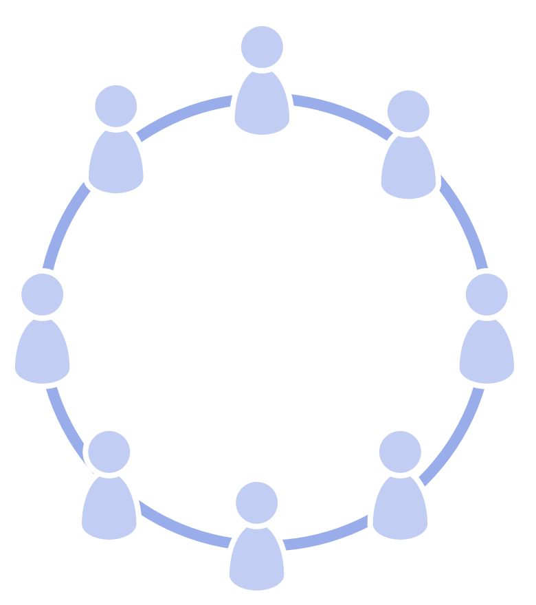

_**Круг** - це самоврядна і напівавтономна команда рівноцінних людей, які, взаємно співпрацюючи, відповідають за домен.
_

Коло:

- може бути постійним або тимчасовим
- може бути <a href="glossary.html#entry-self-organization" class="glossary-tooltip" data-toggle="tooltip" title="Самоорганізація: Будь-яка діяльність або процес, за допомогою якого люди організовують роботу. Самоорганізація відбувається в межах обмежень предметної області, але без прямого впливу зовнішніх агентів. У будь-якій організації чи команді самоорганізація співіснує із зовнішнім впливом (наприклад, зовнішні заперечення чи управлінські рішення, які впливають на домен).">самоорганізованим</a>
- Відповідає за власний розвиток і свій корпус <a href="glossary.html#entry-agreement" class="glossary-tooltip" data-toggle="tooltip" title="Угода: Узгоджений з інструкцією, процесом, протоколом або політикою, призначеним для керування потоком цінностей.">угод</a>

- **напів-автономія:**
    
    - Члени кола діють у межах обмежень їхнього <a href="glossary.html#entry-domain" class="glossary-tooltip" data-toggle="tooltip" title="Домен: Окрема сфера впливу, діяльності та прийняття рішень всередині організації.">домену</a>
    - Кожне коло може створювати <a href="glossary.html#entry-value" class="glossary-tooltip" data-toggle="tooltip" title="Цінність: Важливість, цінність або корисність чогось по відношенню до водія. Також &quot;принцип певної значущості, який керує поведінкою&quot; (здебільшого вживається у множині, &quot;цінності&quot; або &quot;організаційні цінності&quot;).">цінність</a> самостійно
- **самоврядування:** 
    - Члени кола постійно разом вирішують, як відповідати за домен, і встановлюють обмеження на те, як і коли відбуватимуться дії. 
- **Рівноцінність членів кола:** 
    - Усі члени кола рівною мірою відповідають за <a href="glossary.html#entry-governance" class="glossary-tooltip" data-toggle="tooltip" title="Врядування: Процес постановки цілей, прийняття та розвитку рішень, які спрямовують людей на досягнення цих цілей.">управління</a> доменом цього кола

