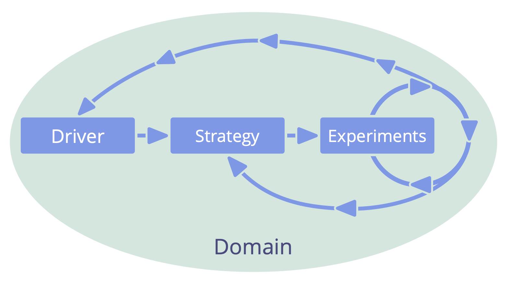

_**Стратегія** - це високорівневий підхід до того, як люди створюватимуть цінність для успішного управління доменом._

Зазвичай ефективніше, якщо команда або носій ролі беруть на себе ініціативу в розробці власної стратегії.

Стратегія часто включає в себе опис <a href="glossary.html#entry-intended-outcome" class="glossary-tooltip" data-toggle="tooltip" title="Очікуваний результат: Очікуваний результат угоди, дії, проекту або стратегії.">очікуваного результату</a> реалізації цієї стратегії.

Оскільки <a href="glossary.html#entry-delegator" class="glossary-tooltip" data-toggle="tooltip" title="Делегатор: Особа або група, які делегують відповідальність за домен іншій(им) особі(ам).">делегатор</a> несе відповідальність за <a href="glossary.html#entry-domain" class="glossary-tooltip" data-toggle="tooltip" title="Домен: Окрема сфера впливу, діяльності та прийняття рішень всередині організації.">домени</a>, які він делегує, важливо, щоб він переглядав стратегію <a href="glossary.html#entry-delegatee" class="glossary-tooltip" data-toggle="tooltip" title="Делегат: Особа або група, які приймають відповідальність за делегований їм домен, виконуючи роль хранителя або команди.">делегата</a>, щоб перевірити її на наявність потенційних перешкод і запропонувати шляхи її покращення.

Стратегія - це спільна угода між делегатором(ами) та делегатом(ами), яка регулярно переглядається та оновлюється за необхідності (*змінна або постійна*)

Стратегії перевіряються та вдосконалюються шляхом експериментів та навчання.
