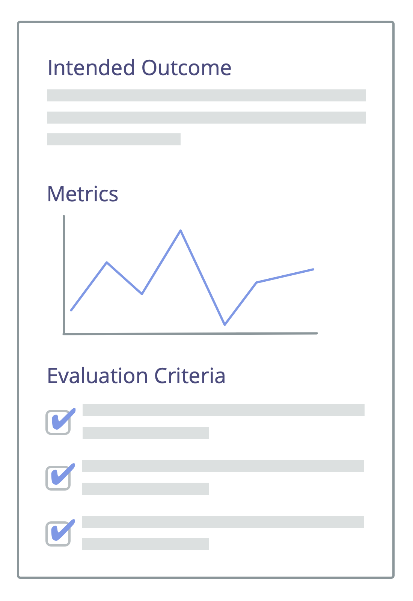

Чітко формулюйте очікувані результати угод, заходів, проектів і стратегій.

Узгодьте та запишіть стислий опис очікуваного результату.

Запланований результат може бути використаний для визначення [Критеріїв Оцінювання](evaluation-criteria.html) та <a href="glossary.html#entry-metric" class="glossary-tooltip" data-toggle="tooltip" title="Метрика: Кількісний показник, який використовується для відстеження та оцінки прогресу, оцінки результатів та визначення успіху">Метрик</a> для аналізу фактичного результату.

