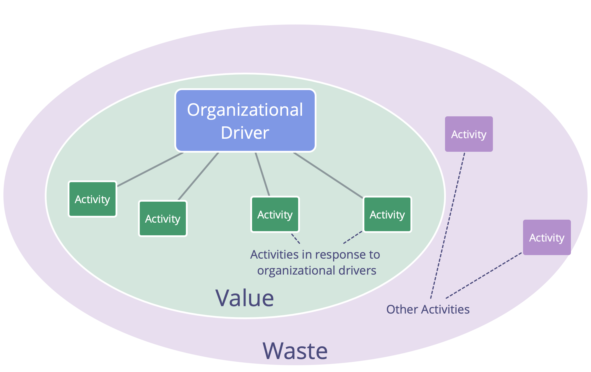

Виявіть драйвери та створіть засновану на метриках пулл-систему для організаційних змін шляхом постійного вдосконалення та покращення робочого процесу.

- впроваджуйте принцип консента і патерн [Рух через Напруженість](navigate-via-tension.html), щоб забезпечити розвиток робочого процесу в команді
- якщо це корисно, виберіть фасилітатора для ведення групових процесів і сформулюйте цінності, що зумовлюють поведінку
- ініціюйте процес безперервного поліпшення, використовуючи, наприклад, метод Канбан або регулярні [ретроспективи](retrospective.html)
- Члени команди використовують патерни S3 при потребі
- Якщо це корисно, ітеративно поширюйте цей експеримент на інші команди
- Цілеспрямовано шукайте перешкоди

## Втрати та Постійний Розвиток

_**Втрати** - це все, що не потрібно - або що стоїть на шляху для (більш) ефективної відповіді драйверу._

Втрати існують у різних формах та на різних рівнях абстракції (завдання, процеси, організаційна структура, ментальні моделі тощо).

Впровадження процесу постійного усунення втрат дає змогу забезпечити природний розвиток організації в напрямку більшої ефективності та адаптації до мінливого контексту.

