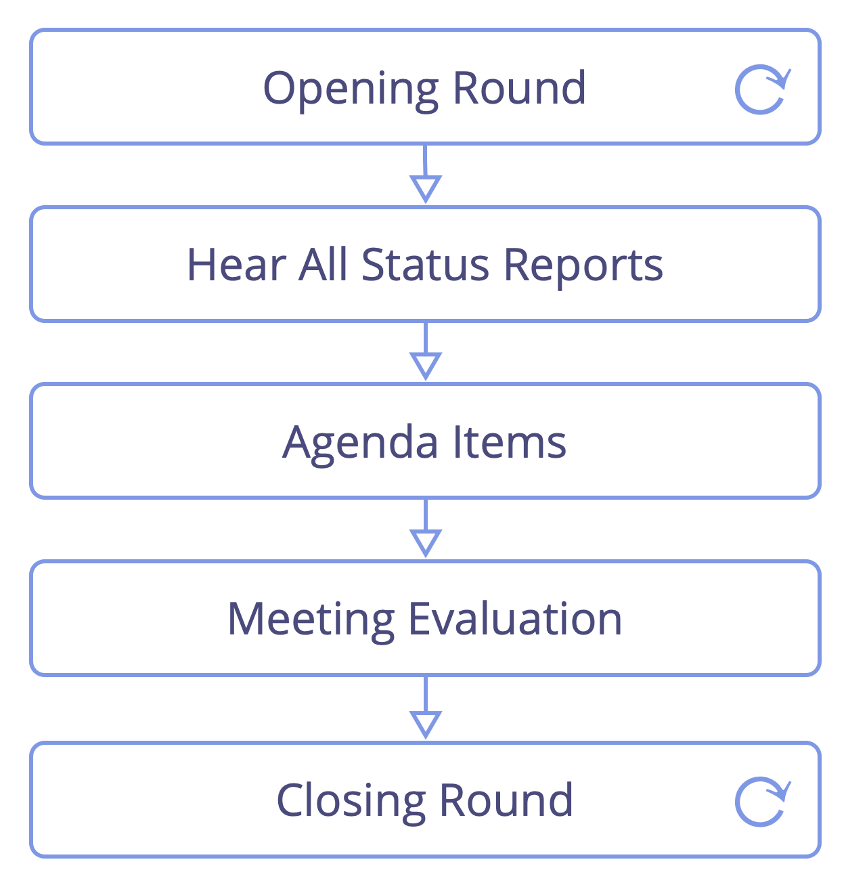

Зустрічатися на регулярній основі (зазвичай щотижня) для звітування та координації роботи в різних сферах.

-   сприяти проведенню зустрічі (<a href="glossary.html#entry-timebox" class="glossary-tooltip" data-toggle="tooltip" title="Таймбокс: Фіксований період часу, зосереджений на певній діяльності (яка не обов&#x27;язково завершується до кінця таймбоксу).">таймбокс</a> діалог і використовувати раунди, де це доцільно)
-   коли це корисно, складайте порядок денний перед зустріччю і заздалегідь ознайомте з ним учасників
    -   включіть деталі будь-яких передумов, які можуть допомогти учасникам підготуватися до зустрічі
    -   подальші питання порядку денного можуть виникати під час заслуховування звітів про стан справ

Пункти порядку денного:

- синхронізація та вирівнювання між доменами
- визначення пріоритетів та розподіл роботи
- реагування на перешкоди

