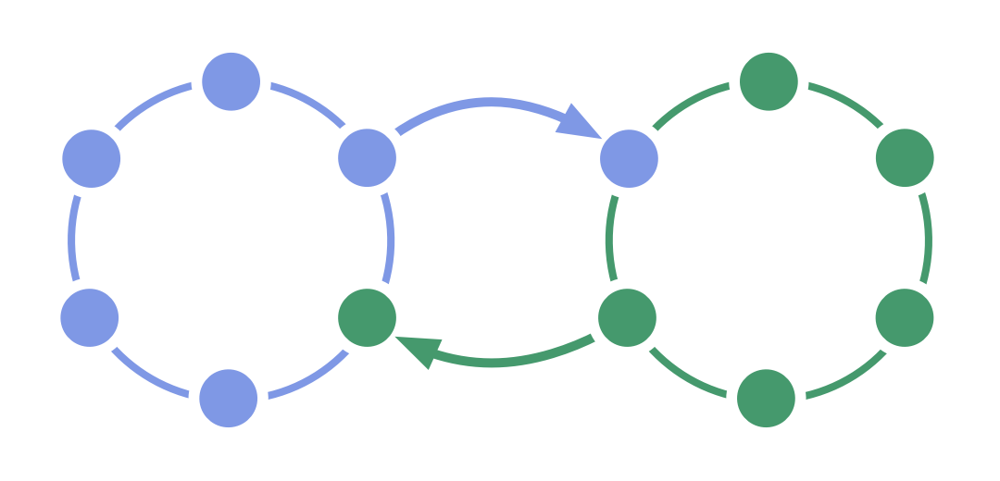

Увімкніть <em>двосторонній</em> потік інформації та впливу між двома командами.

Кожна з двох взаємозалежних команд обирає представника, які беруть участь в ухваленні <a href="glossary.html#entry-governance" class="glossary-tooltip" data-toggle="tooltip" title="Врядування: Процес постановки цілей, прийняття та розвитку рішень, які спрямовують людей на досягнення цих цілей.">управлінських</a> рішень іншою командою.

Двонаправлений зв'язок забезпечує рівноцінність двох команд і може використовуватися для отримання цінної інформації в ієрархічних структурах.

