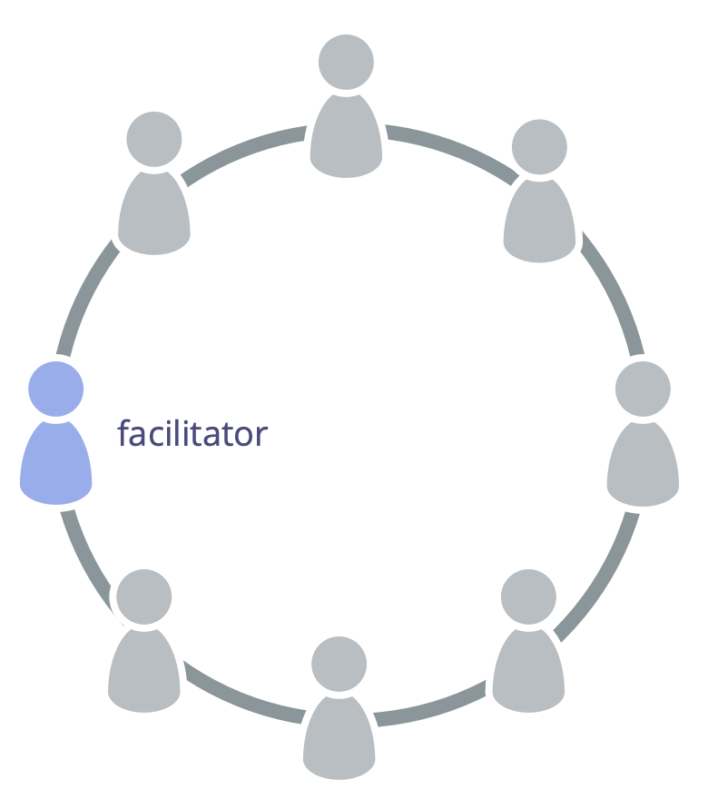

Виберіть когось, хто буде фасилітувати наради з питань управління.

Фасилітатор з питань <a href="glossary.html#entry-governance" class="glossary-tooltip" data-toggle="tooltip" title="Врядування: Процес постановки цілей, прийняття та розвитку рішень, які спрямовують людей на досягнення цих цілей.">управління</a>:

-   забезпечує, щоб [засідання керівництва](governance-meeting.html) відбувалися за планом та оцінювалися
-   (зазвичай) обирається <a href="glossary.html#entry-team" class="glossary-tooltip" data-toggle="tooltip" title="Команда: Група людей, які співпрацюють задля досягнення спільної мети (або рушійної сили). Зазвичай команда є частиною організації або формується як співпраця кількох організацій.">командою</a> з її членів (і на певний термін)
-   ознайомлений з [Журналом (Беклогом) Управління](governance-backlog.html)
-   часто запрошує інших фасилітувати деякі пункти порядку денного

Як фасилітатор управління, розгляньте можливість вивчення та використання наступних шаблонів від S3 для ефективного управління:

-   [Раунди](rounds.html)
-   [Формування Пропозиції](proposal-forming.html)
-   [Знаходження Консенсусу](consent-decision-making.html)
-   [Обрання Ролі](role-selection.html)
-   [Оцінка Зустрічей](evaluate-meetings.html)
-   [Вирішення Заперечень](resolve-objections.html)
-   [Колегіальний Огляд](peer-review.html)

