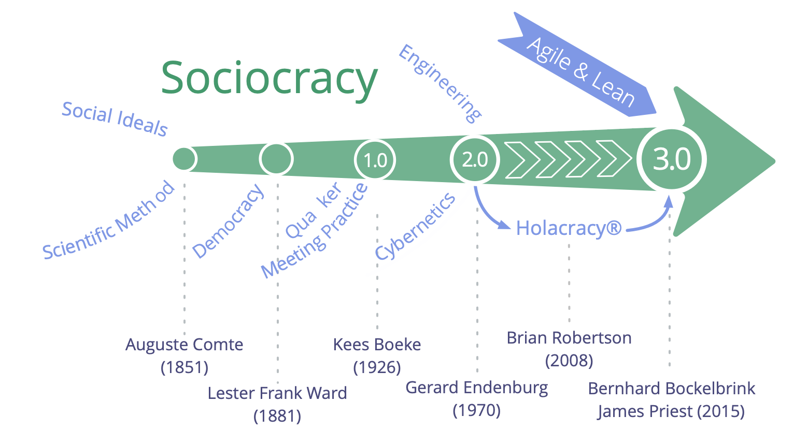

Буквальне значення терміну **соціократія** - "правління товаришів": *socio* - від латинського *socius* - означає "супутник", або "друг", а суфікс *-cracy* - від давньогрецького κράτος (krátos) - означає "влада", або "правління".

Слово "соціократія" з'явилося в 1851 році, коли **Огюст Конт** запропонував застосувати науковий підхід до суспільства: державою має керувати група вчених, які є експертами з питань суспільства (яких він називав "соціологами"). На його думку, це майбутнє, хоча ще й недосяжне, але неминуче.

Кілька десятиліть потому **Лестер Френк Ворд** використав слово "соціократія", щоб описати правління людей, які мають стосунки один з одним. Замість того, щоб мати соціологів у центрі, він хотів дати більше влади і відповідальності людині, він уявляв соціологів у ролі дослідників і консультантів.

У 1926 році голландський педагог-реформатор і квакер **Кіс Боке** заснував школу-інтернат, засновану на принципі консенсусу. Співробітники та учні розглядалися як рівноправні учасники в управлінні школою, всі рішення мали бути прийнятними для всіх. Він побудував цю версію соціократії на квакерських принципах і практиках і описав соціократію як еволюцію демократії у своєму есе 1945 року "Демократія, якою вона могла б бути".

**Джерард Енденбург**, також Квакер і учень школи Буке, хотів застосувати соціократію в сімейному бізнесі "Енденбург Електротехнік". Він створив і розвинув *Метод Організації Кола (SCM)* (пізніше він став "Соціократичним Методом"), інтегрувавши форму соціократії Бека з інженерією та кібернетикою. У 1978 році Енденбург заснував Соціократичний Центр в Утрехті (зараз це Соціократичний Центр у Роттердамі) як засіб просування соціократії в Нідерландах та за їх межами. З 1994 року організації в Нідерландах, що використовують SCM, звільнені від законодавчої вимоги мати раду працівників.

Наприкінці 1990-х і на початку 2000-х років кілька не голландськомовних людей познайомилися з соціократією, але лише в 2007 році, коли **Шерон Віллінс і Джон Бак** випустили свою книгу "Ми народ", соціократія стала широко доступною для англомовного світу, а звідти почала мігрувати в кілька інших мов.

Соціократія довела свою ефективність для багатьох організацій та спільнот по всьому світу, але вона ще не стала вірусною.

У 2014 році ** Джеймс Пріст і Бернхард Бокельбрінк ** об'єдналися, щоб спільно створити навчальні ресурси під ліцензією Creative Commons, синтезувавши ідеї Соціократії, Гнучкості та Бережливості. Вони виявили, що організації будь-якого розміру потребують гнучкого меню практик і структур - відповідно до їхнього конкретного контексту - які уможливлюють еволюцію більш соціократичного і гнучкого підходу для досягнення більшої ефективності, узгодженості, самореалізації та добробуту. Перша версія **Соціократії 3.0.** була запущена в березні 2015 року.

**Ліліана Девід** приєдналася до команди невдовзі після цього. Разом вони регулярно співпрацюють, щоб зробити S3 доступним і застосовним для якомога більшої кількості організацій, а також надають ресурси на умовах **Creative Commons Free Culture License** для людей, які хочуть вивчати, застосовувати та розповідати іншим про Соціократію_3.0.

## Рух Соціократія 3.0

Зі зростанням інтересу до Соціократії 3.0 швидко зростає спільнота людей з різним досвідом - консультантів-новаторів, коучів, фасилітаторів навчання та людей, які застосовують S3 у різних контекстах, - які поділяють високу оцінку трансформаційного потенціалу Соціократії 3.0, що допомагає організаціям та їхнім членам процвітати. Багато хто люб'язно присвячує частину свого часу експериментуванню з S3 і ділиться інформацією про нього, а також співпрацює, щоб вчитися один в одного і документувати досвід, щоб інформувати про постійний розвиток і еволюцію S3 і його різноманітних застосувань.