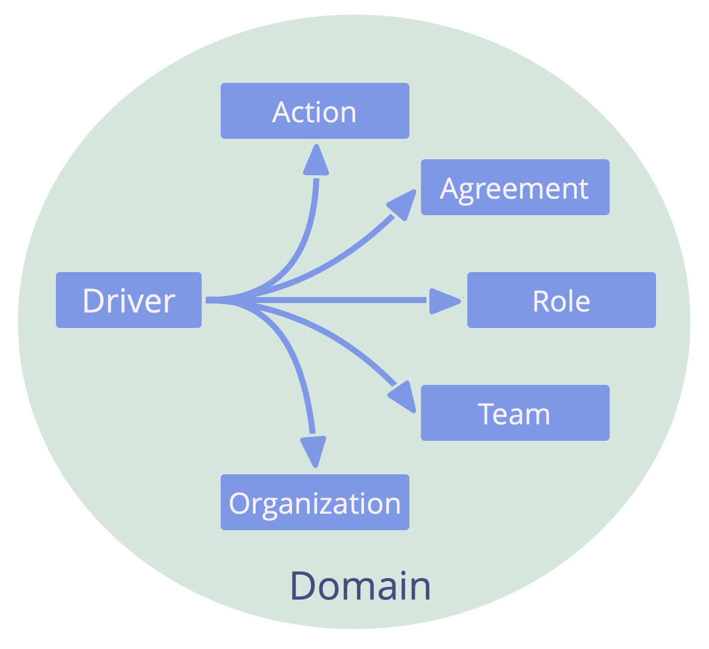

З'ясуйте організаційні драйвери (тобто, що відбувається і що потрібно для організації) і реагуйте на них за необхідності.

Відповіді на <a href="glossary.html#entry-organizational-driver" class="glossary-tooltip" data-toggle="tooltip" title="Організаційний драйвер: Драйвер - це мотив, який спонукає людину або групу реагувати на конкретну ситуацію. Драйвер вважається **організаційним драйвером**, якщо реагування на нього допоможе організації створити цінність, усунути втрати або уникнути непередбачуваних наслідків.">організаційні драйвери</a> включають:

- пряму дію (<a href="glossary.html#entry-operations" class="glossary-tooltip" data-toggle="tooltip" title="Операційна діяльність: Виконання роботи та організація повсякденної діяльності в межах обмежень, визначених через управління.">операції</a>)
- організацію того, як буде виконуватися робота
- прийняття управлінських рішень

Реакція на організаційний драйвер зазвичай розглядається як експеримент, який оцінюється і розвивається з часом.

## Кваліфікація Драйверів як Організаційних Драйверів

Драйвер - це мотив, який спонукає людину або групу реагувати на конкретну ситуацію. Драйвер вважається **організаційним драйвером**, якщо реагування на нього допоможе організації створити цінність, усунути втрати або уникнути непередбачуваних наслідків.

Простий спосіб визначити, чи належить драйвер до <a href="glossary.html#entry-domain" class="glossary-tooltip" data-toggle="tooltip" title="Домен: Окрема сфера впливу, діяльності та прийняття рішень всередині організації.">домену організації</a>, - це перевірити:

_Чи допоможе організації, якщо ми відреагуємо на цей драйвер? Чи не призведе це до непередбачуваних наслідків, якщо ми цього не зробимо?_
