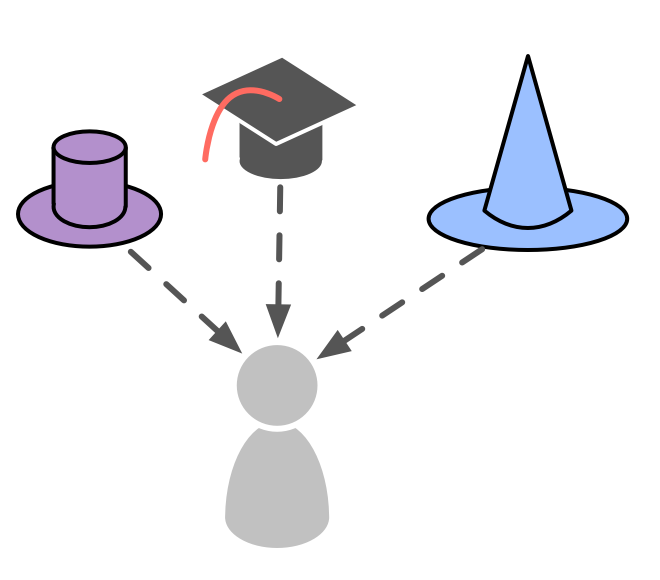

Делегуйте відповідальність за домен окремим особам.

Роль - це зона відповідальності (<a href="glossary.html#entry-domain" class="glossary-tooltip" data-toggle="tooltip" title="Домен: Окрема сфера впливу, діяльності та прийняття рішень всередині організації.">домен</a>), яка <a href="glossary.html#entry-delegation" class="glossary-tooltip" data-toggle="tooltip" title="Делегування: Надання повноважень однією стороною (делегатом) іншій стороні (делегату) відповідати за домен (тобто робити певні дії та/або приймати певні рішення), за який делегат несе повну відповідальність.">делегується</a> окремій людині (**зберігач ролі**), наділеній правом самостійно вирішувати та діяти в межах обмежень домену цієї ролі.

Зберігач ролі визначає <a href="glossary.html#entry-strategy" class="glossary-tooltip" data-toggle="tooltip" title="Стратегія: Високорівневий підхід до того, як люди створюватимуть цінність для успішного обліку домену.">стратегію</a> того, як він відповідатиме за свій домен. Під час розроблення стратегії він взаємодіє з <a href="glossary.html#entry-delegator" class="glossary-tooltip" data-toggle="tooltip" title="Делегатор: Особа або група, які делегують відповідальність за домен іншій(им) особі(ам).">делегатом</a>.

Роль - це простий спосіб для організації (або <a href="glossary.html#entry-team" class="glossary-tooltip" data-toggle="tooltip" title="Команда: Група людей, які співпрацюють задля досягнення спільної мети (або рушійної сили). Зазвичай команда є частиною організації або формується як співпраця кількох організацій.">команди</a>) делегувати повторювані завдання або певну сферу роботи та прийняття рішень одному з її членів.

- люди можуть брати відповідальність за кілька ролей
- замість створення нової команди іноді зручніше передати одну роль кільком людям 
- зберігачі ролі обираються методом консента і на обмежений термін
- колеги допомагають один одному зростати у своїх ролях

Виконавець ролі може вести <a href="glossary.html#entry-backlog" class="glossary-tooltip" data-toggle="tooltip" title="Беклог: Перелік (часто пріоритизований) незавершених елементів роботи (очікуваних кінцевих результатів або драйверів), які необхідно виконати/вирішити.">беклог</a> з управління та журнал (<a href="glossary.html#entry-logbook" class="glossary-tooltip" data-toggle="tooltip" title="Журнал: (Цифрова) система для зберігання всієї інформації, необхідної для управління організацією.">логбук</a>), щоб фіксувати те, що відбувається, і вдосконалюватися у створенні <a href="glossary.html#entry-value" class="glossary-tooltip" data-toggle="tooltip" title="Цінність: Важливість, цінність або корисність чогось по відношенню до водія. Також &quot;принцип певної значущості, який керує поведінкою&quot; (здебільшого вживається у множині, &quot;цінності&quot; або &quot;організаційні цінності&quot;).">цінності</a>

**Примітка:** У S3 керівні принципи, процеси або протоколи, створені людиною в ролі, вважаються угодами.

