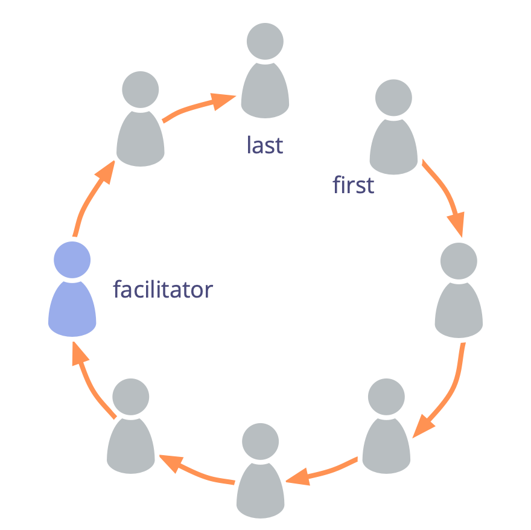

Під час групової зустрічі ходіть по колу, даючи можливість кожному висловитися по черзі.

Раунди - це техніка групової фасилітації для підтримки рівноправності та ефективного діалогу.

Чітко визначте мету та очікуваний результат кожного раунду.

Сядьте в коло, починайте кожне коло з іншого учасника і змінюйте напрямок (за або проти годинникової стрілки), щоб урізноманітнити тих, хто говорить першим і останнім, а також порядок виступів.

