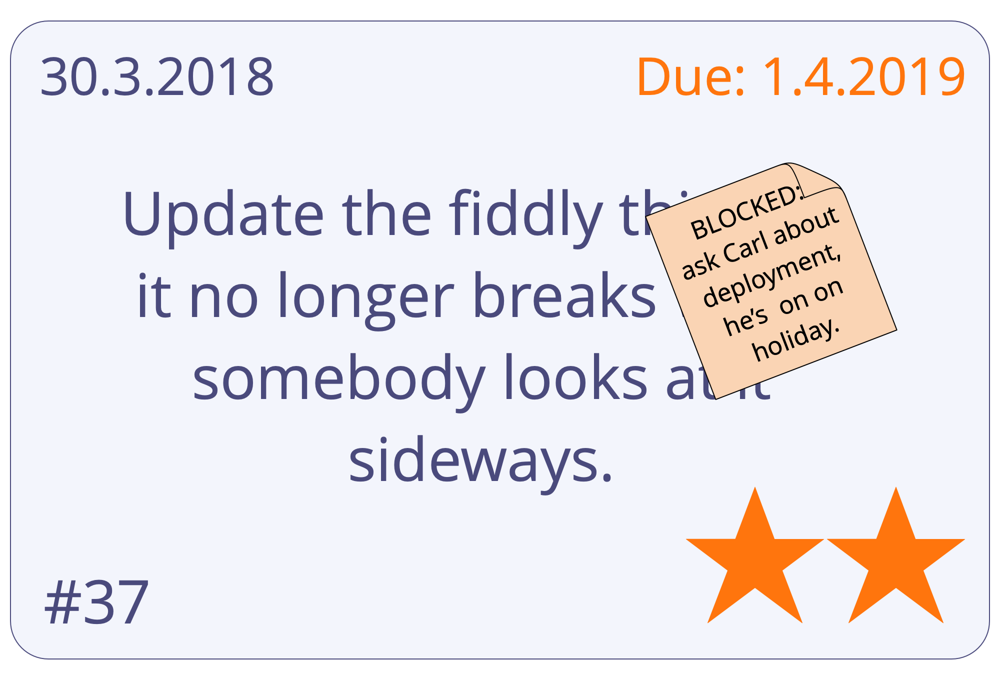

Підтримувати систему, яка дозволяє всім зацікавленим сторонам переглядати стан всіх робочих пунктів, які знаходяться на розгляді, в процесі виконання або завершені.

- цінно для <a href="glossary.html#entry-self-organization" class="glossary-tooltip" data-toggle="tooltip" title="Самоорганізація: Будь-яка діяльність або процес, за допомогою якого люди організовують роботу. Самоорганізація відбувається в межах обмежень предметної області, але без прямого впливу зовнішніх агентів. У будь-якій організації чи команді самоорганізація співіснує із зовнішнім впливом (наприклад, зовнішні заперечення чи управлінські рішення, які впливають на домен).">самоорганізації</a> та pull-систем
- система має бути доступною для всіх, кого вона стосується
- **аналог:** стікери на стіну, або індексні картки, магніти та дошка
- **цифрові:** [Trello](https://trello.com/), [Kanbanize](https://kanbanize.com/), [Leankit](https://leankit.com/), [Miro](https://miro.com), [Jira](https://www.atlassian.com/software/jira), [Google Sheets](https://www.google.com/sheets/about/) тощо.

## Що треба відстежити:

- **типи робочих завдань** (наприклад, запит клієнта, завдання проекту, завдання звітності, доопрацювання)
- **дата початку** (і **дата завершення**, якщо необхідно)
- **пріоритети**
- **етапи** роботи (наприклад, "робити", "в процесі", "на розгляді" та "виконано")
- перешкоди/блоки
- хто над чим працює
- <a href="glossary.html#entry-agreement" class="glossary-tooltip" data-toggle="tooltip" title="Угода: Узгоджений з інструкцією, процесом, протоколом або політикою, призначеним для керування потоком цінностей.">угоди</a> та очікування, що керують робочим процесом (наприклад, визначення виконаної роботи, політика, стандарти якості)
- використовуйте кольори, символи, виділення тощо.

